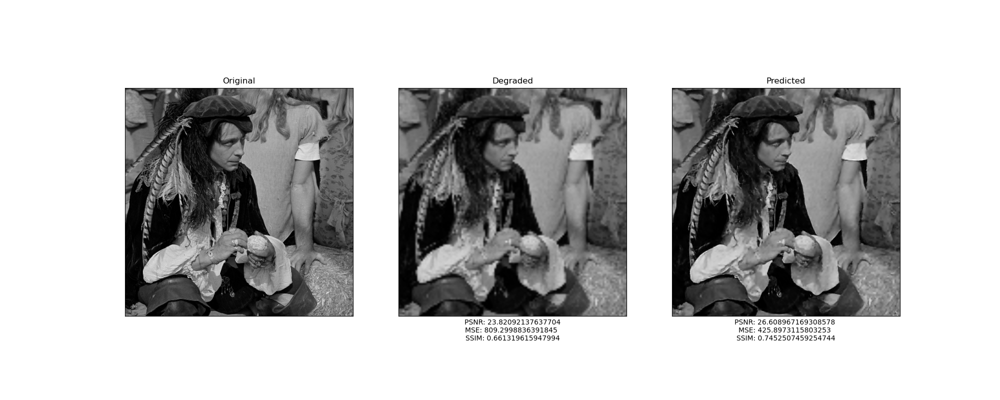
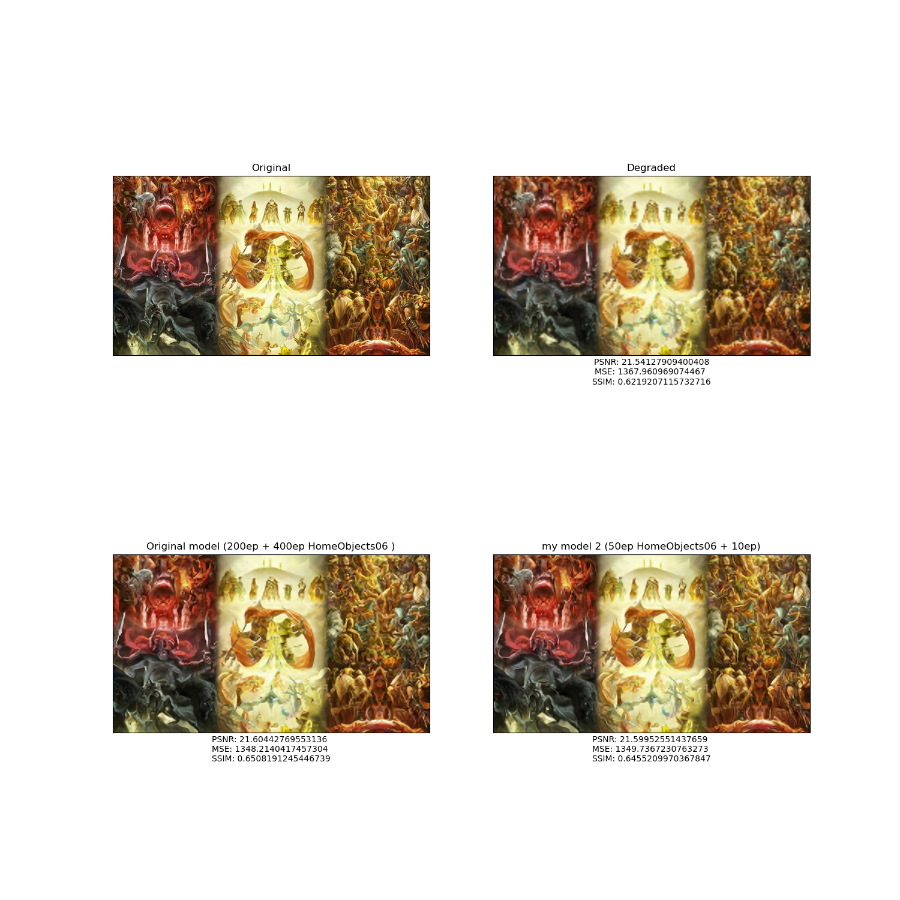
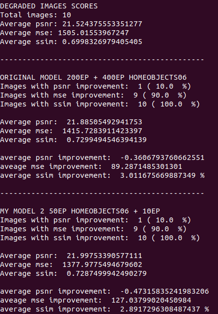

En este post comento el trabajo, experimentación y conclusiones de mi proyecto de **Redes Neuronales Convolucionales** para el curso de _Redes Neuronales_ impartido por el profesor Julio Waissman en la Universidad de Sonora.
A lo largo de este proyecto trabajé sobre una red neuronal convolucional que es capaz de reconstruir una imagen degradada y aumentar su calidad.

# ¿QUÉ ES LA SUPERRESOLUCIÓN?

Se les llama _Técnicas de superresolución_ a **aquellos algoritmos diseñados para mejorar la calidad de imágenes digitales**. Estos algoritmos pueden aplicarse en muchos campos; por ejemplo, en la química para mejorar la resolución de las imágenes tomadas por microscopios; en la astronomía para mejorar las fotos de los astros; en la industria fotográfica, e incluso en el campo de la seguridad donde todos hemos notado que las imágenes obtenidas por este tipo de cámaras no tienen una calidad alta. También he imaginado un modelo que se asimile en potencia a un microscopio digital profesional y que pueda comercializarse; con esto, mediante el desarrollo de aplicaciones móviles, podríamos restaurar fotos familiares antigüas con una app para celular obteniendo resultados magníficos o compartir nuestras vacaciones en muy alta resolución con nuestros amigos de Facebook, todo por un costo bajo.

Quizá la cantidad de aplicaciones para este tipo de algoritmos se debe a lo difícil que es resolver este problema, ya que existen diferentes "soluciones" al reconstruir un pixel en baja resolución. Afortunadamente, es un campo de investigación en el que se sigue trabajando con mucho ímpetu, y vaya que se han conseguido grandes avances; por ejemplo, el modelo [_Deep Image Prior_](https://dmitryulyanov.github.io/deep_image_prior) mejora la calidad de imágenes sin necesidad de entrenamiento obteniendo resultados increíbles.

# MODELO ORIGINAL

Se conoce a este modelo como **SRCNN**. El artículo donde se propone se puede consultar [aquí](https://arxiv.org/abs/1501.00092) y el código fuente se encuentra en esta [dirección](http://mmlab.ie.cuhk.edu.hk/projects/SRCNN.html).

Como pueden notar, el código original está escrito con _Matlab_ y _Caffe_. Pero en este [repositorio de Github](https://github.com/MarkPrecursor/SRCNN-keras) se encuentra traducido en **Python y TensorFlow (Keras)**. Yo utilicé como base éste código y le hice algunas modificaciones para adaptarlo a mis objetivos. Si deseas revisarlo, te dejo aquí el enlace a [mi versión](https://github.com/Pedro-Hdez/Experimentacion_SRCNN) en donde te explico cómo usarlo paso a paso.

# ARQUITECTURA

A continuación, voy a explicar brevemente cómo funciona esta red neuronal y trataré de hacerlo de la forma más amena posible. Sugiero echar un vistazo al artículo original para conocer a fondo la red, y visitar este [blog](https://medium.com/datadriveninvestor/using-the-super-resolution-convolutional-neural-network-for-image-restoration-ff1e8420d846) que resultó muy útil para mí al momento de analizar el código fuente.

_SRCNN_ **es una red neuronal convolucional con alimentación hacia adelante que se entrena con aprendizaje supervisado**. Es relativamente pequeña, únicamente **contiene 3 capas convolucionales con 128, 64 y 1 filtros respectivamente**. Escencialmente, este modelo ejecuta tres operaciones: _Extraccion de parches_, _Mapeo no lineal_ y _Reconstrucción_. El siguiente esquema representa el trabajo que realiza la red:

|  |
| :------------------------------------------------------: |
|                _Esquema de la red SRCNN_                 |

Ahora, veamos en qué consiste cada una de las operaciones.

1. **EXTRACCIÓN DE PARCHES**: La primer capa de la red extrae "parches" de la imagen de entrada (en baja resolución) aplicando **$$n_{1}$$ convoluciones o filtros convolucionales con kernels de tamaño $$\mathcal{f}_1 \times \mathcal{f}_1$$ y aplicando la función ReLu en la salida de cada filtro**.
2. **MAPEO NO LINEAL**: La primer capa extrae una _característica $$n_{1}$$-dimensional_ por cada parche de la imagen degradada. **En la segunda capa, se "mapea" cada una de estas características (vectores $$n_{1}$$-dimensionales) aplicando $$n_{2}$$ convoluciones con kernels de tamaño $$\mathcal{f}_2 \times \mathcal{f}_2$$. En esta capa también se utiliza la función ReLu\*\*. Cada uno de estos vectores $$n_{2}$$-dimensionales constituye, conceptualmente, la representación de un parche de la imagen original en alta resolución.
3. **RECONSTRUCCIÓN**: Básicamente, todos los parches de la capa anterior se unen para reconstruir la imagen aumentando su resolución. Para ello, los autores definen una tercer capa convolucional que aplica **$$\mathcal{c}$$ filtros convolucionales de tamaño $$ n\_{2} \times \mathcal{f}\_3 \times \mathcal{f}\_3$$. En esta capa, se utilizan filtros lineales**.

|  |
| :----------------------------------------------------------------: |
|                     _Funcionamiento de SRCNN_                      |

# MÉTRICAS

Una vez conociendo la arquitectura de la red SRCNN, vamos a revisar las métricas que los autores proponen para medir su desempeño.

**MSE (Mean Squared Error)**: El _Error Cuadrado Medio_ Es la diferencia cuadrada promedio entre valores estimados y valores reales. Matemáticamente, se define como:

$$MSE = \frac{1}{n} \sum_{i=0}^{n-1}(\hat{Y_{i}} - Y_{i})^{2}$$

Esta operación se efectuará **sobre los pixeles de las imágenes**.

**PSNR (Peak Signal-to-Noise Ratio)**: En español, _Proporción Máxima de Señal a Ruido_, es la relación que existe entre la máxima energía posible de una señal y el ruido que afecta su representación. En decibeles, se define como:

$$PSNR = 20 \cdot \log_{10}(\frac{MAX_{I}}{\sqrt{MSE}})$$, donde $$MAX_{I}$$ es el máximo valor posible para un pixel en la imágen.

**SSIM (Structural Similarity Index Measure)**: En español, _Índice de Similitud Estructural_, básicamente es una métrica para saber qué tan parecidas son dos imágenes. Su definición teórica es la más compleja de las tres:

El _SSIM_ se calcula sobre varias ventanas de una imagen. La medida entre dos ventanas $$x$$ y $$y$$, ambas de tamaño $$N \times N$$ es:

$$SSIM(x,y)=\frac{(2\mu_{x}\mu_{y} + c_{1})(2\sigma_{xy} + c_{2})}{(\mu_{x}^{2} + \mu_{y}^{2} + c_{1})(\sigma_{x}^{2} + \sigma_{y}^{2} +c_{2})}$$

con:

- $$\mu_{x}$$: El promedio de $$x$$
- $$\mu_{y}$$: El promedio de $$y$$
- $$\sigma_{x}^{2}$$: La varianza de $$x$$
- $$\sigma_{y}^{2}$$: La varianza de $$y$$
- $$\sigma_{xy}$$: La covarianza de $$x$$ & $$y$$
- $$c_{1}=(k_{1}L)^{2}, c_{2}=(k_{2}L)^{2}$$: Dos variables para estabiliar la división con denominador pequeño
- $$L$$ El rango de valores de los pixeles (comúnmente es $$2^{\text{#bits por pixel}} - 1$$)
- $$k_{1}=0.01$$ y $$k_{2}=0.03$$ por default.

Las definiciones anteriores son puramente teóricas, pero **¿Cómo las vamos a interpretar?**. Respondamos esta pregunta:

El **MSE**, como su definición lo indica, mide la diferencia entre valores estimados y los valores reales, y ésta operación se va aplicar sobre todos los pixeles de una imagen; entonces, un MSE pequeño **indica que los valores de los pixeles de la imagen de salida son muy parecidos a los valores de los pixeles en la imagen de entrada**. Por otro lado, un MSE muy grande **indica que los valores de los pixeles de la imagen de salida guardan muy poca similitud respecto a los valores de los pixeles de la imagen de entrada**. Así pues, esperamos que los modelos minimicen el Error Cuadrado Medio.

**PSNR** mide el ruido que existe en la imagen. En pocas palabras, este indicador nos dará una idea de **qué tan nítido es el resultado**.

**SSIM** es la métrica más fácil de comprender, como ya se ha dicho, este índice nos va a dirá **qué tan parecidas son estructuralmente las imágenes de entrada y salida**.

# PREPARACIÓN DE LAS IMÁGENES

El código fuente **únicamente contiene 19 imágenes (5 para entrenar y 14 para prueba)**. Me parecieron muy pocos datos, así que me di a la tarea de buscar un conjunto de imagenes más grande, pero no tan masivo; además, buscaba imagenes complejas para ver qué tal se comportaba la red. Encontré el Dataset llamado [_HomeObjects06_](http://www.vision.caltech.edu/pmoreels/Datasets/Home_Objects_06/) del Instituto Tecnológico de California; como su nombre lo dice, contiene 450 imágenes de objetos caseros. Para mi poder de cómputo incluso 450 imágenes resultaron ser muchísimas, más que nada al momento de preparar los datos de entrenamiento, pues hago uso de la técnica de **Data Augmentation** con la que, partiendo de las imagenes del conjunto de entrenamiento, se genera información extra para crear más ejemplos. Entonces, reduje mi conjunto de entrenamiento a **70 imágenes y mi conjunto de prueba a 123 imágenes**, todas del Dataset **HomeObjects06**

|  |  |
| :------------------------------------------------------------------------: | :--------------------------------------------------------------------------: |
|                            _Conjunto original_                             |                          _Muestra de HomeObjects06_                          |

Una vez conseguidos los conjuntos de entrenamiento y prueba, el siguiente paso es **degradar las imágenes** reescalándolas para que pierdan resolución; en mi caso, **utilicé una interpolación bilineal**. En el código fuente muestran esto con un factor 2, pero yo puse a prueba los modelos con **factor 2 y 4** para aumentar el nivel de dificultad.

A partir de este punto, al hablar de **Factor** nos estaremos refiriendo al factor con el cuál las imágenes han sido degradadas.

|  |  |  |
| :-----------------------------------------------------------: | :---------------------------------------------: | :---------------------------------------------: |
|                          _Original_                           |             _Degradada (Factor 2)_              |             _Degradada (Factor 4)_              |

Si la imagen se degrada con un **factor 2**, el resultado será una imagen <ins>"borrosa"</ins>. Al utilizar un **factor 4**, la imagen degradada se verá <ins>"pixelada"</ins>.

# EXPERIMENTACIÓN

A continuación, voy a exponer los experimentos que realicé y sus resultados. En pocas palabras, entrené el modelo original y dos modelos con más capas ocultas; también probé estas redes con distintos epochs de entrenamiento y sobre diferentes conjuntos de imágenes.

### MODELO ORIGINAL PRE-ENTRENADO CON 200 EPOCHS

Antes de comenzar, quiero mostrarles cómo se ve el modelo SRCNN escrito en Python utilizando Keras. A partir de aquí, al hablar del **"Modelo Original"** nos estaremos refiriendo a la siguiente red:

|  |
| :------------------------------------------------------: |
|                         _SRCNN_                          |

En el repositorio del código en Python, nos ofrecen los pesos del modelo original previamente entrenado con 200 epochs. Estos son algunos de los mejores **resultados para imágenes degradadas con factor 2 del conjunto original**:

|                    |
| :----------------------------------------------------------------: |
|            |
|                                :--:                                |
|                          |
|                                :--:                                |
|  |
|                                :--:                                |
|               _Modelo original 200 epochs. Factor 2_               |

Si analizamos las métricas nos damos cuenta de que PSNR y SSIM aumentan. Vamos a recordar cómo interpretar estos valores numéricos. **El PSNR mide el ruido y es inversamente proporcional a la nitidez**: entre más grande, menos nítido es el resultado. **SSIM mide qué tan parecidas son dos imagenes**: entre más grande, más parecido tiene el resultado con la imagen original. Teniendo esto en mente, podríamos decir que **este modelo sacrifica un poco de nitidez a cambio de aumentar la similitud entre las entradas y las salidas**.

Todos los resultados son muy buenos. Aunque las dos primeras imágenes están incluidas en el conjunto de entrenamiento, podemos darnos cuenta de que también es capaz de predecir, con excelentes resultados, imágenes que nunca había procesado.

Ahora, vamos a ver qué ocurre cuando este mismo modelo intenta reconstruir las mismas imágenes pero ahora degradadas con **factor 4**

|      |
| :------------------------------------------------------------------------------------------: |
|  |
|                                             :--:                                             |
|                |
|                                             :--:                                             |
|          |
|                                             :--:                                             |
|                            _Modelo original 200 epochs. Factor 4_                            |

En este caso, ni siquiera se obtuvieron resultados decentes en las imágenes que formaban parte del conjunto de entrenamiento. **El SSIM aumenta en 1 y 3 por ciento aproximadamente**, mientras que las imágenes degradadas con factor 2 aumentaron hasta en, aproximadamente, un **7 por ciento**.

### MODELO ORIGINAL PRE-ENTRENADO CON 200 EPOCHS + 400 EPOCHS DE ENTRENAMIENTO CON EL CONJUNTO _HomeObjects06_

Me di a la tarea de continuar el entrenamiento de este modelo pero ahora con el conjunto de imágenes que yo descargué por mi cuenta. Veamos los resultados con el mismo factor y los mismos ejemplos.

|      |
| :--------------------------------------------------------------------------------------------------------: |
|  |
|                                                    :--:                                                    |
|                |
|                                                    :--:                                                    |
|           |
|                                                    :--:                                                    |
|                   _Modelo original 200 epochs + 400 epochs con HomeObjects06. Factor 4_                    |

Podemos notar a simple vista que los resultados ahora son bastante mejores. Analicemos los números:

El PSNR **aumenta entre 0 y 1, aproximadamente**. Podemos decir que el modelo nuevamente está sacrificando un poco (casi nada) la nitidez. El SSIM **aumenta, aproximadamente, entre 2 y 3 por ciento** a excepción de la mariposa, en donde aumenta sorprendentemente casi en un 10 por ciento.

Aquí surge la siguiente pregunta: **¿Por qué los resultados son mejores si en el caso anterior el SSIM aumenta prácticamente lo mismo que ahora?**

La respuesta está en el **Error Cuadrado Medio**. Si observamos el MSE nos damos cuenta de que, en el caso anterior, el valor de esta métrica aumenta aproximadamente 10 en las últimas dos imágenes que no formaban parte del conjunto de entrenamiento. Después de los 400 epochs extra, ahora el MSE disminuye sustancialmente en todos los ejemplos. Recordemos que **si el MSE disminuye, significa que los valores de los pixeles en la imagen de salida de la red son similares a los valores que tienen los pixeles en la imagen original**; por lo tanto, la imagen completa va a lucir más parecida.

### MODELO "MACHETERO"

A lo largo de mi formación académica, he escuchado muchas veces a mis compañeros / profesores / padres de familia llamar "macheteros" a aquellos alumnos que repasan una y otra vez las preguntas que saben estarán incluidas en el examen, memorizándolas a la perfección (y obteniendo notas muy altas) pero que son incapaces de resolver un problema similar porque no es cien por ciento igual a lo que ellos estudiaron por horas.

Lo mismo me ocurrió cuando definí un modelo con 6 capas convolucionales para intentar mejorar los resultados.

|  |
| :--------------------------------------------------------: |
|                  _Mi modelo con 6 capas_                   |

Como pueden ver, también aumentó bastante el número de filtros convolucionales por lo que el entrenamiento con 800 epochs demoró, en mi máquina, al rededor de **28 horas**. Un detalle importantísimo es que **entrené la red con el conjunto original de imagenes completo** (la puse a "machetearse" los 19 ejemplos) y después hice la predicción sobre éste. Aquí una muestra de los mejores resultados con **factor 4**:

|  |
| :------------------------------------------------------: |
|  |
|                           :--:                           |
|  |
|                           :--:                           |
|  |
|                           :--:                           |
|             _Mi modelo 800 epochs. Factor 4_             |

El SSIM **aumenta mucho, entre 8 y 11 por ciento**. Es verdad que el PSNR también aumenta bastante, pero visualmente los resultados son increíbles. ¿He propuesto un nuevo modelo que revolucionará el campo de la restauración de imágenes?. Para responder esta pregunta, es necesario continuar con las pruebas.

Vamos a analizar el rendimiento de mi modelo con el conjunto _HomeObjects06_ de acuerdo al **SSIM** y con **factor 4**

| :--: |
| _Mejores resultados_ |
|  |
| :--: |
|  |
| :--: |
| _Peores resultados_ |
|  |
| :--: |
|  |
| :--: |

Antes de continuar quiero hacer una observación. Al parecer los resultados son muy buenos, pero **hay que tomar en cuenta que las imágenes originales tienen una resolución alta**; por lo tanto, las diferencias al momento de degradarlas con un factor 4 no son tan notorias como en los ejemplos anteriores. Por esta misma razón es que se calculan las métricas, es la manera más precisa y "científicamente" correcta de evaluar el rendimiento.

Podemos notar que, en el mejor de los casos, el SSIM **aumenta 1.5 por ciento, aproximadamente**; y es curioso cómo en los peores casos **el resultado se parece menos que la imagen degradada**. Ahora, analicemos el comportamiento general de este modelo sobre el mismo conjunto de imágenes.

|  |
| :------------------------------------------------------: |
|                    _Análisis General_                    |

Primero hablemos del SSIM. Mi modelo **mejoró este indicador en el 63 % de las imágenes**, no parece un número muy malo, pero las imagenes degradadas tienen un SSIM promedio de **68.121 %** y nuestros resultados, un **68.095 %**. En promedio, las imágenes de salida **empeoran en un .02 %**. Es verdad, empeoran muy, muy poco; para fines prácticos podemos decir que, en general, **el SSIM permanece igual**.

Continuemos con el PSNR. Mi modelo **mejoró este indicador en el 80 % de los ejemplos**, ¡suena muy bien!, pero hay que ver qué tanto mejora. Las imágenes degradadas tienen un PSNR promedio de **25.541** y los resultados de la red, **25.254**. **Únicamente mejoran en .68**, prácticamente nada.

En este momento podríamos concluir que mi modelo hace nada, pero no hay que apresurarnos; tal vez este conjunto de imágenes es muy difícil para toda red neuronal, veamos qué tal lo hace el modelo original **entrenado 200 epochs + 400 epochs con el conjunto de entrenamiento de HomeObjects06**. A continuación, una comparativa entre estos dos modelos.

|    |
| :----------------------------------------------: |
|    |
|                       :--:                       |
|  |
|                       :--:                       |
|  |
|                       :--:                       |
|         _Comparación de los resultados_          |

Los resultados se ven muy, muy parecidos a simple vista. Si prestamos atención al SSIM podemos darnos cuenta de que el modelo original claramente supera al mío. Veamos la comparación de las métricas.

**Model 1** es el modelo original.

**Model 2** es mi modelo.

|  |
| :-------------------------------------------------------------------------------: |
|                           _Comparación de las métricas_                           |

Primero, analicemos el SSIM. El modelo original aumentó este índice en el **100 % de las imagenes** con un SSIM promedio del **70 %**. Es aproximadamente 2 % más alto que la media de las imagenes degradadas. No es mucho, pero esta red lo ha mejorado.

Vamos con el PSNR. En este indicador mi red aplastó por completo al modelo original, SRCNN apenas mejoró la métrica en el **2 %** de los ejemplos y, de hecho, la empeoró (en promedio) **.46**.

Pueden pensar que el rendimiento de ambos modelos es el mismo porque los resultados del SSIM y PSNR son muy parecidos, y en esto último tienen razón. Pero, igual que antes, el veredicto final lo tiene el **MSE**. Si checamos esta métrica, SRCNN mejoró el Error Cuadrado Medio en el **97 % de las imagenes**, aplastó al 24 % de mi modelo. De igual manera, el MSE promedio de SRCNN es considerablemente menor.

Mi red con 6 capas y 800 epochs de entrenamiento no pudo hacerle frente al modelo original. Puede ser que SRCNN haya tenido un mejor rendimiento porque entrenó con el Training Set de HomeObjects06. Vamos a darle otra oportunidad a mi red; al final del día, esa victoria contundente en el PSNR puede significar algo. Para comprobarlo, los modelos van a predecir un conjunto de imágenes que ambos desconocen: un DataSet de **caras** (Yo usé una pequeña muestra de [este conjunto](http://mmlab.ie.cuhk.edu.hk/projects/CelebA.html)) con **factor 4**.

Aquí nos volvemos a enfrentar con el problema anterior, las imagenes originales están en muy, muy, pero muy alta resolución; por lo tanto, la degradación es prácticamente imperceptible.

|  |
| :------------------------------------------: |
|  |
|                     :--:                     |
|  |
|    _Comparación con el conjunto de caras_    |

Antes de dar las conclusiones veamos la comparación de las métricas.

**Model 1** es el modelo original.

**Model 2** es mi modelo.

|  |
| :--------------------------------------------------------------: |
|                  _Comparación de las métricas_                   |

Comencemos el análisis observando el comportamiento del PSNR. Una vez más, mi modelo aplastó contundentemente a SRCNN, pues este último **no mejoró este indicador en ejemplo alguno**; de hecho, **tiene un PSNR promedio más alto que las imágenes degradadas**.

Por otro lado, SRCNN derrota de forma unánime a mi modelo en el MSE. La red original logra mejorar el Error Cuadrado Medio en el **100 % de los casos**. En promedio, el MSE de SRCNN es suficientemente menor que en las imágenes degradadas; por lo tanto, hablando a nivel de intensidad de pixeles, éste ofrece mejores resultados.

Finalmente, si analizamos el SSIM, de nuevo SRCNN le gana por mucho a la red que yo propuse mejorando esta métrica en el **94 % de los casos**. En promedio, el modelo original **mejora este índice en un 0.5 %** (muy poco debido a la alta resolución de las imagenes); en cambio, mi modelo **tiene a empeorar este valor en un .18%**.

**CONCLUSIÓN DEL EXPERIMENTO**: SRCNN siempre fue mejor a pesar de su arquitectura tan sencilla. Mi modelo ofreció resultados de ensueño en el conjunto original de imagenes porque **fue entrenado con los mismos ejemplos que después iba a predecir**. Fue un error gravísimo de mi parte y esta práctica **se debe EVITAR a toda costa**. Como el nombre de esta sección lo dice, mi red es un modelo totalmente "machetero".

# MODELO CON MÁS FILTROS CONVOLUCIONALES

Como último experimento, veamos el rendimiento que presentó el modelo original modificado cuando aumentamos el número de capas ocultas y filtros convolucionales. Llamemos a esta red **Modelo 2**.

|  |
| :----------------------------------------------: |
|                    _Modelo 2_                    |

Al aumentar el número de filtros, aumenta el tiempo de entrenamiento. Entrené este modelo con el conjunto **HomeObjects06 y 50 epochs**, esta etapa del experimento demoró, en mi máquina, un poco más de **71 horas**.

Puse a prueba este modelo con los ejemplos del **conjunto _Zelda_**. Este conjunto es muy pequeño, consta únicamente de 10 imágenes de uno de mis videojuegos favoritos. Para empezar, veamos una comparativa entre esta red y el <ins>modelo "machetero"</ins>

|  |
| :----------------------------------: |
|  |
|                 :--:                 |
|  |
|                 :--:                 |
|      _Comparación de imágenes_       |

Echemos un vistazo a las métricas

|  |
| :----------------------------------: |
|      _Comparación de Métricas_       |

_Modelo 2_ **mejoró el MSE y SSIM del 60 y 90 por ciento de las imágenes, respectivamente**. Si vemos los valores de mejora promedio, podemos notar que el modelo entrenado con 800 epochs empeoró MSE y SSIM, mientras que la nueva red los mejoró ambos. **En conclusión, _Modelo 2_ supera al modelo machetero**.

Ahora, comparemos el rendimiento del Modelo original (SRCNN) y mi nueva red.

|  |
| :----------------------------------: |
|  |
|                 :--:                 |
|  |
|                 :--:                 |
|      _Comparación de imágenes_       |

Pasemos a revisar las métricas

|  |
| :----------------------------------: |
|      _Comparación de Métricas_       |

El porcentaje de imágenes que SRCNN mejora, tanto en MSE como SSIM, es muy cercano a estos mismos índices de _Modelo 2_. De hecho, **el promedio de las tres métricas es muy parecido entre ambas redes**. Pero si nos fijamos en los promedios de mejora, podemos ver que SRCNN tiene mejores resultados en los tres indicadores, sobre todo en el MSE. Con la diferencia tan grande en el Error Cuadrado Medio, aunque los otros dos indicadores permanezcan muy similares entre ambas redes, podemos concluir que el modelo original ofrece resultados más parecidos a las imágenes de entrada que _Modelo 2_.

Tratando de mejorar el desempeño de _Modelo 2_, me di a la tarea de someter la red a un entrenamiento de "alto rendimiento". Para esto, construí un nuevo conjunto de entrenamiento a base de imágenes con muchos colores y formas complejas.

|  |
| :--------------------------------: |
| _Nuevo conjunto de entrenamiento_  |

Después de seguir entrenando a _Modelo 2_ por 10 epochs con el conjunto de ejemplos anterior, la comparación entre éste y SRCNN es la siguiente:

|    |
| :------------------------------------: |
|  |
|                  :--:                  |
|  |
|                  :--:                  |
|       _Comparación de imágenes_        |

Las métricas

|  |
| :------------------------------------: |
|       _Comparación de Métricas_        |

Con únicamente 10 epochs, y con un conjunto muy pequeño de entrenamiento, se lograron cambios en _Modelo 2_. El número de imágenes con mejora en el PSNR bajó, pero los otros dos aumentaron. Este descenso en el número de ejemplos no es tan significativo, porque podemos observar que el PSNR promedio antes era de **21.68** y pasó a ser **21.99**. Este "sacrificio" de nitidez es compensado por las mejoras en el MSE ya que este disminuyó en, aproximadamente, **115**; y en el SSIM que aumentó, más o menos, **0.2%**.

Ahora, si volvemos a comparar a _Modelo 2_ con SRCNN, nos damos cuenta de que, a excepción del MSE, los indicadores son muy similares aunque el modelo original sigue venciendo por muy poco.

**CONLUSIÓN DEL EXPERIMENTO:** SRCNN y _Modelo 2_ tienen, aproximadamente, el mismo desempeño.

# CONCLUSIONES DEL PROYECTO

A lo largo de este proyecto obtuve nuevo aprendizaje y también pude experimentar "en carne propia" situaciones y fenómenos que hasta ese momento únicamente los había estudiado teóricamente en el salón de clase. Esto me sirvió para aprender algunas lecciones y, en futuros proyectos, saber qué hacer, qué no hacer y cómo hacerlo. A continuación, las conclusiones de este trabajo.

- **A veces, más no es mejor**: El modelo original SRCNN es relativamente sencillo porque únicamente contiene 3 capas convolucionales; además, el número de filtros que emplea es considerablemente pequeño. En los dos modelos que yo propuse aumenté capas y filtros, sin embargo, apenas pude igualar el rendimiento con _Modelo 2_.

- **Todo tiene un por qué**: SRCNN se sustenta sobre una fuerte base teórica y cada parte del modelo tiene una función claramente establecida. En cambio, mis modelos contenían más capas que no tenían un "por qué" en específico, fueron incluidas porque en un principio pensaba que esto aumentaría directamente el rendimiento de las redes.

- **En ocasiones, la "Fuerza bruta" no es una buena idea**: Este punto está muy relacionado con el anterior. En _Modelo 2_ aumenté de 3 a 6 el número de capas convolucionales, y de 193 a 448 el número total de filtros; además, su entrenamiento se prolongó por 71 horas. Sin embargo, esta red apenas y puede igualar su rendimiento con el del modelo original. Aunque _Modelo 2_ luce masivo en comparación a SRCNN, esto no significa que ofrezca mejores resultados.

- **SEPARAR los conjuntos de entrenamiento y prueba**: Considero que este error fue el más grave. Entrené al modelo "machetero" con los mismos ejemplos que después iba a predecir, por lo tanto, los resultados sobre esas imágenes fueron increíblemente buenos; pero después de probar con otro conjunto diferente me llevé una gran desilución. Los resultados sobre el conjunto de entrenamiento no reflejan el rendimiento real de las redes neuronales.

- **El conjunto de entrenamiento es muy importante**: Noté esto sobre todo con _Modelo 2_. Recordemos que al final lo entrené con un conjunto de ejemplos que contenían imágenes "complejas" y los resultados mejoraron. De la misma forma, el modelo original mejoró al ser entrenado con un conjunto más grande (HomeObjects06). El tamaño del conjunto de entrenamiento y la forma de los ejemplos es clave para un buen rendimiento. Por lo que he leído en la literatura científica, es todo un arte construir un _Training Set_ bueno, además, el número de epochs también resulta difícil de establecer para que el modelo aprenda y no se sobreentrene.

- **El supercómputo es necesario**: Todos los entrenamientos demoraron, unos más que otros, pero siempre voy a recordar las 71 horas de _Modelo 2_. Con el modelo "machetero" fue doloroso, porque esperé al rededor de 30 horas para darme cuenta de que el modelo no había servido de mucho. Ahora imaginemos una aplicación profesional de redes neuronales con 1000 capas ocultas y algunas decenas de Terabytes para entrenar, resultaría prácticamente imposible hacerlo en una computadora de gama media. Por esta razón, el supercómputo se vuelve completamente necesario.

- **La "simple vista" no es suficiente para evaluar resultados**: Algunos de los resultados que presenté lucían excelentes (sobre todo con las imágenes en muy allta resolución), sin embargo, las métricas no eran buenas; por lo tanto, estos indicadores resultan necesarios para evaluar el rendimiento de una manera precisa y formal.
