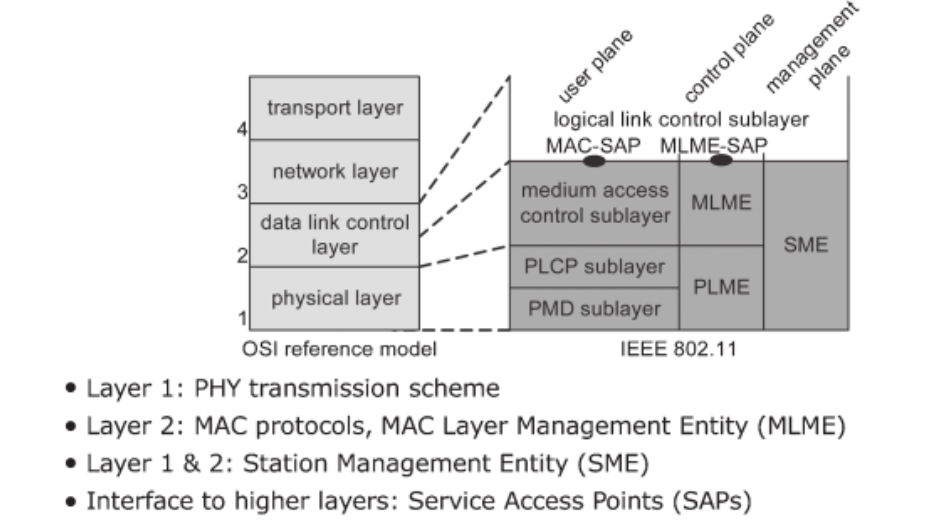
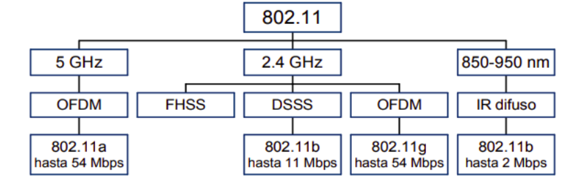
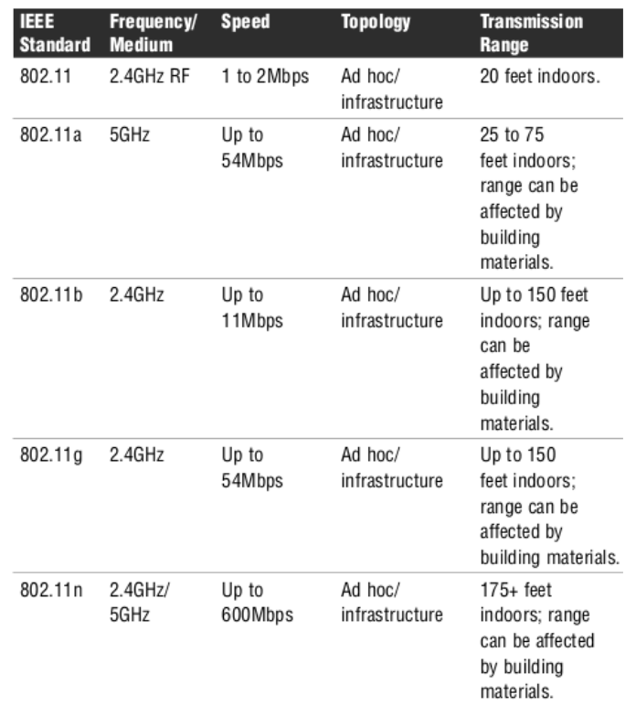
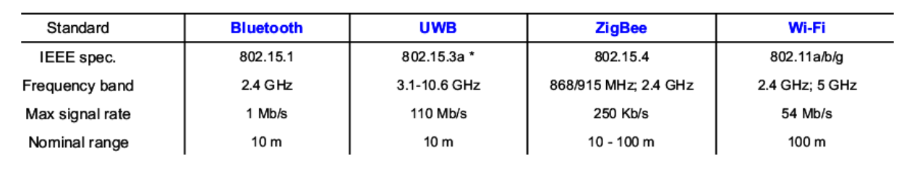
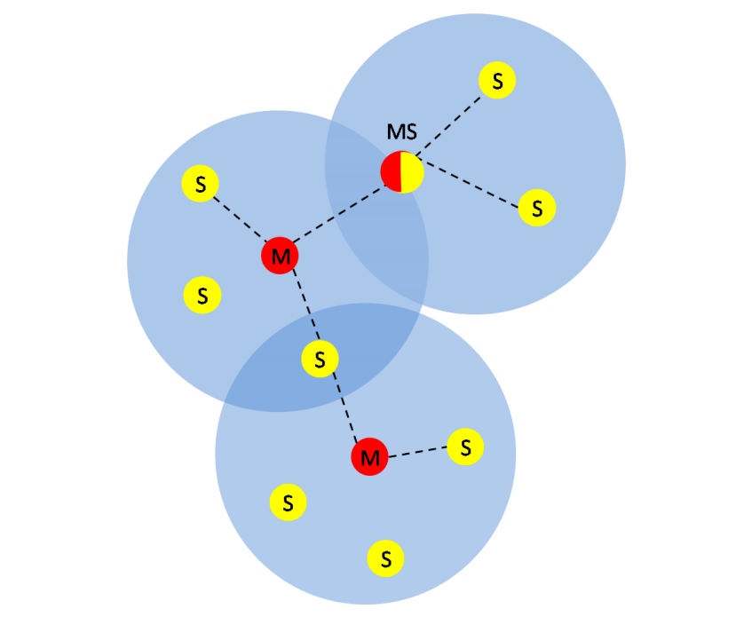
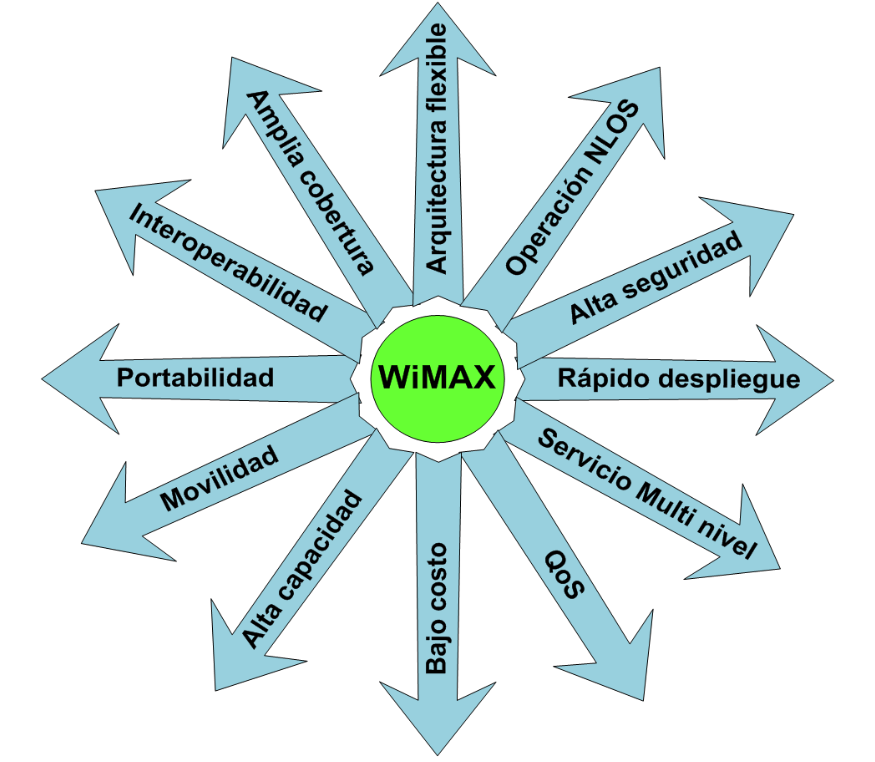
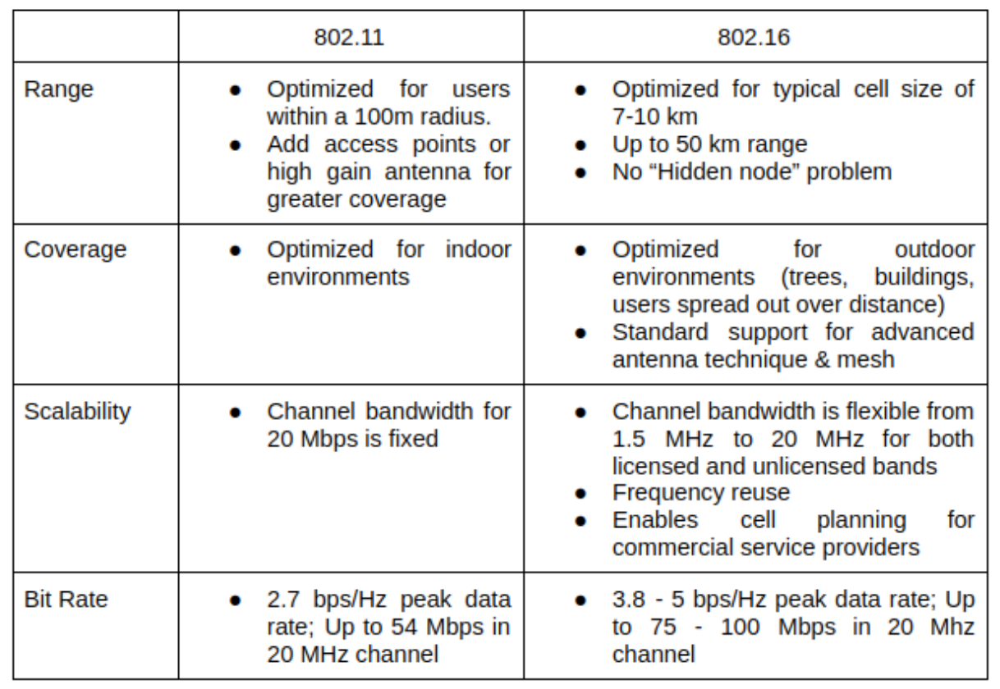

## Introducción
Los estándares son documentos que establecen especificaciones y procedimientos diseñados para asegurar la funcionalidad, compatibilidad, interoperabilidad y confiabilidad de materiales, productos, métodos y/o servicios.<a href="#1">[1]</a> En el ámbito de la tecnologı́a, la organización responsable del desarrollo y actualización de estándares es el Instituto de Ingenieros Eléctricos y Electrónicos (IEEE, por sus siglas en inglés). 

En este trabajo de investigación se revisará la familia de normas **IEEE 802**. La autorización para este proyecto fue solicitada en Diciembre de 1979 y aprobada el 13 de Marzo del siguiente año. Desde entonces, el Comité de Estándares IEEE 802 LAN/MAN (LMSC) desarrolla los estándares y protocolos para redes personales, locales y metropolitanas. Los grupos de trabajo designados a este proyecto consideran princopalmente las dos primeras capas del modelo de referencia OSI.

## Estándar 802.11
* **Tipo de red en la que se utiliza:** LAN
* **Fecha de publicación:** 1997
* **Estado:** Activo

IEEE 802.11 sin lugar a dudas es uno de los estándares más importantes. Hoy en dı́a existen incontables dispositivos basados en estos protocolos. En un inicio, 802.11 fue desarrollado para sistemas de radio usando espectro sin licencia; por lo tanto, dichos sistemas de radio pueden ser usados en cualquier lugar y momento. Debido a su inherente simplicidad, es el estándar dominante en los sistemas comerciales de comunicación inalámbrica.

En el modelo de referencia IEEE 802.11 se divide la capa *Data Link* del modelo OSI en las capas *Logical Link Control* (LLC) y *Medium Access Control* (MAC). Define la capa fı́sica (PHY) como dos subcapas: *Physical Layer Convergence Protocol* (PLCP) y *Physical Media Dependent* (PMD). <a href="#2">[2]</a> 

    
    
Figura 1. Comparación entre los modelos de referencia OSI e IEEE 802.11 <a href="#2">[2]</a>

La subcapa PMD es responsable de enviar y recibir información desde el canal inalámbrico y define el esquema de transmisión, mientras que la subcapa PLCP adapta las peticiones MAC para el medio fı́sico.<a href="#2">[2]</a>

Originalmente, 802.11 tenı́a dos variaciones en la tecnologı́a de la capa fı́sica:
FHSS (Frequency Hopping Spread Spectrum) y DSSS (Direct Sequence Spread Spectrum). Como este conjunto de protocolos se ha mantenido en constante evolución,
ahora existen más alternativas y mejoras en las originales respecto a su frecuencia
y velocidad. Por ejemplo, gracias a 802.11b, 802.11a y 802.11g es posible implementar infrarrojo y otras técnicas de Spread Spectrum como OFDM (Orthogonal
Frequency-Division Multiplexing). <a href="#3">[3]</a>

    
    
Figura 2. Capa física del modelo de referencia IEEE 802.11 <a href="#3">[3]</a>

### Variantes de 802.11

Dentro de IEEE han existido diferentes equipos de trabajo encargados de investigar, actualizar y desarrollar temas relacionados con 802.11. Algunos de ellos son
los siguientes: <a href="#4">[4]</a>

* **802.11a**: Está especificado para tener una velocidad de 54 Mbps en una banda
de 5GHz, aunque usualmente la comunicacion se da a 6, 12 o 24 Mbps. Es
incompatible con los estándares 802.11b y 802.11g.

* **802.11b**: Tiene una velocidad de transmisión máxima de 11 Mbps en una
banda de 2.4GHz. Sin embargo, está diseñado para ser retrocompatible con
estándares 802.11 previos que manejen velocidades de 1, 2 y 5.5 Mbps.

* **802.11g**: Es uno de los estándares más populares. Posibilita la comunicación
a distancias de aproximadamente 150 pies a una velocidad de hasta 54 Mbps.
Es compatible con 802.11b porque también maneja una banda de 2.4GHz.

* **802.11n**: Su objetivo es incrementar el rendimiento en rangos de frecuencia
de 2.4 y 5GHz. En condiciones ideales se puede alcanzar una velocidad de 600
Mbps aunque en la práctica esta velocidad sea mucho menor.

    
    
Figura 3. Tabla comparativa de las variaciones de 802.11 <a href="#4">[4]</a>

## Estándar 802.15

* **Tipo de red en la que se utiliza**: PAN
* **Fecha de publicación**: 2002
* **Estado**: Activo

Este grupo de trabajo está especializado en redes inalámbricas de área personal. En 2011, este estándar se dividı́a en cinco subgrupos:

* 802.15.1 - WPAN / Bluetooth
* 802.15.2 - Coexistencia
* 802.15.3 - WPAN de alta velocidad / UWB
  * 802.15.3a - PHY alternativa para WPAN de alta velocidad
  * 802.15.3b - Revisión MAC
  * 802.15.3c - PHY alternativa de onda milimétrica
* 802.15.4 - WPAN de baja velocidad / ZigBee
  * 802.15.4a - PHY alternativa
  * 802.15.4b - Revisiones y mejoras
* 802.15.5 - Redes en malla

A continuación una breve explicación de cada uno, y al final, un vistazo a los
estándares más interesantes de acuerdo a los objetivos de este trabajo: Bluetooth,
UWB y ZigBee <a href="#5">[5]</a>.

### WPAN / Bluetooth

Estándar basado en la especificación 1.1 de la tecnologı́a Bluetooth. Incluye el nivel fı́sico (PHY) y el control de acceso al medio.

### Coexistencia 

Estudia los posibles problemas entre las WPAN con dispositivos que utilicen
bandas de frecuencia no reguladas como las sredes basadas en algunas variantes de
802.11

### WPAN de Alta Velocidad / UWB

Define los niveles PHY y MAC para WPAN’s de alta velocidad (11-55 Mbps)

#### PHY Alternativa Para WPAN de Alta Velocidad

Se intentaron mejoras a nivel fı́sico de la tecnologı́a Ultra-WideBand en comu-
nicaciones multimedia.

#### Revisión MAC

Desarrollo de mejoras para la implementación e interoperabilidad del control de
acceso al medio.

#### PHY alternativa de onda milimétrica

Desarrollo de una PHY basada en ondas milimétricas (57-64 GHz de banda no
regulada). Permite una coezistencia muy alta con todos los sitemas de microondas
de 802.15 con velocidades mayores a 3 Gbps.

### WPAN de Baja Velociadad / ZigBee

Define las capas PHY y MAC e WPAN’s con tasas bajas de transmisión (LR-WPAN)

#### PHY Alternativa

Tiene el objetivo de permitir comunicaciones y facilidades de localización de alta
precisión (un metro, aproximadamente), aumentar la productividad y reducir las
necesidades energéticas.

#### Revisiones y Mejoras

Pretende resolver ambigüedades y reducción de la complejidad; incrementar la
flexibilidad en el uso de claves de seguridad y considera nuevos rangos de frecuencia.

    
    
Figura 4. Comparación entre protocolos de 802.11 y 802.15 <a href="#6">[6]</a>

### Bluetooth

Se basa en un sistema de radio diseñado para corto alcance y dispositivos económi-
cos. Su finalidad es reemplazar los cables para los periféricos de las computadoras.
Dos topologı́as se definen en este estándar: Piconet y Scatternet.<a href="#6">[6]</a>

#### Características de Piconet

* Es una WPAN conformada por un dispositivo Bluetooth maestro y uno o más
dispositivos Bluetooth esclavos.

* Un canal con salto de frecuencia basado en la dirección del maestro define a
cada Piconet.

* Todos los dispositivos que participan en la comunicación están sincronizados
mediante el reloj del maestro.

* Los esclavos se comunican con su maestro utilizando una conexión punto a
punto controlada por el maestro.

* Las transmisiones del maestro pueden ser punto a punto o punto a multipunto.
Un dispositivo esclavo puede entrar en modo de espera para reducir los con-
sumos de energı́a.

#### Características de Scatternet

* Es una colección de Piconets.
   
* Dos Piconets pueden interconectarse para formar una Scatternet.
Un dispositivo Bluetooth puede participar en más de una Piconet al mismo
tiempo; por lo tanto, la información puede fluı́r más allá del área que cubre
alguna Piconet.
* Un dispositivo en una Scatternet puede ser esclavo en varias Piconets pero
sólo puede tomar el rol de maestro en una sola.

    
    
Figura 5. Piconets y Scatternets

### UWB

Utilizado en redes inalámbricas interiores de corto alcance y de alta velocidad.
Su ancho de banda es de 110 hasta 480 Mbps, lo cual puede satisfacer la mayorı́a de
las aplicaciones multimedia como el envı́o de audio y video en redes caseras; además,
funciona como un reemplazo inalámbrico del bus serial como los USB 2.0 e IEEE

### ZigBee

Define las especificaciones para WPAN’s de baja velocidad (LR-WPAN) en dispositivos con un consumo mı́nimo de energı́a dentro de un espacio operativo personal
(POS) de 10 metros.

#### Características 

* Dos dispositivos diferentes pueden participar en una red LR-WPAN: Dispositivo con todas las funcionalidades (FFD) y Dispositivo con funcionalidades
reducidas (RFD).

* Un dispositivo FFD puede operar en tres modos: Coordinador PAN, Coordinador o Dispositivo.

* Un FFD puede comunicarse con otros FFD’S o con RDF’s, mientras que un
RFD solamente puede comunicarse con un FFD.

* Los RFD está destinado a tareas extremadamente simples, por ejemplo, sensores infrarrojos pasivos por lo que no necesitan enviar grandes cantidades de
información y puede ser que únicamente necesite estar relacionado con un solo
FFD a la vez.

* Justo después de que un FFD se activa por primera vez, establecerá su propia
red y se convertirá en coordinador PAN.

* Todas las redes de estrella consideradas operan independientemente de otras
que estén activas, esto se logra eligiendo un identificador PAN que no esté
siendo usado por ninguna otra rd en el radio de influencia.

* Una vez que un identificador PAN es elegido, el coordinador PAN puede per-
mitir que otros dispositivos se unan a su red.

* Un RFD se deberá conectar a una red árbol como nodo hoja porque única-
mente puede estar asociado con un FFD a la vez.

* Cualquier FFD puede tomar el rol de coordinador y sincronizar los servicios
con otros dispositivos o coordinadores.

* Únicamente uno de estos coordinadores puede ser el coordinador PAN, el cual
podrá tener mayores recursos computacionales que todos los demás dispositivo
en la PAN.

## Estándar 802.16

* **Tipo de red en la que se utiliza**: MAN
* **Fecha de publicación**: 2001
* **Estado**: Parcialmente activo

El grupo de trabajo IEEE 802.16 es responsable del desarrollo de estándares y
recomendaciones prácticas para dar soporte al desarrollo y uso de las redes inalámbricas de área metropolitana. En su versión del 2004, especifica una interfaz de radio
aérea para sistemas de accerso inalámbrico de banda ancha incluyendo la capa de
control de acceso al medio y distintas especificaciones de capa fı́sica para sistemas
BWA fijos (Broadband Wireless Access) soportando múltiples servicios. <a href="#7">[7]</a>

### WiiMax

*Worldwide Interoperability for Microwave Access* es una tecnologı́a estrechamente relacionada con el estándar en cuestión. Surge en 2001 debido a la necesidad de
verificar aspectos como la compatibilidad e interoperabilidad de los sistemas basados en IEEE 802.16. En la práctica WiiMAX y el estándar IEEE 802.16 suelen ser
intercambiables. Algunas de sus caracterı́sticas son las siguientes <a href="#8">[8]</a>

* Puede usarse en bandas licenciadas (2.3GHz y 3.5GHz) para transmisiones a
larga distancia y en bandas no licenciadas entre 5.8GHz y 10GHz.

* Puede cubrir distancias muy amplias (15km en condiciones NLOS y 50km en
condiciones LOS, aproximadamente).

* Tiene una tasa de transmisión de hasta 128 Mbps.
  
* Es escalable y puede acoplarse con sistemas WiFi.

* Soporta aplicaciones como video y voz en un mismo canal.
 
* Es más económica que las redes cableadas.
  
* Implementa mecanismos de antenas inteligentes, los cuales mejoran la eficiencia espectral en sistemas inalámbricos y distintos tipos de antenas.

* Es posible dotar a un edificio de una antena convirtiéndolo en una SS (Subscriber Station) y hacer que se comunique con una BS (Base Station). Ası́ los
usuarios pueden conectarse directamente a la BS pasando por la SS o bien
conectarse directamente a la BS.

    
    
Figura 6. Características WiiMax

Con el estándar IEEE 802.16e del 2005 se buscaba dotar de movilidad a esta
tecnologı́a. De este modo una misma red puede soportar accesos fijos, nomádas y
móviles (velocidad de desplazamiento de hasta 180 km/hr). El objetivo más ambicioso de WiiMax es la interoperabilidad con la mayor parte de los estándares
existentes. Esta tecnologı́a no entra en conflicto con Wi-Fi pues utilizan el mismo
protocolo LLC (Logical Link Control, estandarizado en IEEE 802.2) que la mayorı́a
de redes LAN o WAN.

    
    
Figura 6. Breve comparación entre IEEE 802.11 e IEEE 802.16 <a href="#7">[7]</a>

## Conclusión

Como vimos en este trabajo, existen múltiples estándares para las telecomunicaciones. Cada uno de ellos atiende cuestiones para diferentes tipos de redes; por
lo tanto, su elección depende de la aplicación a implementar. Resulta vital para los
proveedores conocer dichos estándares, pues simplifica el desarrollo de los productos
y por ende, minimiza el tiempo necesario para que salgan al mercado; además, la
aplicación de estos conjuntos de protocolos es la única manera de asegurar y verificar que los servicios cumplan con los requisitos fundamentales de interconectividad,
interoperabilidad y confiabilidad demandados en el mercado global.

## Referencias

[1] Beyond Standards, (2011), <i>What are Standards? Why are They Important?</i>, Recuperado el 8 de Octubre del 2020 de <a href="https://beyondstandards.ieee.org/general-news/what-are-standards-why-are-they-important/">https://beyondstandards.ieee.org/general-news/what-are-standards-why-are-they-important/</a>

[2] Walke, B., Mangold, S., y Berlemann, L., (2006), <i>IEEE 802 Wireless Systems Protocols, Multi-Hop, Mesh/Relaying, Performance and Spectrum Coexistence</i>,
Chichester, Inglaterra, John Wiley & Sons Ltd.

[3] Yunquera, J., <i>Diseño de una red Wi-Fi para la E.S.I</i> (Proyecto de fin de carrera). Universidad de Sevilla, España, Recuperado el 9 de Octubre del 2020 de:
<a href="http://bibing.us.es/proyectos/abreproy/11138/direccion/memoria">http://bibing.us.es/proyectos/abreproy/11138/direccion/memoria</a>

[4] Harwood, M., (2009), <i>CompTIA Network+</i>, Estados Unidos de América, Pearson Education Inc.

[5] Martı́nez, A., (2011), <i>Otros sistemas de acceso inalámbrico</i>, Universidad Politécnica de Valencia, España.

[6] Lee, J., Su, Y., y Shen, C., (2007) <i>A Comparative Study of Wireless Protocols: Bluetooth, UWB, ZigBee, and Wi-Fi</i>. The 33rd Annual Conference of the IEEE Industrial Electronics Society (IECON), 46-51.

[7] Malpartida, G., <i>Simulador de nivel MAC y comparativa de mecanismos en ARQ en el estándar IEEE 802.16</i> (Proyecto de fin de carrera), Universidad de Sevilla, España. Recuperado el 9 de Octubre del 2020 de: <a href="http://bibing.us.es/proyectos/abreproy/11539/direccion/Volumen1%252F">http://bibing.us.es/proyectos/abreproy/11539/direccion/Volumen1%252F</a>

[8] <i>Comparación de la eficiencia volumétrica entre redes inalámbricas Wifi y WiiMAX</i>. Capı́tulo 4. Estándar IEEE 802.16 WiiMAX, Universidad Autónoma de México, México.

