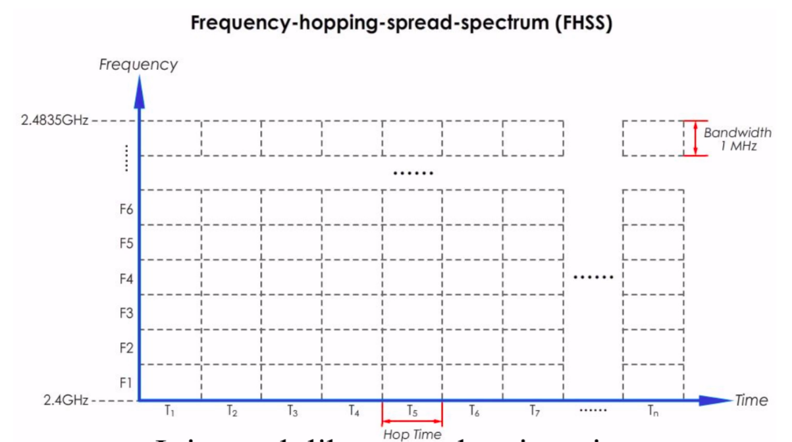
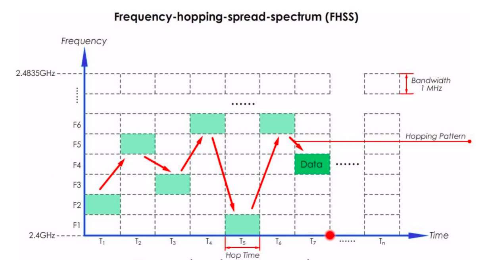
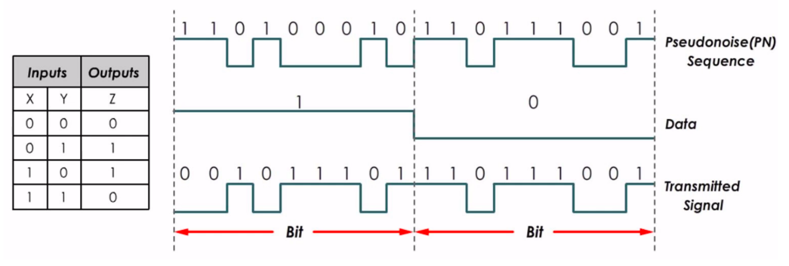
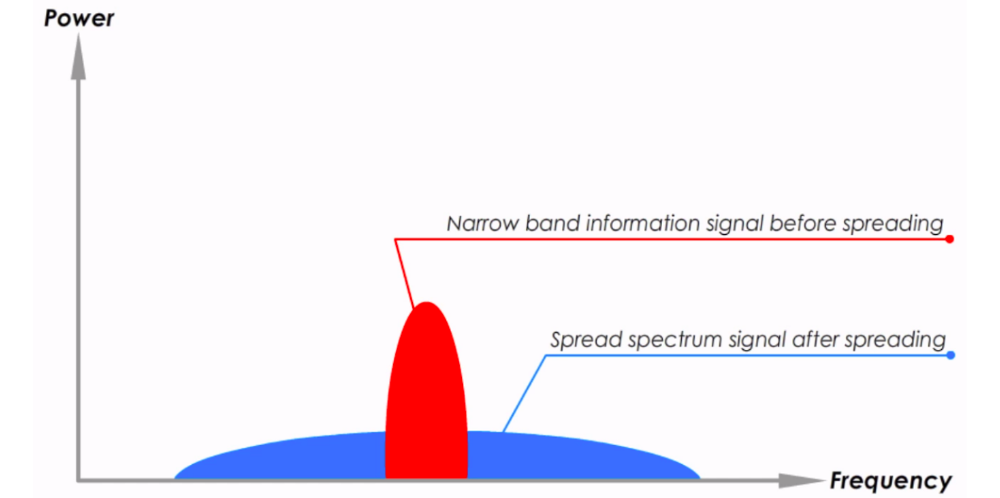

## Introducción

Las técnicas de Spread Spectrum (espectro ensanchado) son método de modulación que se aplican a señales digitales, la idea fundamental es transmitir intencionalmente con un ancho de banda mucho más alto que el necesario. Sus principales ventajas son la resistencia a las interferencias y al ruido. Es importante minimizar estos problemas ya que pueden comprometer la velocidad de transmisión y la seguridad de los datos. En este post se presentan dos procesos: Direct Sequence Spread Spectrum (DSSS) y Frequency Hopping Spread Spectrum (FHSS).

## Frequency Hopping Spread Spectrum

Este método fue presentado en la versión inicial de IEEE 802.11 donde se especifica que las velocidades
de transmisión deben ser de 1 y 2 Mbps, y que debe operarse en el rango de frecuencias de 2.4 GHz.

Para su funcionamiento, la banda de frecuencias de 2.4 GHz se divide en 79 canales de 1 MHz de ancho
cada uno. Además, el flujo de tiempo se divide en segmentos pequeños llamados *Hop Times*.

    
    
Figura 1. Esquema de FHSS <a href="#1">[1]</a>

La información se envı́a en una frecuencia diferente a la vez utilizando algún patron denominado *Hopping Pattern* el cual es **conocido únicamente por el Sender y Receiver**.

    
    
Figura 1. Flujo de FHSS <a href="#1">[1]</a>

Este método es utilizado, por ejemplo, en aplicaciones militares, telefonı́a inalámbrica y GPS.

## Direct Sequence Spread Spectrum

Este es una de las tecnologı́as de espectro ensanchado más usadas, de hecho, la mayorı́a de los dispositivos WLAN en el mercado la utilizan. Su popularidad se debe a su fácil implementación y altas velocidades en la transmisión de datos. 

Este método combina las señales originales y secuencias de bits con velocidades más altas; dichas secuencias se conocen como *Pseudoruido o Chips*. Ası́, cada bit se codifica y la señal se distribuye en una banda de frecuencia mucho más ancha.

    
    
Figura 3. Ejemplo de DSSS con XOR <a href="#2">[2]</a>

Los principales beneficios de este método son el aumento en el ancho de banda y la transmisión de datos codificados, esta última razón podrı́a explica por qué la gran mayorı́a de las aplicaciones de DSSS pertenecen al ámbito militar.

## ¿Cómo Ayudan Estas Técnicas a Reducir las Interferencias?
Las bandas estrechas son fáciles de interferir ya que toda la información fluye por ese mismo camino angosto y sin variaciones. Es como si conduciéramos sobre una avenida concurrida en hora pico, nos desplazarı́amos muy lento y la probabilidad de accidentes es alta. En cambio, gracias a los métodos de Spread Spectrum, la información se propaga sobre un canal más ancho permitiendo generar señales con potencias bajas parecidas a ruido y que fluyen con mayor rapidez.

    
    
Figura 4. Transformación de las señales <a href="#2">[2]</a>

## Conclusión

En el envı́o de señales inalámbricas uno de los problemas principales es la interferencia. Esta interferencia puede ser intencional o no intencional, en cualquiera de los casos la información se ve comprometida y deben tomarse acciones al respecto. Las técnicas de Spread Spectrum son de gran utilidad para afrontar dicho problema.

## Referencias

[1] Sunny, S. [Sunny Classroom]. (2018, Septiembre 21). <i>FHSS - Frequency Hopping Spread Spectrum</i>. [Archivo de video] Recuperado de <a href="https://www.youtube.com/watch?v=CkhA7s5GIGc">https://www.youtube.com/watch?v=CkhA7s5GIGc</a>

[2] Sunny, S. [Sunny Classroom]. (2018, Septiembre 23). <i>DSSS - Direct Sequence Spread Spectrum</i>. [Archivo de video] Recuperado de <a href="https://www.youtube.com/watch?v=-1mxYWvfVWQ">https://www.youtube.com/watch?v=-1mxYWvfVWQ</a>

