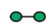
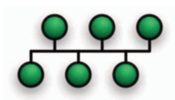
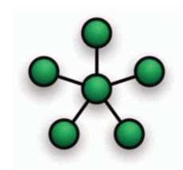
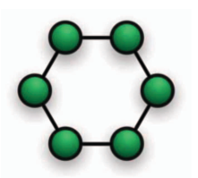
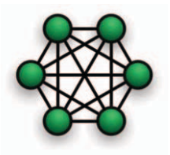
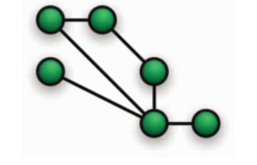

## Introducción
Una ***red de computadoras*** es un ***conjunto de computadoras autónomas interconectadas por un medio.*** Decimos que dos computadoras están interco-
nectadas si son capaces de intercambiar información.[[1]](#bibliografia)

Gracias al rápido desarrollo de la Internet, y la computación en general, las redes
de computadoras han impactado profundamente en casi todos los aspectos de nuestra vida cotidiana y la industria. Todos los sistemas tienen sus propias prioridades
e intereses, por ejemplo, algunas aplicaciones necesitan permanecer disponibles la
mayor cantidad de tiempo posible, mientras que otras se dedican a brindar servicios
de alta velocidad; a su vez, cada sistema cuenta con recursos de hardware diferentes
y sus niveles de optimización respecto al uso de éstos pueden variar. Esta tecnologı́a
se aplica cada vez en más áreas de muy diversa ı́ndole y debido a esa variedad en la
naturaleza de los problemas es racional pensar en diferentes formas de solucionarlos.

Uno de los factores de las redes de computadoras que impacta directamente en
el desempeño de los sistemas, y que es imposible dejar pasar por alto al momento
de diseñarlas, son las topologı́as. Existen ocho topologı́as básicas: Punto a punto,
Bus, Estrella, Anillo, Malla, Árbol, Hı́brida y Daisy Chain. [[2]](#bibliografia)

## Definición de Topología de Red

El término ***topologı́a de red*** se refiere a la **forma en la que las computadoras o estaciones de trabajo (nodos) están interconectadas en la red**
[[3]](#bibliografia).

Podemos hablar de dos tipos de topologı́a: fı́sica y lógica. La primera se refiere
al diseño fı́sico de la red, es decir, a la manera en la que los dispositivos están fı́sica-
mente conectados a través de alambres y cables 1 o enlaces directos de comunicación
inalámbrica 2 . En cambio, la topologı́a lógica de una red se refiere a la manera en
la que la información fluye de un nodo a otro sin tener en cuenta la interconexión
fı́sica de los dispositivos.[[4]](#bibliografia)

## Topologías de Red

### Topología Punto a Punto

    
    
Figura 1. Topología punto a punto <a href="#bibliografia">[5]</a>

* **Estándar:** IEEE 802.15.4

También llamada *P2P*, esta es la topologı́a más simple. Consta únicamente de
dos dispositivos conectados directamente el uno con el otro [[4]](#bibliografia). Cada dispositivo
puede ser emisor o receptor en momentos diferentes; es decir, los roles son intercam-
biables entre ellos.

* **Ventajas**
  * Muy fáciles de configurar.
  * Complejidad reducida debido al número de dispositivos interconectados.
  * Red sencilla y barata.
* **Desventajas**
  * No tienen un rendimiento competitivo.
  * Nula tolerancia a fallas. Si falla uno de los equipos o el medio de comunicación, la red completa se detiene.

### Topología Bus

    
    
Figura 2. Topología bus <a href="#bibliografia">[5]</a>

* **Estándar:** IEEE 802.3

Esta topologı́a es ampliamente usada en redes LAN y es la forma más sencilla de
interconectar varias computadoras. Aquı́ cada nodo está conectado a un único canal
de comunicaciones (comúnmente es un cable) llamado bus y no existen conexiones
entre equipos. Al contar con un solo canal de comunicación compartido, todos los
nodos pueden conocer la información que se transmite; además, por esta misma
razón, pueden ocurrir problemas al momento de que dos equipos intenten transmitir
al mismo tiempo. [[3]](#bibliografia) Un dato importante es que las señales pueden transferirse en
ambos sentidos usando un cables bidireccionales [[2,6]](#bibliografia)

* **Ventajas [[3,6]](#bibliografia)**
  * Fácil implementación.
  * Fácil de extender.
  * Barato debido a la poca cantidad de cables necesarios para conectar los nodos.
  * Conveniente y fácil de usar para redes pequeñas o temporales.
* **Desventajas [[3,6]](#bibliografia)**
  * Mucho tráfico de información puede ralentizar el desempeño de la red porque solo cuenta con un canal de comunicación.
  * Dificultad para administrar porque se necesita un mecanismo de arbitraje
para evitar o minimizar colisiones de información cuando varios equipos
transmiten al mismo tiempo.
  * Una falla en el bus detiene totalmente la transmisión de la red.

### Topología Estrella

    
    
Figura 3. Topología estrella <a href="#bibliografia">[5]</a>

* **Estándar:** IEEE 802.15.4

La topologı́a estrella también es muy usada en redes LAN. En este caso, todos
los equipos están conectados a un mismo dispositivo central 3 llamado nodo maestro
que actúa como servidor; las demás computadoras se conocen como nodos esclavos
y toman el rol de clientes. Es importante señalar que no existen interconexiones
entre los nodos esclavos, por lo tanto, únicamente pueden comunicarse con el nodo
maestro y la comunicación entre clientes requiere que toda la información pase a
través del dispositivo central. [[2,4]](#bibliografia)

* **Ventajas [[3,4]](#bibliografia)**
  * Estructura simple.
  * Baja latencia y ancho de banda alto.
  * Bajo consumo de energı́a por parte de los nodos esclavos
  * Sistema centralizado.
  * Facilidad para detectar fallas porque cada nodo esclavo cuenta con exactamente una interfaz de comunicación.
  * Es fácil agregar nodos esclavos a la red.
* **Desventajas [[3,4]](#bibliografia)**
  * Dependencia total del nodo maestro. Si éste falla, la red completa deja de funcionar.
  * Consumo asimétrico de energı́a ya que el nodo maestro tiene un consumo
mucho más alto que los nodos esclavos.
  * Comunicación ineficiente entre nodos esclavos.
  * El costo de instalación puede resultar elevado si se necesitan muchos
nodos esclavos.

### Topología Anillo

    
    
Figura 4. Topología anillo <a href="#bibliografia">[5]</a>

* **Estándar:** IEEE 802.5

En esta topologı́a cada nodo se conecta con exactamente otros dos nodos ( anterior y el siguiente) mediante una conexión punto a punto. [[3](#bibliografia) De esta manera, cada dispositivo tiene una única conexión de entrada y otra de salida. Una caracterı́stica importante es que la información fluye en un solo sentido, por lo que es necesario que los datos pasen a través de varios nodos hasta llegar a su destino. Existen algunas variaciones como la topologı́a de anillo doble en donde la comunicación es bidireccional.

* **Ventajas [[3]](#bibliografia)**
  * Presenta un mejor desempeño que la topologı́a bus.
  * El funcionamiento no depende de un solo nodo como en la topologı́a estrella.
  * Es relativamente fácil de configurar ya que todas las interconexiones son punto a punto.
  * Si se utilizan pocos nodos su desempeño es alto
  * Si se utilizan muchos nodos con cargas de trabajo similares también pre- senta un buen desempeño
  * Es fácil de extender.
* **Desventajas**
  * Aunque es fácil de extender, el hecho de agregar, remover o incluso reaco- modar los nodos puede afectar la red completa
  * Es un poco más difı́cil de configurar que una topologı́a bus o estrella, en especial cuando el número de nodos es muy grande
  * La información debe pasar por varios equipos, por lo que no es muy recomendable si la red debe contar con un nivel considerable de privacidad.

### Topología Malla

    <table style="width:100%">
        <tr>
            <th></th>
            <th></th>
        </tr>
        <tr>
            <td></td>
            <td></td>
        </tr>
        <tr>
             <td>
Figura 5. Topología malla completa <a href="#bibliografia">[5]</a>
</td>
             <td>
Figura 6. Topología malla parcial <a href="#bibliografia">[5]</a>
</td>
        </tr>
    </table>
    

* **Estándar:** IEEE 802.15

La topologı́a malla puede catalogarse en dos dependiendo del número de interconexiones (punto a punto) entre los dispositivos. En una malla completa cada nodo se encuentra interconectado con todos los demás, resultando en un total de $\frac{n(n-1)}{2}$ conexiones.[[2]](#bibliografia) Por otro lado, en una malla parcial, algunos dispositivos no necesariamente se encontrarán interconectados con los restantes.

* **Ventajas [[2,3,4]](#bibliografia)**
  * Comunicación sencilla (punto a punto).
  * Mayor privacidad. La información no necesariamente debe viajar por to- dos los nodos para llegar a su destino.
  * Alta tolerancia a fallas gracias a su redundancia y su control descentra- lizado. Si un nodo presenta problemas, la información puede llegar a su destino por medio de una ruta alterna.
  * Con una malla parcial se puede implementar cierto grado de redundancia sin la necesidad de interconectar todos los nodos.
  * Puede cubrir áreas grandes.
  * El consumo de energı́a de los nodos puede balancearse.

* **Desventajas [[3,4]](#bibliografia)**
  * El costo del cableado puede llegar a ser bastante alto.
  * La complejidad de la red puede llegar a ser grande debido al número de interconexiones.
  * Alta latencia y bajo ancho de banda.
  

## Bibliografia

[1] Tanenbaum, A., (2003). Computer Networks, Fourth edition, Upper Saddle River, Estados Unidos de América, Prentice Hall.

[2] Liu, Q. y Liu, Q., (2014) A Study on Topology in Computer Network 2014 7th
International Conference on Intelligent Computation Technology and Automa-
tion, 45-48.

[3] Bisht, N., y Singh, S., (2015) ANALYTICAL STUDY OF DIFFERENT NET-
WORK TOPOLOGIES International Research Journal of Engineering and Tech-
nology (IRJET), 02(01), 88-90.

[4] Espina J., Falck T., Panousopoulou A., Schmitt L., Mülhens O., y Yang
GZ., (2014) Network Topologies, Communication Protocols, and Stan-
dards. In: Yang GZ. (eds) Body Sensor Networks. Springer, London.
<https://doi.org/10.1007/978-1-4471-6374-9_5>

[5] Network Topologies, (2015), Types of network topologies [Imagen], LMN
Techno Hub Blogs, <https://lmntechnohub.blogspot.com/2015/01/network-topology.html>

[6] Rivera, H., Orellana, I., y Recarte, J., (2017). Clasificación de las redes., <https://clasificaciondelasredesblog.wordpress.com/segun-su-topologia/>

[7] Notas de topologı́as hı́bridas. MIT, (s.f), <https://blossoms.mit.edu/sites/default/files/video/download/Notes-on-Hybrid-topology.pdf>

[8] Daisy Chain Network, (s.f), <https://www.educba.com/daisy-chain-network/>

