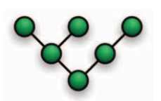
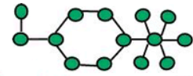
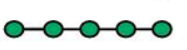

## Introducción
Una ***red de computadoras*** es un ***conjunto de computadoras autónomas interconectadas por un medio.*** Decimos que dos computadoras están interconectadas si son capaces de intercambiar información.<a href="#1">[1]</a>

Gracias al rápido desarrollo de la Internet, y la computación en general, las redes
de computadoras han impactado profundamente en casi todos los aspectos de nuestra vida cotidiana y la industria. Todos los sistemas tienen sus propias prioridades
e intereses, por ejemplo, algunas aplicaciones necesitan permanecer disponibles la
mayor cantidad de tiempo posible, mientras que otras se dedican a brindar servicios
de alta velocidad; a su vez, cada sistema cuenta con recursos de hardware diferentes
y sus niveles de optimización respecto al uso de éstos pueden variar. Esta tecnologı́a
se aplica cada vez en más áreas de muy diversa ı́ndole y debido a esa variedad en la
naturaleza de los problemas es racional pensar en diferentes formas de solucionarlos.

Uno de los factores de las redes de computadoras que impacta directamente en
el desempeño de los sistemas, y que es imposible dejar pasar por alto al momento
de diseñarlas, son las topologı́as. Existen ocho topologı́as básicas: Punto a punto,
Bus, Estrella, Anillo, Malla, Árbol, Hı́brida y Daisy Chain. <a href="#2">[2]</a> En este trabajo, se exponen las diferentes topologı́as de red, sus diseños, estándares, funcionamiento, ası́ como sus ventajas y desventajas.

## Definición de Topología de Red

El término ***topologı́a de red*** se refiere a la **forma en la que las computadoras o estaciones de trabajo (nodos) están interconectadas en la red.**
<a href="#3">[3]</a>

Podemos hablar de dos tipos de topologı́a: fı́sica y lógica. La primera se refiere
al diseño fı́sico de la red, es decir, a la manera en la que los dispositivos están fı́sicamente conectados a través de alambres y cables, o enlaces directos de comunicación inalámbrica. En cambio, la topologı́a lógica de una red se refiere a la manera en la que la información fluye de un nodo a otro sin tener en cuenta la interconexión fı́sica de los dispositivos.<a href="#4">[4]</a>

## Topologías de Red

### Topología Punto a Punto

    
    
Figura 1. Topología punto a punto <a href="#5">[5]</a>

* **Estándar:** IEEE 802.15.4

También llamada *P2P*, esta es la topologı́a más simple. Consta únicamente de
dos dispositivos conectados directamente el uno con el otro <a href="#4">[4]</a>. Cada dispositivo
puede ser emisor o receptor en momentos diferentes; es decir, los roles son intercambiables entre ellos.

* **Ventajas**
  * Muy fáciles de configurar.
  * Complejidad reducida debido al número de dispositivos interconectados.
  * Red sencilla y barata.
* **Desventajas**
  * No tienen un rendimiento competitivo.
  * Nula tolerancia a fallas. Si falla uno de los equipos o el medio de comunicación, la red completa se detiene.

### Topología Bus

    
    
Figura 2. Topología bus <a href="#5">[5]</a>

* **Estándar:** IEEE 802.3

Esta topologı́a es ampliamente usada en redes LAN y es la forma más sencilla de
interconectar varias computadoras. Aquı́ cada nodo está conectado a un único canal
de comunicaciones (comúnmente es un cable) llamado bus y no existen conexiones
entre equipos. Al contar con un solo canal de comunicación compartido, todos los
nodos pueden conocer la información que se transmite; además, por esta misma
razón, pueden ocurrir problemas al momento de que dos equipos intenten transmitir
al mismo tiempo. <a href="#3">[3]</a> Un dato importante es que las señales pueden transferirse en
ambos sentidos usando un cables bidireccionales [[2,6]](#bibliografia)

* **Ventajas [[3,6]](#bibliografia)**
  * Fácil implementación.
  * Fácil de extender.
  * Barato debido a la poca cantidad de cables necesarios para conectar los nodos.
  * Conveniente y fácil de usar para redes pequeñas o temporales.
* **Desventajas [[3,6]](#bibliografia)**
  * Mucho tráfico de información puede ralentizar el desempeño de la red porque sólo cuenta con un canal de comunicación.
  * Dificultad para administrar porque se necesita un mecanismo de arbitraje
para evitar o minimizar colisiones de información cuando varios equipos
transmiten al mismo tiempo.
  * Una falla en el bus detiene totalmente la transmisión de la red.

### Topología Estrella

    
    
Figura 3. Topología estrella <a href="#5">[5]</a>

* **Estándar:** IEEE 802.15.4

La topologı́a estrella también es muy usada en redes LAN. En este caso, todos
los equipos están conectados a un mismo dispositivo central llamado nodo maestro
que actúa como servidor; las demás computadoras se conocen como nodos esclavos
y toman el rol de clientes. Es importante señalar que no existen interconexiones
entre los nodos esclavos, por lo tanto, únicamente pueden comunicarse con el nodo
maestro y la comunicación entre clientes requiere que toda la información pase a
través del dispositivo central. [[2,4]](#bibliografia)

* **Ventajas [[3,4]](#bibliografia)**
  * Estructura simple.
  * Baja latencia y ancho de banda alto.
  * Bajo consumo de energı́a por parte de los nodos esclavos.
  * Sistema centralizado.
  * Facilidad para detectar fallas porque cada nodo esclavo cuenta con exactamente una interfaz de comunicación.
  * Es fácil agregar nodos esclavos a la red.
* **Desventajas [[3,4]](#bibliografia)**
  * Dependencia total del nodo maestro. Si éste falla, la red completa deja de funcionar.
  * Consumo asimétrico de energı́a ya que el nodo maestro tiene un consumo
mucho más alto que los nodos esclavos.
  * Comunicación ineficiente entre nodos esclavos.
  * El costo de instalación puede resultar elevado si se necesitan muchos
nodos esclavos.

### Topología Anillo

    
    
Figura 4. Topología anillo <a href="#5">[5]</a>

* **Estándar:** IEEE 802.5

En esta topologı́a cada nodo se conecta con exactamente otros dos nodos ( anterior y el siguiente) mediante una conexión punto a punto. <a href="#3">[3]</a> De esta manera, cada dispositivo tiene una única conexión de entrada y otra de salida. Una caracterı́stica importante es que la información fluye en un solo sentido, por lo que es necesario que los datos pasen a través de varios nodos hasta llegar a su destino. Existen algunas variantes como la topologı́a de anillo doble en donde la comunicación es bidireccional.

* **Ventajas <a href="#3">[3]</a>**
  * Presenta un mejor desempeño que la topologı́a bus.
  * El funcionamiento no depende de un solo nodo como en la topologı́a estrella.
  * Es relativamente fácil de configurar ya que todas las interconexiones son punto a punto.
  * Si se utilizan pocos nodos su desempeño es alto.
  * Si se utilizan muchos nodos con cargas de trabajo similares también presenta un buen desempeño.
  * Es fácil de extender.
* **Desventajas**
  * Aunque es fácil de extender, el hecho de agregar, remover o incluso reacomodar los nodos puede afectar la red completa.
  * Es un poco más difı́cil de configurar que una topologı́a bus o estrella, en especial cuando el número de nodos es muy grande.
  * La información debe pasar por varios equipos, por lo que no es muy recomendable si la red debe contar con un nivel considerable de privacidad.

### Topología Malla

    <table style="width:100%">
        <tr>
            <th></th>
            <th></th>
        </tr>
        <tr>
            <td></td>
            <td></td>
        </tr>
        <tr>
             <td>
Figura 5. Topología malla completa <a href="#5">[5]</a>
</td>
             <td>
Figura 6. Topología malla parcial <a href="#5">[5]</a>
</td>
        </tr>
    </table>
    

* **Estándar:** IEEE 802.15

La topologı́a malla puede catalogarse en dos dependiendo del número de interconexiones (punto a punto) entre los dispositivos. En una malla completa cada nodo se encuentra interconectado con todos los demás, resultando en un total de $$\frac{n(n-1)}{2}$$ conexiones.<a href="#2">[2]</a> Por otro lado, en una malla parcial, algunos dispositivos no necesariamente se encontrarán interconectados con los restantes.

* **Ventajas [[2,3,4]](#bibliografia)**
  * Comunicación sencilla (punto a punto).
  * Mayor privacidad. La información no necesariamente debe viajar por todos los nodos para llegar a su destino.
  * Alta tolerancia a fallas gracias a su redundancia y su control descentralizado. Si un nodo presenta problemas, la información puede llegar a su destino por medio de una ruta alterna.
  * Con una malla parcial se puede implementar cierto grado de redundancia sin la necesidad de interconectar todos los nodos.
  * Puede cubrir áreas grandes.
  * El consumo de energı́a de los nodos puede balancearse.

* **Desventajas [[3,4]](#bibliografia)**
  * El costo del cableado puede llegar a ser bastante alto.
  * La complejidad de la red puede llegar a ser grande debido al número de interconexiones.
  * Alta latencia y bajo ancho de banda.
  
### Topología Árbol

    
    
Figura 7. Topología árbol <a href="#5">[5]</a>

* **Estándar:** IEEE 802.15.4 (Árbol de clusters)

Las redes en árbol son jerárquicas. En este caso, existe un nodo central llamado raı́z (el nivel más alto en la jerarquı́a). Éste se conecta con uno o más nodos que se encuentran un nivel más abajo de la jerarquı́a, es decir, en el segundo nivel; mientras que cada nodo del segundo nivel está conectado a su vez con uno o más nodos pertenecientes al tercer nivel y ası́ sucesivamente. Un dato importante es que el nodo raı́z es el único que no cuenta con un nodo padre; además sólo existe un “camino” entre dos nodos.[[2,4]](#bibliografia) En esta topologı́a, el medio de comunicación es compartido (de manera similar que en las redes bus) por lo que la información puede propagarse hacia todas las ramificaciones de un nodo. En este sentido, podemos decir que la topologı́a árbol es una especie de combinación de redes en estrella.

* **Ventajas [[3,4]](#bibliografia)**
  * Fáciles de mantener.
  * Fácil detección de fallas.
  * La expansión de los nodos es posible y sencilla.
  * Es una extensión de las topologı́as bus y estrella.
  * Bajo consumo de energı́a por parte de los nodos hoja.
  * Pueden cubrir áreas extensas.
  * Complejidad intermedia. El rerouting es necesario cuando un nodo en el árbol muere.
* **Desventajas [[3,4]](#bibliografia)**
  * Confiabilidad baja. Si un nodo falla, se necesita un rerouting.
  * Alta latencia y bajo ancho de banda.
  * Consumo asimétrico de energı́a. Los nodos hojas consumen mucho menos que los demás nodos.
  * Se necesitan muchas interfaces.
  * Es centralizada. Si falla el nodo raı́z, falla toda la red.

### Topología Híbrida

    
    
Figura 8. Topología híbrida <a href="#5">[5]</a>

* **Estándar:** Sin estándar

Una topologı́a hı́brida es la integración de dos o más topologı́as diferentes. Esta combinación se realiza de acuerdo a los requerimientos de la red. <a href="#7">[7]</a>

* **Ventajas <a href="#7">[7]</a>**
  * Tolerancia a fallas. La parte en la que se detecta la falla puede aislarse y corregirse sin interferir con el funcionamiento de la red completa.
  * Escalable. Es fácil integrar nuevos componentes.
  * Flexible. Pueden diseñarse de acuerdo a requerimientos especı́ficos y buscando optimizar los recursos disponibles. Además, desde el punto de vista del diseño, puede ponerse más atención en los nodos donde el tráfico de información es más alto o en los que la probabilidad de que una falla se presente sea mayor.
  * Eficiente. Pueden combinarse varias topologı́as y heredar las ventajas de cada una.
* **Desventajas <a href="#7">[7]</a>**
  * Complejidad en el diseño. Al tratarse de una combinación de topologı́as es difı́cil diseñarlas y configurarlas de manera eficiente.
  * Hubs costosos. Los precios de los hubs usados para conectar dos redes diferentes son elevados.
  * Mantenimiento costoso. Como las arquitecturas hı́bridas comúnmente se construyen a gran escala, requieren de mucho cableado, sistemas de refrigeración y dispositivos de red sofisticados.

### Daisy Chaining

    
    
Figura 8. Topología Daisy chain <a href="#5">[5]</a>

* **Estándar:** Sin estándar

Más que una topologı́a de red, este es un esquema de cableado en donde múltiples dispositivos están conectados en serie. Por ejemplo, algunos tipos de hardware pueden conectarse a un equipo con una red Daisy Chain asociando cada componente con otro similar, en vez de conectar cada uno directamente al sistema de cómputo. <a href="#8">[8]</a> Este esquema puede transportarse al ámbito de las redes de computadoras al momento de conectar varios equipos diferentes o cuando necesitamos interconectar dos redes diferentes.

## Conclusión
En este trabajo se han presentado las topologı́as básicas de redes de computadora. Cada sistema cuenta con sus propios requerimientos de privacidad, espacio, recursos económicos y de hardware, etc; por ello, es importante conocer las diferentes topologı́as de red pues éstas representan uno de los pilares fundamentales en el diseño de redes y su comprensión nos permitirá decidir cuál distribución es la que mejor se ajusta a las necesidades establecidas.

## Referencias

[1] Tanenbaum, A., (2003). <i>Computer Networks, Fourth edition</i>, Upper Saddle River, Estados Unidos de América, Prentice Hall.

[2] Liu, Q. y Liu, Q., (2014) <i>A Study on Topology in Computer Networks</i> 2014 7th
International Conference on Intelligent Computation Technology and Automa-
tion, 45-48.

[3] Bisht, N., y Singh, S., (2015) <i>ANALYTICAL STUDY OF DIFFERENT NETWORK TOPOLOGIES</i> International Research Journal of Engineering and Tech-
nology (IRJET), 02(01), 88-90.

[4] Espina J., Falck T., Panousopoulou A., Schmitt L., Mülhens O., y Yang
GZ., (2014) <i>Network Topologies, Communication Protocols, and Standards</i>. In: Yang GZ. (eds) Body Sensor Networks. Springer, London.
<a href="https://doi.org/10.1007/978-1-4471-6374-9_5">https://doi.org/10.1007/978-1-4471-6374-9_5</a>

[5] Network Topologies, (2015), <i>Types of network topologies</i> [Imagen], LMN Techno Hub Blogs, <a href="https://lmntechnohub.blogspot.com/2015/01/network-topology.html">https://lmntechnohub.blogspot.com/2015/01/network-topology.html</a>

[6] Rivera, H., Orellana, I., y Recarte, J., (2017). <i>Clasificación de las redes</i>. <a href="https://clasificaciondelasredesblog.wordpress.com/seg<un-su-topologia/">https://clasificaciondelasredesblog.wordpress.com/segun-su-topologia/</a>

[7] <i>Notas de topologı́as hı́bridas</i>. MIT, (s.f), <a href="https://blossoms.mit.edu/sites/default/files/video/download/Notes-on-Hybrid-topology.pdf">https://blossoms.mit.edu/sites/default/files/video/download/Notes-on-Hybrid-topology.pdf</a>

[8] <i>Daisy Chain Network</i>, (s.f), <a href="https://www.educba.com/daisy-chain-network/">https://www.educba.com/daisy-chain-network/></a>

