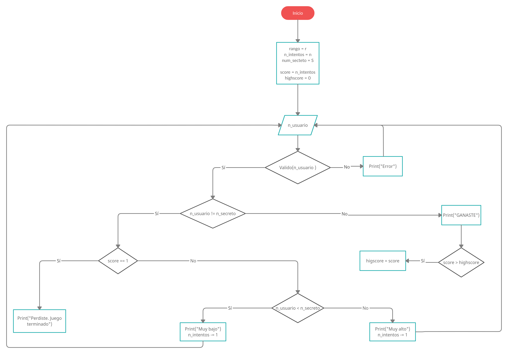

**Adivina el número** es un juego sencillo pero con el que puedes pasar un rato de diversión con tu familia y amigos (¡aún más si existe una apuesta de por medio!). A pesar de su simplicidad, si pensamos en él como un algoritmo a resolver, resulta en un problema divertido y con la suficiente lógica como para poner en práctica nuestros conocimientos de programación y JavaScript.

Las reglas son las siguientes:

1. Se define un rango para elegir un número secreto.
2. Se definen el número de intentos para que el jugador adivine el número.
3. Mientras el usuario tenga intentos disponibles:
   1. El usuario selecciona un número dentro del rango establecido.
      - Si el número del usuario es correcto, entonces el usuario gana y se termina el juego. Su puntuación será el número de intentos que le restan.
      - Si el número del usuario no es correcto, entonces se le da una pista:
        - Si el número del usuario es más grande que el número secreto se le indica que ha introducido un valor **Muy alto**.
        - Si el número del usuario es más pequeño que el número secreto se le indica que ha introducido un valor **Muy bajo**.
4. Cuando el usuario ya no tenga intentos disponibles el usuario pierde y se termina el juego.

Con esta información ya podemos implementar la lógica del juego, sin embargo, existen algunos aspectos importantes que no hemos tomado en cuenta; por ejemplo, ¿qué pasa si el usuario nos da una entrada inválida?, ¿qué pasa si el usuario desea reiniciar el juego?, ¿podríamos implementar un sistema de _Highscore_?.

En el siguiente diagrama de flujo se presenta la lógica del juego y la consideración de los escenarios que acabamos de mencionar.

    
    
Figura 1. Diagrama de flujo del juego "Adivina el número"

   
¡Excelente!. Ahora ya podemos programar el juego. A continuación, un vistazo a la interfaz principal. Si deseas jugarlo <a href="../web_projects/guess_the_number/index.html">Haz click aquí.</a>
 

    
    
Figura 1. Diagrama de flujo del juego "Adivina el número"

