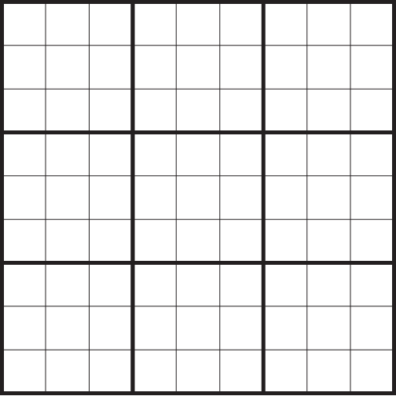

## Prerrequisitos

Para ejecutar el programa necesitas instalar Python en tu dispositivo. Puedes descargar los archivos 
necesarios desde su [sitio oficial](https://www.python.org/downloads/). Si utilizas alguna 
distribución de Linux es muy probable que Python ya se encuentre instalado, si es así, te 
recomiendo actualizarlo porque es probable que tengas una versión desactualizada. 

Aquí unas [guías excelentes](https://realpython.com/installing-python/#how-to-install-python-on-linux)
para la instalación de Python en cualquier sistema operativo.

Si deseas revisar el código fuente original o bien, quieres ejecutar el programa, puedes encontrar 
el proyecto en este [repositorio de Github](https://github.com/Pedro-Hdez/sudoku-python).

## Breve Historia del Sudoku

El Sudoku tal y como lo conocemos hoy en día es un invento relativamente nuevo ¡Incluso es más joven que el mismo cubo de Rubik!. Howard Garns, un inventor de rompecabezas estadounidense lo publicó en la revista de su mismo país titulada *Dell Pencill Puzzles & Word Games* en el año de 1979 bajo el nombre de *Number Place*.

Cinco años después, en 1984 el rompecabezas llega a Japón en donde obtuvo un gran recibimiento; ahí, la comunidad lo acogió con el nombre de **Sudoku**, que es la forma abreviada de la expresión *"Sūji wa dokushin ni kagiru"* que significa *"Los dígitos solo deben aparecer una vez"*.

El responsable del éxito mundial del juego fue el Neozelandés Wayne Gould, quien en 1997 se encontraba vacacionando en Tokio cuando descubrió el juego. A partir de este suceso se dio a la tarea de construir un programa de computadora para generar tableros de Sudoku y comenzó a publicarlos en diarios de Estados Unidos desde donde comenzó a esparcirse a prácticamente todos los rincones del planeta.

## Objetivo y Reglas del Juego

Aunque existen muchas variantes del juego, nos centraremos en el original, el cual, es muy sencillo:

El Sudoku se juega en un tablero cuadrado de 9x9 (81 casillas) dividido en 9 cuadrados internos de 3x3.

|  |
| :----------------------------------------------------------------: |
|                     *Figura 1: Tablero de Sudoku*                      |

El objetivo es rellenar el tablero con los dígitos del 1 al 9 cuidando que cada dígito aparezca una única vez en cada casilla, en cada renglón y en cada cuadrado interno.

