## Prerrequisitos

Para ejecutar el programa necesitas instalar Python en tu dispositivo. Puedes descargar los archivos
necesarios desde su [sitio oficial](https://www.python.org/downloads/). Si utilizas alguna
distribución de Linux es muy probable que Python ya se encuentre instalado; si es el caso, te
recomiendo actualizarlo porque es probable que tengas una versión antigüa.

Aquí unas [guías excelentes](https://realpython.com/installing-python/)
para la instalación de Python en cualquier sistema operativo.

Si deseas revisar el código fuente original, o bien, quieres ejecutar el programa, puedes encontrar
el proyecto en este [repositorio de Github](https://github.com/Pedro-Hdez/sudoku-python).

## Breve Historia del Sudoku

El Sudoku tal y como lo conocemos hoy en día es un invento relativamente nuevo ¡Incluso es más joven que el cubo de Rubik!. Howard Garns, un inventor de rompecabezas estadounidense, lo publicó en la revista de su mismo país titulada _Dell Pencill Puzzles & Word Games_ en el año 1979 bajo el nombre de _Number Place_.

Cinco años después, en 1984 el rompecabezas llega a Japón donde obtuvo un gran recibimiento; ahí, la comunidad lo acogió con el nombre de **Sudoku**, que es la forma abreviada de la expresión _"Sūji wa dokushin ni kagiru"_ que significa _"Los dígitos solo deben aparecer una vez"_.

El responsable del éxito mundial del juego fue el Neozelandés Wayne Gould, quien en 1997 se encontraba vacacionando en Tokio cuando descubrió el juego. A partir de este suceso se dio a la tarea de construir un programa de computadora para generar tableros de Sudoku y comenzó a publicarlos en diarios de Estados Unidos desde donde se propagó a prácticamente todos los rincones del planeta.

## Objetivo del Juego y sus Reglas

Aunque existen muchas variantes del juego, nos centraremos en el original que es muy sencillo:

El Sudoku se juega en un tablero cuadrado de 9x9 (81 casillas) dividido en 9 cuadrados internos de 3x3. Inicialmente se nos proporcionará un tablero semivacío como el que se muestra a continuación:

<div style="text-align:center">
    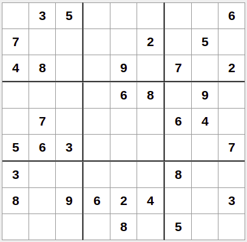
    <p><i>Figura 1. Tablero promedio de Sudoku</i></p>
</div>

El objetivo es terminar de llenar el tablero con los números del 1 al 9 utilizando los valores que ya se encuentran en la cuadrícula para inferir los que faltan. Debemos respetar las siguientes reglas:

- Cada dígito debe aparecer una sola vez en cada renglón.
- Cada dígito debe aparecer una sola vez en cada columna.
- Cada dígito debe aparecer una sola vez en cada cuadrado interno.

### Ejemplo

Si bien hay muy pocas reglas, a veces puede resultar confuso cuando nunca lo hemos jugado. A continuación un ejemplo:

Supongamos que queremos resolver el siguiente tablero (ignorar las casillas sombreadas, son generadas automáticamente por el [software que utilicé para los ejemplos](https://sudoku.com/)):

<div style="text-align:center">
    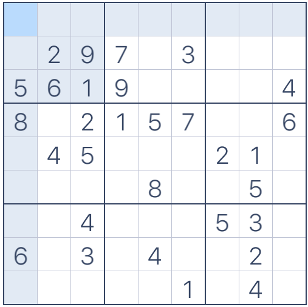
    <p><i>Figura 2. Tablero a resolver</i></p>
</div>

Si nos fijamos en la casilla central del segundo cuadrado interno podemos ver que no es posible colocar un 2 porque otro 2 ya existe en el mismo renglón; también podemos notar que sería un error poner el 5 debido a que otro 5 ya se encuentra colocado en la misma columna. Asimismo, poner un 9 no es válido porque el 9 ya existe en ese cuadrado interno y en el renglón correspondiente:

<div style="text-align:center">
    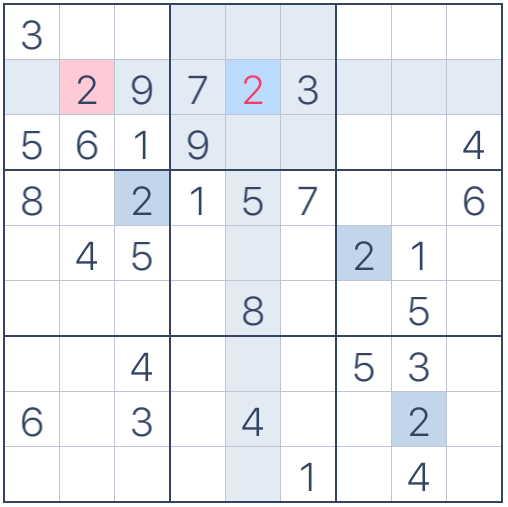
    <p><i>Figura 3. Error: número repetido en el renglón</i></p>
</div>

<br>

<div style="text-align:center">
    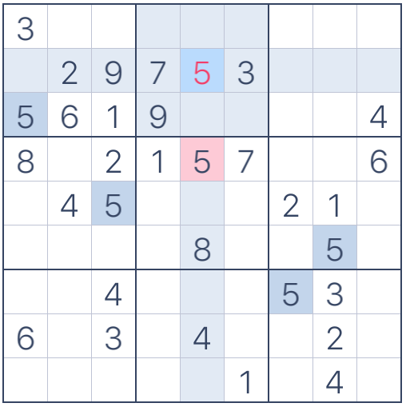
    <p><i>Figura 4. Error: número repetido en la columna</i></p>
</div>

<br>

<div style="text-align:center">
    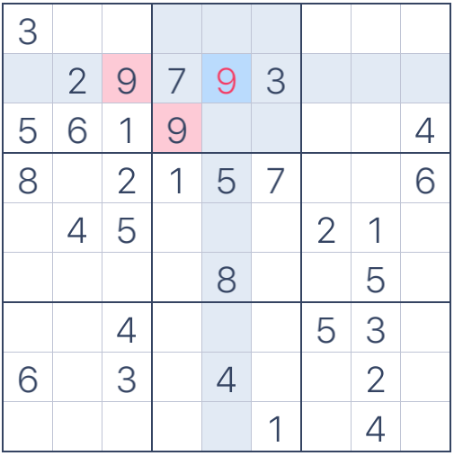
    <p><i>Figura 5. Error: número repetido en renglón y cuadrado interno</i></p>
</div>

<br>

Si observamos bien, los únicos números que no rompen las reglas son el 1 y el 6:

<div style="text-align:center">
    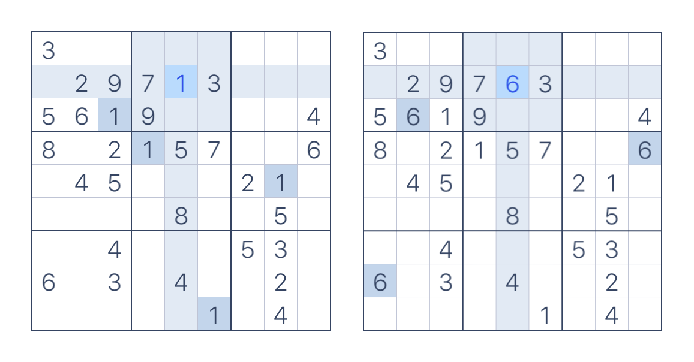
    <p><i>Figura 6. El 1 y el 6 son válidos</i></p>
</div>

¿Entonces cuál elegir? la respuesta es ejecutar un **Algoritmo de Backtracking** para probar ambos números y saber con cúal de éstos es posible resolver el rompecabezas; sin embargo, esta opción es difícil de ejecutar para un ser humano, es por eso que aquí aprenderemos a cómo programarlo para que la computadora lo haga por nosotros.

Una opción más viable para un ser humano sería dejar pendiente esa casilla, continuar resolviendo otras y llenarla cuando estemos 100% seguros de que solamente un único valor puede encajar en ella sin romper las reglas.

Abajo se muestra el tablero resuelto, observa que ningún número se repite ni por renglón, ni por columna, ni tampoco se repite dentro de un mismo cuadrado interno:

<div style="text-align:center">
    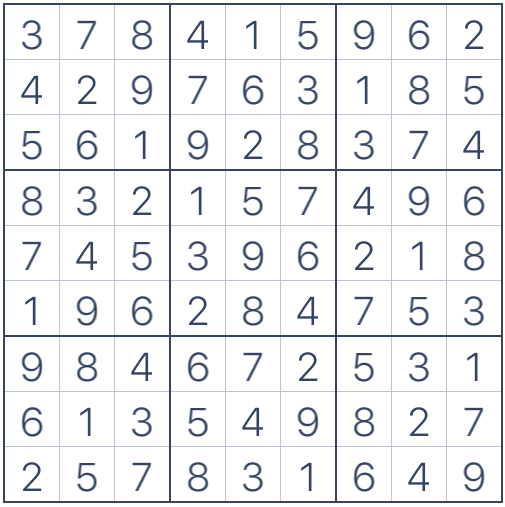
    <p><i>Figura 7. Ejemplo resuelto</i></p>
</div>

## Implementación

Una vez conocidas las reglas el juego es momento de pensar en cómo implementar una solución computacional al problema de resolver y generar tableros de Sudoku. Recuerda que puedes encontrar el código fuente [aquí](https://github.com/Pedro-Hdez/sudoku-python).

### Planeación y Consideraciones

El objetivo del proyecto es construir un programa que resuelva Sudokus y también que sea capaz de generar tableros parcialmente completos para que alguien más los utilice para jugar.

He optado por construir la clase `SudokuBoard` que contiene el atributo `self.board` donde se almacenará el tablero. Asimismo, la clase tendrá métodos públicos para resolver, imprimir y generar tableros de Sudoku.

Antes de comenzar a programar necesitamos saber cómo vamos a representar el juego en la computadora y también debemos establecer una manera para darle a conocer al programa el tablero que deseamos resolver.

#### Representación del Tablero

Para ésto, nos olvidaremos momentáneamente de los cuadrados internos y representaremos el tablero como un arreglo 2-dimensional (lista de listas) de $$9x9$$. Cada renglón del tablero corresponde a una lista diferente; además, los espacios vacíos se van a representar con el número 0. Aquí un pequeño ejemplo:

<div style="text-align:center">
    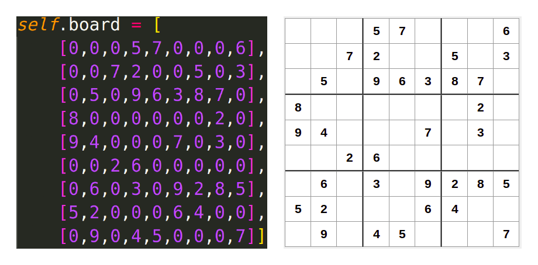
    <p><i>Figura 8. Representación del tablero en el programa</i></p>
</div>

#### Entrada del Tablero al Programa

Considero que la forma más eficiente para que el programa lea el tablero a resolver es que lo haga secuencialmente. De este modo también será muy fácil y rápido para nosotros como humanos escribir los valores de las 81 casillas del tablero. A continuación, un ejemplo de cómo le pasaríamos al programa el tablero a resolver:

<div style="text-align:center">
    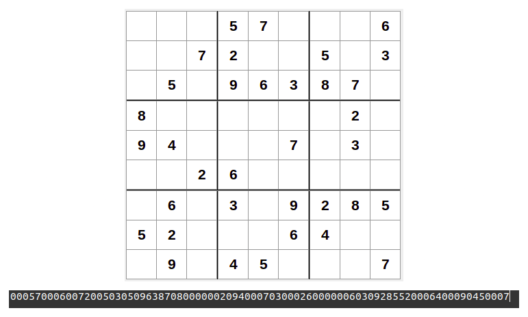
    <p><i>Figura 9. Entrada secuencial del tablero al programa</i></p>
</div>

### Métodos base

#### Constructor

```python
import copy
import random

class SudokuBoard:
    def __init__(self, board=None):
        """
            This class represents a Sudoku Board and its methods.

            Params
            ------
            board: It expects a 81 characters <string> object containing the numbers distribution
                in the board. Empty cells are represented with 0. If <None> is given, then an
                empty board will be created (9x9 board filled with 0's).
        """

        # Populate the board with 0's
        self.__resetBoard()

        # If board was given, copy it to the self.board attribute
        if board:
            for i in range(0,9):
                for j in range(0,9):
                    self.board[i][j] = int(board[(i*9) + j])
```

Primero importamos las liberías `copy` y `random` que utilizaremos más adelante.

Recordemos que el programa no solo solucionará Sudokus, sino que también los generará. Por ese motivo no es obligatorio darle al constructor un tablero inicial, por lo que su parámetro `board`
es opcional. Además, siempre que creemos una instancia de la clase se utilizará el método privado `self.__resetBoard()` que inicializa el atributo `self.board` como un tablero vacío. En caso de que el parámetro `board` sea una cadena de 81 caracteres, entonces utilizamos los ciclos For anidados para copiar los valores de la cadena proporcionada, al tablero interno.

A continuación, el método que resetea el tablero, o en otras palabras, el que crea un tablero interno vacío.

```python
    def __resetBoard(self):
        """
            This private functions resets the board state. This is, fill it with 0's
            (empty spaces).
        """
        self.board = [
            [0,0,0,0,0,0,0,0,0],
            [0,0,0,0,0,0,0,0,0],
            [0,0,0,0,0,0,0,0,0],
            [0,0,0,0,0,0,0,0,0],
            [0,0,0,0,0,0,0,0,0],
            [0,0,0,0,0,0,0,0,0],
            [0,0,0,0,0,0,0,0,0],
            [0,0,0,0,0,0,0,0,0],
            [0,0,0,0,0,0,0,0,0]]
```

#### Método para imprimir el tablero en consola

Ahora, veamos un método para imprimir el tablero:

```python
    def printBoard(self):
        """
            This method prints the board with the standard Sudoku format.
        """
        for i in range(9):
            if i%3 == 0 and i != 0:
                print("- - - - - - - - - - - - ")
            for j in range(9):
                if j%3 == 0 and j != 0:
                    print(" | ", end="")
                if j == 8:
                    print(self.board[i][j])
                else:
                    print(str(self.board[i][j]) + " ", end="")
```

Podríamos simplemente recorrer el arreglo bidimensional `self.board` e ir imprimiendo valor a valor, pero le daremos un pequeño retoque al formato de la salida para que se asemeje un poco más a un tablero de Sudoku real. Cada tres renglones imprimiremos una línea horizontal y cada tres columnas imprimiremos una línea vertical, ésto con la finalidad de hacer visible la separación entre cada uno de los nueve cuadrados internos, aquí un pequeño ejemplo de cómo se ve el tablero impreso en consola:

<div style="text-align:center">
    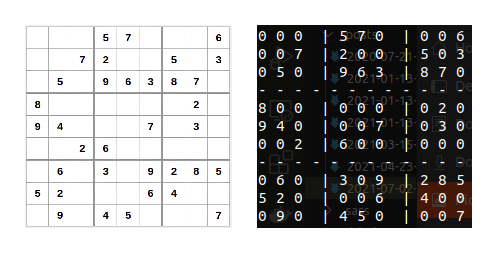
    <p><i>Figura 10. Ejemplo de la impresión de un tablero</i></p>
</div>

#### Método para convertir el tablero en una cadena de caracteres

Este método nos será de importancia más adelante, pero considero que es bueno familiarizarse con él desde ahora:

```python
    def boardAsString(self):
        """
            This method converts the board in a string.

            Returns
            -------
            - A <str> object which stores the board.
        """
        string = "".join([str(col) for row in self.board for col in row])
        return string
```

Aquí utilizamos el método `join` de la clase `<str>` combinado con la comprehensión de listas para convertir el arreglo bidimensional que representa al tablero, en un arreglo unidimiensional de caracteres.

### Solucionador de Sudokus

Ya que hemos visto los métodos base, es hora de comenzar a codificar los métodos para solucionar Sudokus.

Primero, vamos a establecer la forma de resolver una sola casilla, este corto y fácil algoritmo será la base de todo el programa:

**Algoritmo para resolver una casilla del tablero**

Sea $$(x,y)$$ la posición de una casilla vacía en el tablero.

Para todo número $$n \in [1,9]$$ :

1.  Revisar que podemos poner $$n$$ en $$(x,y)$$ sin romper las reglas.
2.  Si $$n$$ en $$(x,y)$$ rompe una regla, probar con el siguiente número $$n$$.
3.  Si $$n$$ en $$(x,y)$$ es válido, asignar el valor $$n$$ a la casilla vacía $$(x,y)$$

Si ningún número $$n \in [1,9]$$ puede asignarse a la casilla $$(x,y)$$, entonces la casilla no se puede resolver.

A partir de ésto construiremos el método que solucionará los tableros, usaremos recursividad para repetir el mismo algoritmo en todas las casillas vacías; además, se implementará siguiendo la estrategia de Backtracking para dar marcha atrás y probar diferentes combinaciones cuando nos encontremos casillas irresolubles.

#### Método para encontrar una casilla vacía

Primero necesitamos un algoritmo para encontrar una casilla vacía, para ello utilizaremos el siguiente método privado:

```python
    def __findEmptySpace(self, board=None, emptySpace=None):
        """
            This method finds an empty space in a board. Empty spaces are represented
            with 0.

            Params
            ------
            - board: <SudokuBoard> object. this function will use 'board' attribute of the object
                     given to search for the empty space. If None, the method will use the
                     'self.board' board.

            -emptySpace: <int> object. If is given, then we will search for the n-th empty space
                         (n = emptySpace). If not given, then the method will return the first
                         empty space that it finds.

            Returns
            -------
            - If empty space was found, then a <tuple> object is returned which contains the
              empty space coordinates: (row, col)
            - If no empty space was found, then returns None.

        """

        # board selection
        if board:
            b = board.board
        else:
            b = self.board

        # Aux. variable to search the n-th empty space in case it is required
        k = 0

        # Nested loops to iterate the boaord
        for row in range(len(b)):
            for col in range(len(b)):
                # If an empty space was found, decide if a return is needed
                if b[row][col] == 0:
                    if not emptySpace:
                        return (row, col)
                    else:
                        if k == emptySpace:
                            return (row, col)
                        k += 1

        return None
```

El método recibe dos parámetros:

- `board`: Objeto de la clase `<SudokuBoard>` en donde buscaremos la casilla vacía. Si este parámetro se omite, entonces el espacio vacío se buscará en el atributo `self.board` del mismo objeto desde el cual este método se invocó.
- `emptySpace`: Número entero que sirve para regresar la posición del n-ésimo espacio vacío; si se omite, entonces la función regresará la posición del primer espacio vacío que el algoritmo encuentre.

Estos dos argumentos son vitales para cuando se genera un tablero semivacío de juego, más adelante se explicará con más detalle el por qué los necesitamos, por ahora son irrelevantes y al momento de usar el método para solucionar un Sudoku se van a omitir.

El algoritmo es muy simple, primero toma el arreglo bidimensional que representa al tablero, puede ser el que se proporcionó en el parámetro `board` o el atributo `self.board`. Una vez seleccionado el tablero, éste se recorre en orden con dos ciclos For anidados. Dentro de este par de ciclos se revisa si la posición actual es una casilla vacía (representada por un cero). Si es así, entonces se decide si se regresa o no la posición actual de acuerdo al parámetro `emptySpace`. Recordemos que dicho parámetro representa el n-ésimo espacio vacío, en caso de que se solicite una casilla en particular, y `emptySpace != None`, debemos continuar con la búsqueda hasta que sea necesario. Si al final recorrimos todo el tablero y no encontramos espacios vacíos, entonces se regresa un `None`

#### Método para revisar que las reglas del Sudoku se cumplan

Ya sabemos cómo buscar una casilla vacía, ahora necesitamos un método para revisar que ninguna regla del juego se rompa cuando asignemos un valor al espacio vacío que encontremos.

```python
    def __checkRules(self, num, space):
        """
            This method checks if a number can be placed in certain space following the
            Sudoku Rules.

            Params
            ------
            num: <int> object from 1 to 9
            space: <tuple> object with (row, col) coordinates of the space

            Return
            ------
            - False if the number cannot be placed in the space according to
              Sudoku rules or if the space already contains a number
            - True if the number can be placed in the space.
        """

        # Checking if the number is already in the same row as the space
        for col in self.board[space[0]]:
            if col == num:
                return False

        # Checking if the number is already in the same column as the space
        for row in range(len(self.board)):
            if self.board[row][space[1]] == num:
                return False

        # Checking if the number is already in the internal square which
        # the space belongs
        internalSquareRow = space[0] // 3
        internalSquareCol = space[1] // 3

        for i in range(3):
            for j in range(3):
                if self.board[i + (internalSquareRow * 3)][j + (internalSquareCol * 3)] == num:
                    return False

        # If the number can be placed in the space, according to Sudoku rules, then
        # return True.
        return True
```

El algoritmo es muy intuitivo, se revisan las tres reglas del Sudoku tal y como un ser humano lo hace. Se reciben dos parámetros:

- `n`: Número que se desea revisar en el espacio vacío.
- `space`: Tupla que contiene la posición del espacio vacío.

El primer ciclo For revisa que el número que deseamos asignar no exista previamente en la columna correspondiente al espacio vacío. El segundo ciclo revisa que el número no se repita en el renglón donde el espacio vacío se encuentra. El resto del código se encarga de ubicar el cuadrado interno al que pertenece la casilla vacía, luego ese cuadrado interno se revisa completamente con dos ciclos For anidados para asegurarnos de que el número no se repite dentro de él. Si alguna regla se rompe, se regresa un `False`, pero si terminamos de revisar todas las reglas sin ningún problema, entonces se regresa un `True`.

#### Método para resolver un Sudoku

Aquí es donde la magia sucede. El siguiente método utiliza la recursividad y el Backtracking para resolver un tablero de Sudoku:

```python
    def solve(self, initialCell=None):
        """
            This method implements a recursive BackTracking algorithm to solve
            the Sudoku Board.

            Params
            ------
            - initialCell: None by default. It expects a <tuple> object with (row, col) coordinates
                           of an empty space. If this parameter is given, then the board will begin
                           to be solved from the corresponding initial cell. If this parameter is
                           not given, the board will begin to be solved from the firs empty space
                           the algorithm find.

            Returns
            -------
            - True if the board could be solved.
            - False is the puzzle couldn't be solved.
        """

        # To store the available space.
        availableSpace = None

        # If initialCell was given, availableSpace = initialCell. Else, the algorithm will
        # search an available space
        if not initialCell:
            # Checking if there are empty spaces. If no empty spaces remains, then return True beacuse
            # it was possible to solve the puzzle.
            availableSpace = self.__findEmptySpace()
            if not availableSpace:
                return True
        else:
            availableSpace = initialCell

        # If there are an empty space, then try to fit the space with all valid numbers (1-9)
        # according to Sudoku rules and try to solve it from this state. If there are no solution
        # from the current configuration, then the next valid number is tried in the current space.

        # List of valid numbers (1-9)
        validNumbers = list(range(1, 10))

        # Trying all possible numbers (choosing them randomly) in the current availableSpace
        while validNumbers:
            n = validNumbers.pop(random.randrange(len(validNumbers)))
            # Checking if is possible to set the number according to Sudoku rules. If we can't,
            # then continue to the next iteration to try with the next number
            if self.__checkRules(n, availableSpace):
                # If we don't broke any sudoku rule setting 'n' in the availableSpace, then put the
                # number
                self.board[availableSpace[0]][availableSpace[1]] = n

                # try to RECURSIVELY SOLVE the puzzle with the current state (with the 'n' number
                # added in the availableScpace)
                if self.solve():
                    # If the puzzle could be solved, then return True
                    return True

                # if the puzzle couldn't be solved with the 'n' number added in the available space,
                # then reset the availableSpace with 0 and continue to the next iteration; that is,
                # try the next number that can fit in the availableSpace keeping the board solvable
                self.board[availableSpace[0]][availableSpace[1]] = 0

        # If any number (1-9) can fit in the availableSpace, then return False because the
        # puzzle can not be solved from the current configuration
        return False
```

El método recibe el argumento `initialCell`, éste representa la casilla desde la cuál se comenzará a resolver el Sudoku, solamente es útil al generar un tablero. Si su valor es `None`, entonces se buscará el primer espacio vacío con el método privado `self.__findEmptySpaces()` y a partir de ahí se resolverá.

El caso base de este algoritmo recursivo se alcanza cuando ya no existen casillas en blanco, entonces se regresará un `True` pues ésto significa que el tablero se pudo resolver. Una vez confirmando que aún existen casillas sin resolver creamos la lista `validNumbers` que almacenará los números del 1 al 9, y mientras existan números dentro de esta variable, significa que aún tenemos valores para probar en el espacio vacío. Entonces, dentro del ciclo While, que no termina hasta que agotamos todos los valores de la lista, primero elegimos al azar un número restante y revisamos que las reglas del Sudoku no se rompan si ponemos dicho valor en el espacio vacío con la instrucción `self.__checkRules(n, availableSpace)`. Si no es posible poner `n` en el espacio vacío, entonces tomamos otro número y repetimos; en cambio, si podemos asignar el valor en la celda, utilizamos el poder de la **recursividad** para que el método se llame a sí mismo y se repita todo este procedimiento en la siguiente casilla en blanco con el objetivo de intentar resolver el tablero. Cuando ningún número desde 1 hasta 9 puede asignarse a la casilla en blanco, se regresa un `False` ya que esto significa que no es posible resolver el tablero.

Ahora, el **Backtracking**. Como puede apreciarse en el código, si en algún punto alcanzamos el caso en el que no es posible resolver el tablero (el método `self.solve()` regresa un `False`), entonces la casilla en blanco a la que se le había asignado el valor `n` se resetea; es decir, su valor vuelve a ser 0 y en la siguiente iteración del ciclo While le asignaremos otro nuevo valor (si es posible) y reiniciaremos el proceso recursivo otra vez. El último If y la instrucción `self.board[availableSpace[0]][availableSpace[1]] = 0` son las que hacen posible dar marcha atrás, es decir, limpiar todas las casillas que se habían resuelto incorrectamente para dejar listo el tablero y así intentar de nuevo, recursivamente, resolver el Sudoku probando con otro número diferente en alguna casilla.

### Generador de Sudokus

Hasta este punto ya tenemos todo lo necesario para resolver Sudokus, sin embargo, el objetivo del proyecto también es generar tableros nuevos listos para jugar. A continuación, se explica el procedimiento a seguir.

Hay que considerar que en este punto ya contamos con un programa que resuelve Sudokus entonces, ¿por qué no reutilizar todo eso? Siguiendo esta idea haremos lo siguiente:

1. Llenar parcialmente un tablero
2. Utilizar nuestro programa para que lo resuelva
3. Ocultar algunas casillas

¡Y listo! Estos tres sencillos pasos representan el algoritmo fundamental de nuestro generador de Sudokus; sin embargo, hay que realizar algunos ajustes para resolver un par de problemas que no son evidentes y que comento a continuación:

**¿Cómo llenamos parcialmente un tablero?**

Algo que podría funcionar para generar un Sudoku es darle a nuestro programa un tablero totalmente vacío y que lo resuelva. Como el método `self.solve()` elige cada vez un número de manera aleatoria, esta idea funcionaría sin problemas para generar muchos tableros diferentes y nos ahorarríamos el primer paso de nuestro algoritmo; sin embargo, la cantidad de tiempo que tomaría realizar esta acción es muy, muy grande. Por ello, haremos lo siguiente.

Recordando las reglas: un número no puede repetirse ni por renglón, ni por columna, ni en un mismo cuadrado interno, y es en estos últimos en donde se encuentra la clave. Si observamos bien, cada uno de los tres cuadrados internos de la diagonal del tablero es totalmente independiente de los otros dos. Esto significa que podemos llenar cada uno de esos tres cuadrados internos libremente, lo único que necesitamos cuidar es que ningún número se repita dentro del mismo cuadrado interno.

<div style="text-align:center">
    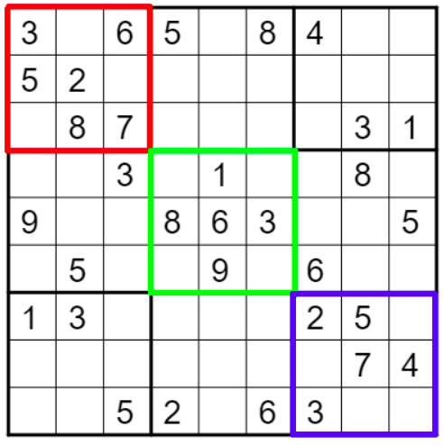
    <p><i>Figura 11. Los cuadrados en la diagonal son independientes</i></p>
</div>

Si llenamos cada uno de los tres cuadrados internos aleatoriamente, al final tendríamos que resolver únicamente 54 casillas en vez de 81. De esta forma llenamos parcialmente el tablero de una manera fácil y rápida.

**¿Cómo ocultamos las casillas?**

Una vez resuelto el tablero podríamos pensar que basta con ocultar aleatoriamente algunas casillas, pero esto no es tan fácil. Si comenzamos a borrar valores sin cuidado podríamos obtener como resultado un tablero con muchas posibles soluciones y eso es un pequeño problema para nosotros. Es deseable obtener siempre tableros con solución única para juzgarlos como correctos o incorrectos y evitar caer en ambigüedades. ¿Por qué pasa ésto? bueno, el Sudoku puede resolverse iniciando desde cualquier casilla vacía y, en un tablero con múltiples respuestas, la solución a la que lleguemos dependerá de la casilla que resolvamos primero. Entonces debemos cuidar que la solución del Sudoku sea siempre la misma al momento de limpiar espacios.

Habiendo resuelto estos pequeños inconvenientes, podemos traducir nuestro algoritmo de generación de Sudokus a Python.

#### Método para generar un tablero resuelto

```python
    def __generateFullBoard(self):
        """
            This method generates a new random and filled Sudoku board following the rules of the
            game.
        """
        # Populate the board with 0's|
        self.__resetBoard()

        # Populate the three diagonal boxes

        # As we know, every diagonal box is independent from the other two diagonal boxes,
        # so we can fill each of them independently only checking that each number (1-9) only
        # exists once in each box.

        # For loop to iterate the three boxes
        for i in range(1,4):
            # As the boxes are diagonal, then (x,y) coordinates for their first and last cells will
            # be equals.

            # Getting the begin coordinate of the box
            boxBegin = 3*(i-1)
            # Getting the end coordinate of the box
            boxEnd = 3*i
            # List with the valid numbers
            validNumbers = list(range(1, 10))
            # Iterate the box
            for row in range(boxBegin, boxEnd):
                for col in range(boxBegin, boxEnd):
                    # Assign a random valid number. To assure that every single number will exist
                    # only once in the box, it is removed when it is selected.
                    self.board[row][col] = validNumbers.pop(random.randrange(len(validNumbers)))

        # Populate the rest of the cells solving the board
        self.solve()
```

Comenzamos por crear un tablero vacío con el método `self.__resetBoard()`. Después hay que rellenar los tres cuadrados internos diagonales. Es evidente que este procedimiento aleatorio es siempre el mismo, lo único que cambia son las coordenadas de inicio y fin de los cuadrados, por esta razón utilizamos un ciclo For para repetir el llenado aleatorio tres veces. Al final, simplemente llamamos al método `self.solve()` para que el programa mismo rellene correctamente las casillas restantes.

#### Método para obtener todas las soluciones de un tablero

```python
    def __findNumberOfSolutions(self):
        """
            This method finds the number of solutions a non-completely filled board has.

            Returns
            -------
            - List of <str> objects with length 81. Each of them represents a different
              solution.
        """

        # Integer to store the number of empty spaces
        numberOfEmptySpaces = 0
        # List to store the solutions.
        list_of_solutions = []

        # Nested for loops to count the number of empty spaces in the board
        for row in range(len(self.board)):
            for col in range(len(self.board)):
                if self.board[row][col] == 0:
                    numberOfEmptySpaces += 1

        # For loop to begin to solve the board from every single empty space found
        for i in range(numberOfEmptySpaces):
            # Copy of the original board
            board_copy = copy.deepcopy(self)
            # Getting the current empty space
            row, col = self.__findEmptySpace(board=board_copy, emptySpace=i)
            # Solving the puzzle from the current empty space
            board_copy.solve(initialCell=(row, col))
            # Storing the current solution
            list_of_solutions.append(board_copy.boardAsString())

        # Return the number of unique solutions
        return list(set(list_of_solutions))
```

Este método nos auxiliará al momento de ocultar casillas para asegurarnos de que el tablero siempre tendrá solución única. El primer par de ciclos For anidados es para contar el número de espacios vacíos que tiene el tablero, de esta forma podremos identificar a cada uno de ellos. Dentro del último ciclo For resolveremos el mismo tablero pero partiendo desde un espacio vacío diferente a la vez. Estas soluciones se almacenarán en la variable auxiliar `list_of_solutions`.

Nótese que en esta ocasión sí utlizamos los parámetros `board` y `emptySpace` del método `self.__findEmptySpace()`; además, estamos utilizando el método básico `boardAsString()` para convertir las soluciones en cadenas de caracteres.

#### Método para generar un tablero de juego

```python
    def generateGameBoard(self, emptySpaces=0):
        """
            This method generates a game board; that is, a partially filled Sudoku board
            with just one solution.

            Params
            ------
            - emptySpaces: <int> which represents the number of empty spaces the board will have.
                           By default, 0.

            Returns
            -------
            - Two <SudokuBoard> objects. The first one containing the
              solved board; the last one is the partially filled board.
        """
        # Generating the full board and storing it
        self.__generateFullBoard()
        fullBoard = copy.deepcopy(self)

        # We erase "emptySpaces" number of cells randomly always checking that
        # the number of solutions is 1.
        emptiedCells = 0
        while emptiedCells < emptySpaces:
            row = random.randint(0, 8)
            col = random.randint(0, 8)

            if self.board[row][col] != 0:
                n = self.board[row][col]
                self.board[row][col] = 0

                if len(self.__findNumberOfSolutions()) != 1:
                    self.board[row][col] = n
                    continue

                emptiedCells += 1

        # returns the solved board and the unsolved board
        if emptySpaces > 0:
            return fullBoard, self

        return self, None
```

Este es el método principal que nos permitirá generar tableros de juego. Recibe el parámetro `emptySpaces` que representa el número de casillas a esconder. Primero, generamos un tablero completamente lleno y lo copiamos a una variable que manipularemos sin alterar el Sudoku original. Después, dentro del ciclo While seleccionamos aleatoriamente una casilla y se valida que no sea un espacio vacío. Luego, borramos el valor de la casilla y llamamos al método `self.__findNumberOfSolutions()` para resolver el tablero desde cada espacio vacío existente hasta el momento. Si el número de soluciones es diferente de 1, significa que, si borramos la casilla actual, el Sudoku dejará de tener solución única, por esta razón volvemos a asignarle su valor original. El procedimiento se repite hasta que borremos el número deseado de casillas. Al final se regresará el tablero resuelto y el de juego.

### Aplicación de consola

¡Lo logramos! Finalmente hemos programado un módulo para resolver y generar Sudokus. También me di a la tarea de construir una pequeña aplicación de consola para interactuar con esta clase y sus métodos. Asegúrate de cumplir con los [prerrequisitos](#prerrequisitos) para poder ejecutar el programa.

Realmente el código es muy sencillo, puedes encontrarlo al final de esta sección. Por lo pronto veamos los casos de uso:

#### Menú principal

Una vez situados en el directorio raíz del repositorio del proyecto ejecutamos el siguiente comando

```bash
$ python console_menu.py
```

Inmediatamente deberíamos ver el menú principal:

<div style="text-align:center">
    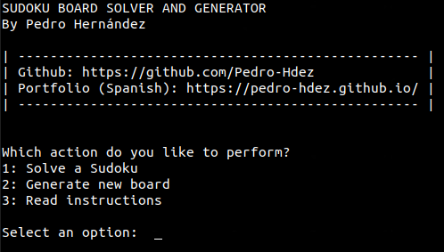
    <p><i>Figura 12. Menú principal</i></p>
</div>

Desde aquí debemos teclear el número correspondiente a la acción que deseamos realizar y después dar Enter.

#### Resolver un Sudoku

Para realizar esta acción debemos elegir la opción 1. A continuación el programa nos pedirá que le proporcionemos un tablero de Sudoku en su forma de cadena de caracteres

<div style="text-align:center">
    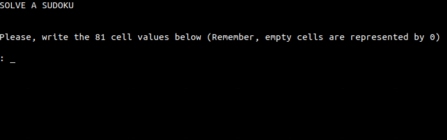
    <p><i>Figura 13. Resolver un Sudoku</i></p>
</div>

Resolvamos el Sudoku del [ejemplo](#ejemplo):

<div style="text-align:center">
    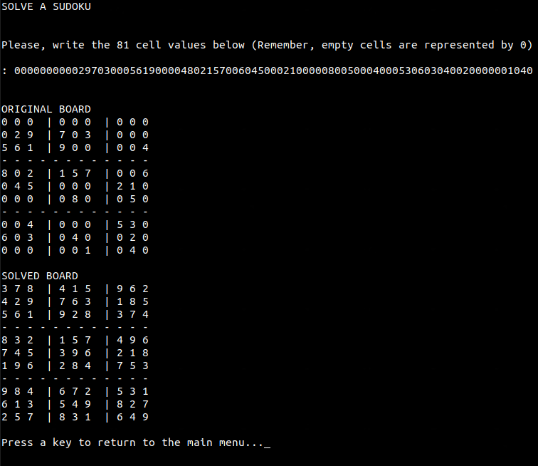
    <p><i>Figura 13. Sudoku resuelto</i></p>
</div>

Podemos comprobar que nuestro programa lo resuelve correctamente con el [software que utilicé en los ejemplos](https://sudoku.com/):

<div style="text-align:center">
    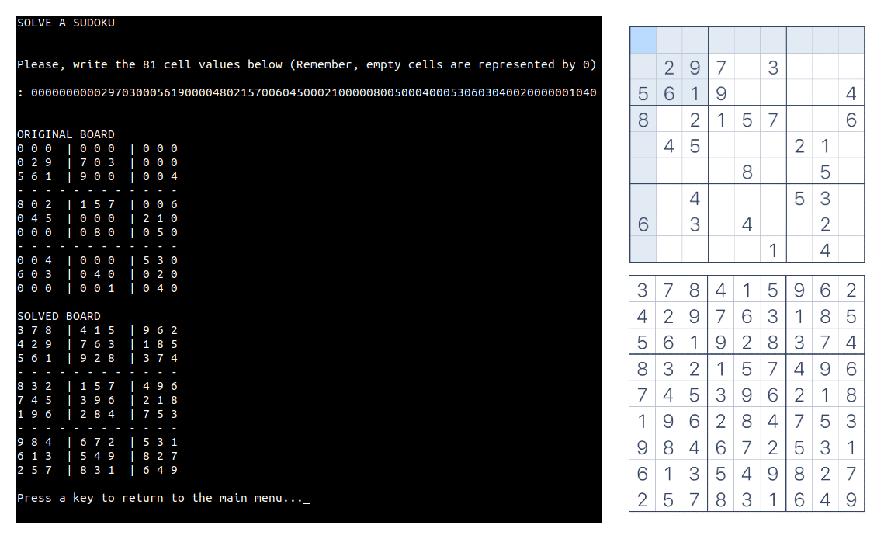
    <p><i>Figura 14. Solución comprobada</i></p>
</div>

#### Generar un tablero

Para generar un tablero debemos elegir la opción 2 del menú principal. A continuación el programa nos pedirá el número de espacios vacíos. Se recomienda elegir un máximo de 50 por cuestiones de velocidad. Por ejemplo, un tablero con 40 espacios vacíos:

<div style="text-align:center">
    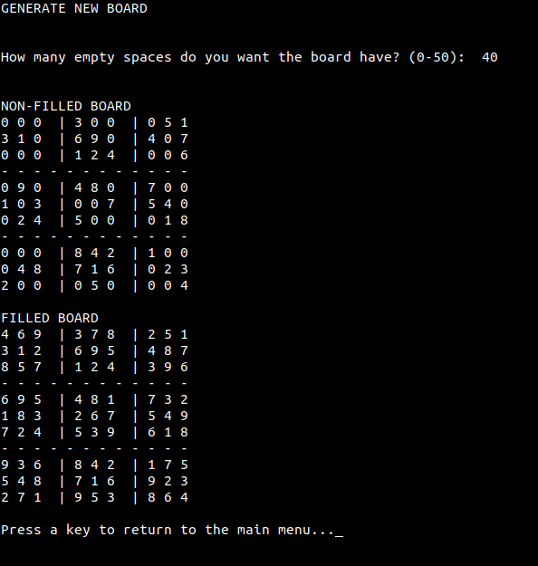
    <p><i>Figura 16. Tablero generado</i></p>
</div>

También podemos comprobar que la solución al tablero de juego es única con el siguiente [software online](https://sudokuspoiler.azurewebsites.net/). Como podemos ver en la esquina inferior izquierda, el programa indica que sólo existe una solución.

<div style="text-align:center">
    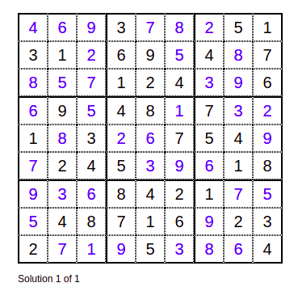
    <p><i>Figura 17. Comprobación de la unicidad de la solución</i></p>
</div>

Si pedimos un tablero con 0 espacios vacíos, únicamente se desplegará el tablero resuelto:

<div style="text-align:center">
    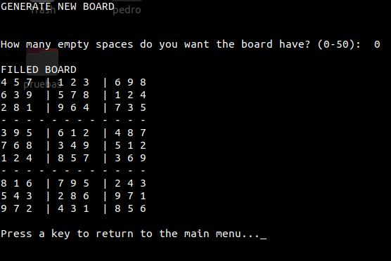
    <p><i>Figura 18. Generación de un tablero sin espacions vacíos</i></p>
</div>

#### Mostrar instrucciones

Si deseamos leer las instrucciones, entonces debemos elegir la opción 3 del menú principal

<div style="text-align:center">
    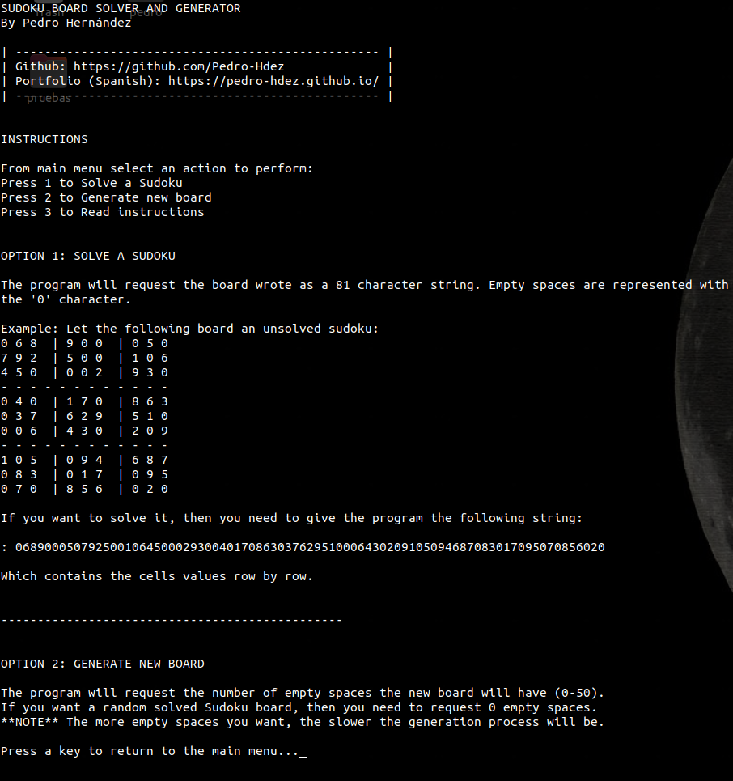
    <p><i>Figura 19. Instrucciones del programa</i></p>
</div>

#### Código

```python
from sudokuBoard import SudokuBoard
import os

def printHeader():
    """"
        This method prints a header
    """

    print("SUDOKU BOARD SOLVER AND GENERATOR")
    print("By Pedro Hernández\n")
    print("| -------------------------------------------------- |")
    print("| Github: https://github.com/Pedro-Hdez              |")
    print("| Portfolio (Spanish): https://pedro-hdez.github.io/ |")
    print("| -------------------------------------------------- |\n\n")


def clearConsole():
    """
        This method clears the console
    """

    command = 'clear'
    if os.name in ('nt', 'dos'):  # If Machine is running on Windows, use cls
        command = 'cls'
    os.system(command)


def showMenu():
    """
        This method show the main menu and perform the user input validation
    """

    printHeader()

    print("Which action do you like to perform?")
    print("1: Solve a Sudoku")
    print("2: Generate new board")
    print("3: Read instructions")

    # Aux. variable to know if the usr input is valid
    valid_input = False
    # Variable to store user input
    usr_input = 0

    # Request an action until the user input is valid
    while not valid_input:
        usr_input = input("\nSelect an option:  ")
        # Checking if user input is a number
        try:
            usr_input = int(usr_input)
            # Checking if user input is 1 or 2
            if usr_input < 1 or usr_input > 3:
                raise Exception

            valid_input = True
        except:
            print("Error, invalid input. Please, select a valid option and try again.")
            continue

    clearConsole()

    return usr_input


def solveSudokuCase():
    """
        This method requests a sudoku in string format, solves it and prints it, as well as performs
        the user input validation
    """

    print("SOLVE A SUDOKU\n\n")
    print("Please, write the 81 cell values below (Remember, empty cells are represented by 0)\n")

    valid_input = False
    while not valid_input:
        boardAsString = input(": ")

        charCounter = 0
        for c in boardAsString:
            # Checking input only contains digits and not letters or another symbols
            try:
                int(c)
                charCounter += 1
            except:
                print("Error. Input must contain only digits. Please, try again.\n")
                break

        #Checking if input length is correct
        if charCounter != 81:
            print("Error. Input length must have a length of 81 characters. Please, try again.\n")
            continue

        valid_input = True

    b = SudokuBoard(board=boardAsString)
    print("\n\nORIGINAL BOARD")
    b.printBoard()
    print("\nSOLVED BOARD")
    b.solve()
    b.printBoard()
    input("\nPress a key to return to the main menu...")


def generateNewBoardCase():
    """
        This method generates a new board. It requests the number of empty spaces and validates it.
    """
    print("GENERATE NEW BOARD\n\n")
    valid_input = False
    emptySpaces = 0
    while not valid_input:
        emptySpaces = input("How many empty spaces do you want the board have? (0-50):  ")
        # Checking if user input is a number
        try:
            emptySpaces = int(emptySpaces)
            # Checking if user input is within valid range
            if emptySpaces < 0 or emptySpaces > 50:
                raise Exception

            valid_input = True
        except:
            print("Error, invalid input. Please, type a number in the range (0-50) and try again.")
            continue

    b = SudokuBoard()
    if emptySpaces > 0:
        filled, unfilled = b.generateGameBoard(emptySpaces=emptySpaces)
        print("\n\nNON-FILLED BOARD")
        unfilled.printBoard()
        print("\nFILLED BOARD")
        filled.printBoard()
    else:
        filled, _ = b.generateGameBoard()
        print("\nFILLED BOARD")
        filled.printBoard()

    input("\nPress a key to return to the main menu...")


def readInstructionsCase():
    """
        This method prints the program's instructions.
    """
    printHeader()

    print("INSTRUCTIONS\n")

    print("From main menu select an action to perform:")
    print("Press 1 to Solve a Sudoku")
    print("Press 2 to Generate new board")
    print("Press 3 to Read instructions\n\n")

    print("OPTION 1: SOLVE A SUDOKU\n")
    print("The program will request the board wrote as a 81 character string. Empty spaces are represented with the \'0\' character.")
    print("\nExample: Let the following board an unsolved sudoku:")

    b = SudokuBoard()
    b.generateGameBoard(emptySpaces=30)
    b.printBoard()

    print("\nIf you want to solve it, then you need to give the program the following string:\n")
    print(f": {b.boardAsString()}\n")
    print("Which contains the cells values row by row.\n\n")

    print("-----------------------------------------------\n\n")

    print("OPTION 2: GENERATE NEW BOARD\n")
    print("The program will request the number of empty spaces the new board will have (0-50).")
    print("If you want a random solved Sudoku board, then you need to request 0 empty spaces.")
    print("**NOTE** The more empty spaces you want, the slower the generation process will be.")


    input("\nPress a key to return to the main menu...")


if __name__ == "__main__":
    while True:
        clearConsole()
        usr_input = showMenu()

        if usr_input == 1:
            solveSudokuCase()
        elif usr_input == 2:
            generateNewBoardCase()
        elif usr_input == 3:
            readInstructionsCase()

```

## Conclusión

¡Te agradezco si has llegado hasta este punto! Ahora tenemos un programa en Python para resolver y generar tableros de Sudoku utilizando los poder combinados del Backtracking y la recursividad. Recuerda que eres libre de utilizarlo y descargarlo. Ahora mismo estoy trabajando en la integración de una interfaz gráfica y así tener un pequeño videojuego para jugar Sudoku, próximamente la estaré publicando.
