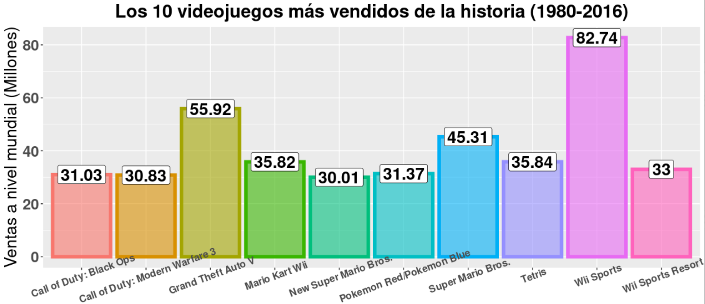
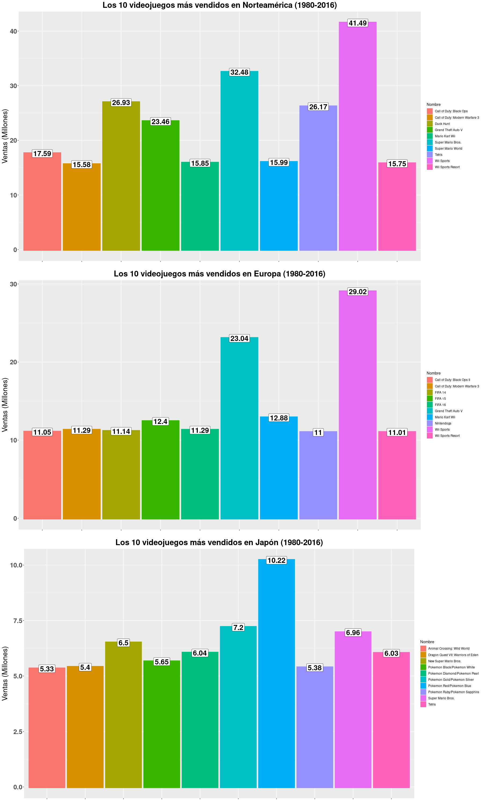
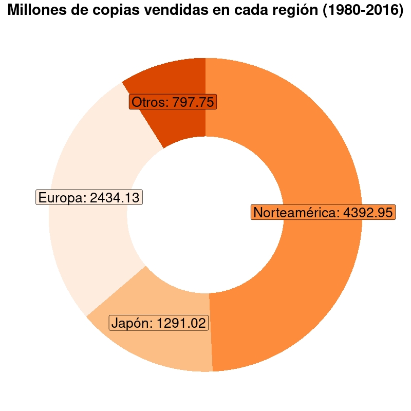
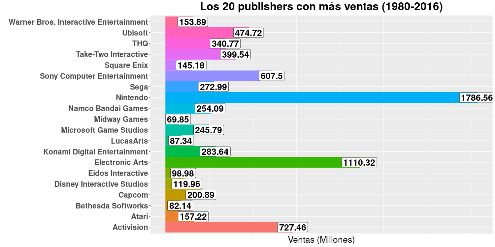
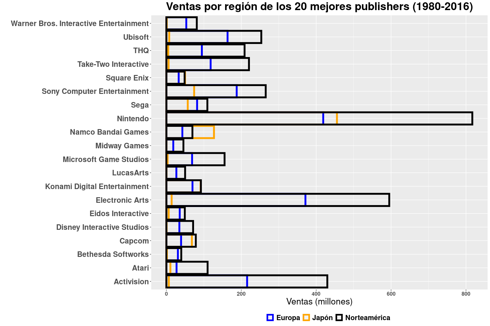
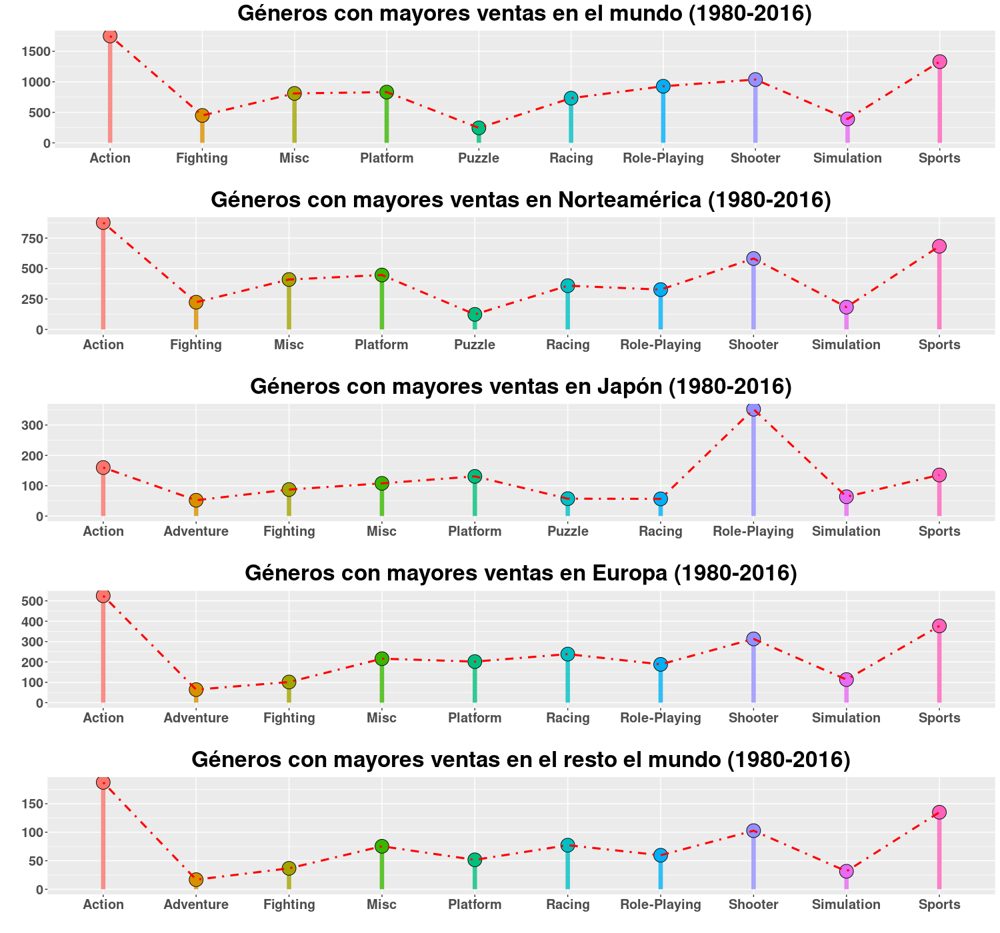
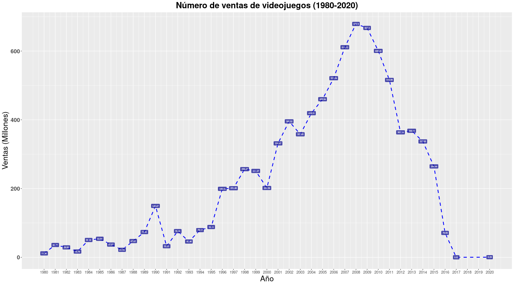

## Introducción

La industria de los videojuegos es una de las más rentables a nivel mundial; de hecho, en el 2020 los juegos de video generaron en Estados Unidos más dinero que el cine y los deportes juntos. Estos productos que en un principio se veían como artículos para niños cada vez adquiere audiencias más diversas y, por lo tanto, genera mayores ingresos ¡y muchos datos!.

En esta investigación se ha realizado un análisis exploratorio del conjunto de datos [vgsales](https://www.kaggle.com/joshuadottavio/videogamesales) que contiene información acerca de la venta de videojuegos desde el año 1980 hasta el 2020. Se mostrará el código en el lenguaje para que puedas reproducirlo tú mismo.

## Objetivos

El objetivo de este análisis exploratorio es observar el comportamiento de las ventas de videojuegos a lo largo de los años y tratar de visualizar su historia a través de los datos, así como también realizar conclusiones que nos permitan tomar mejores decisiones al momento de manejar nuestro propio estudio de desarrollo de videojuegos.

## Prerrequisitos

Primero, necesitas instalar [R](https://www.r-project.org/) en tu dispositivo. También recomiendo instalar el IDE [RStudio](https://www.rstudio.com/products/rstudio/download/).

Después, asegúrate de descargar el conjuto de datos [vgsales](https://www.kaggle.com/joshuadottavio/videogamesales) y guardarlo en el directorio de tu preferencia.

Luego, desde RStudio debes elegir la carpeta en donde se encuentra el conjunto de datos como directorio de trabajo (Working Directory). Aquí una [guía](http://www.sthda.com/english/wiki/running-rstudio-and-setting-up-your-working-directory-easy-r-programming#set-your-working-directory) para hacerlo.

Finalmente, debes crear un nuevo script en el directorio de trabajo y ejecutar las instrucciones que se muestran a continuación.

**NOTA** Por default, Rstudio ajusta automáticamente las dimensiones de las gráficas. En este trabajo la gran mayoría de las imágenes generadas son muy grandes; por este motivo, justo después de crear cada gráfica se va a guardar en el directorio de trabajo con dimensiones predefinidas por mí, te prometo que se veran geniales. En este [repositorio]() se encuentra el proyecto completo. Los reportes en pdf y HTML ya contienen las gráficas con las dimensiones predefinidas incluídas, éstos se generan con el archivo .Rmd.

## Análisis exploratorio

Siempre se mostrará el código seguido de su correspondiente salida.

### Librerías necesarias

Comenzamos importando las librerías que necesitaremos

```r
# Para la graficación
library(ggplot2)
library(cowplot)

# Para la manipulación de los datos
library(dplyr)
```

```
##
## Attaching package: ’dplyr’
## The following objects are masked from ’package:stats’:
##
##
filter, lag
## The following objects are masked from ’package:base’:
##
##
intersect, setdiff, setequal, union
```

### Cargando los datos

Primero, cargamos el conjunto de datos. Aquí, a partir del 2016, los datos son muy escasos, por eso en la mayoría de las gráficas únicamente se va a tomar en cuenta el periodo comprendido entre los años 1980 y 2016

#### Revisando el nombre de las columnas

```r
# Cargamos los datos
data <- read.csv("vgsales.csv", header=T, sep=",")
# Mostramos las columnas que contiene el archivo
colnames(data)
```

```
## [1]  "Rank"       "Name"      "Platform"  "Year"      "Genre"
## [6]  "Publisher"  "NA_Sales"  "EU_Sales"  "JP_Sales"  "Other_Sales"
## [11] "Global_Sales"
```

#### Eliminación de los datos faltantes y resumen de los datos

```r
# Existen varios títulos con años de estreno no especificados, los eliminamos.
data <- data[data$Year != "N/A", ]
# Mostramos un resumen del conjunto de datos
summary(data)
```

```
      Rank                                Name          Platform         Year               Genre                             Publisher
 Min.   :    1   Need for Speed: Most Wanted:   12   DS     :2163   Min.   :1980   Action      :3316   Electronic Arts             : 1351
 1st Qu.: 4151   FIFA 14                    :    9   PS2    :2161   1st Qu.:2003   Sports      :2346   Activision                  :  975
 Median : 8300   LEGO Marvel Super Heroes   :    9   PS3    :1329   Median :2007   Misc        :1739   Namco Bandai Games          :  932
 Mean   : 8301   Madden NFL 07              :    9   Wii    :1325   Mean   :2006   Role-Playing:1488   Ubisoft                     :  921
 3rd Qu.:12450   Ratatouille                :    9   X360   :1265   3rd Qu.:2010   Shooter     :1310   Konami Digital Entertainment:  832
 Max.   :16600   Angry Birds Star Wars      :    8   PSP    :1213   Max.   :2020   Adventure   :1286   THQ                         :  715
                 (Other)                    :16542   (Other):7142                  (Other)     :5113   (Other)                     :10872
    NA_Sales          EU_Sales          JP_Sales         Other_Sales        Global_Sales
 Min.   : 0.0000   Min.   : 0.0000   Min.   : 0.00000   Min.   : 0.00000   Min.   : 0.0100
 1st Qu.: 0.0000   1st Qu.: 0.0000   1st Qu.: 0.00000   1st Qu.: 0.00000   1st Qu.: 0.0600
 Median : 0.0800   Median : 0.0200   Median : 0.00000   Median : 0.01000   Median : 0.1700
 Mean   : 0.2647   Mean   : 0.1467   Mean   : 0.07778   Mean   : 0.04806   Mean   : 0.5374
 3rd Qu.: 0.2400   3rd Qu.: 0.1100   3rd Qu.: 0.04000   3rd Qu.: 0.04000   3rd Qu.: 0.4700
 Max.   :41.4900   Max.   :29.0200   Max.   :10.22000   Max.   :10.57000   Max.   :82.7400
```

### Los videojuegos más vendidos de la historia a nivel mundial

Aunque los primeros videojuegos nacen como proyectos de investigación en la década de 1950, su historia “comercial” inicia entre los años 70’s y 80’s del siglo pasado. Como la base de datos con la que estamos trabajando contiene información de las ventas desde 1980 hasta el 2016, podemos decir que los resultados que obtengamos serán muy fieles a lo que en realidad sucedió en ese periodo de tiempo. Empecemos por conocer los diez videojuegos más vendidos de la historia.

```r
# Obtenemos un la sumatoria de las ventas a nivel global por cada
# título en cada año y almacenamos esta información en una lista con las
# columnas: Ventas, Nombre
ventas_globales <- aggregate(list(Ventas = data$Global_Sales),
                             list(Nombre = data$Name), sum)

# Ordenamos los titulos de acuerdo al número de ventas de forma decreciente
# y tomamos los primeros diez
ventas_globales <- ventas_globales[order(ventas_globales$Ventas,
                                         decreasing = T), ]
ventas_globales <- head(ventas_globales, n=10)

# Construimos una gráfica de barras para mostrar el resultado
a <- ggplot(data=ventas_globales, mapping = aes(x = Nombre, y = Ventas)) +
         geom_bar(stat = "identity",
                  mapping = aes(fill = Nombre, color = Nombre),
                  size = 2, alpha = .6) +
         geom_label(mapping = aes(label = Ventas),
                    size = 7,
                    fontface = "bold") +
         xlab("") +
         ylab("Ventas a nivel mundial (Millones)") +
         ggtitle("Los 10 videojuegos más vendidos de la historia (1980-2016)") +
        theme(legend.position = "none",
               plot.title = element_text(size = 22, face = "bold", hjust = .5),
               axis.text.x = element_text(size = 12, face = "bold", angle = 20),
               axis.text.y = element_text(size = 18, face = "bold"),
               axis.title.y = element_text(size = 20))

png(file="fig1.png", width=1696, height=734)
plot(a)
dev.off()
```

<div style="text-align:center">
    
    <p><i>Figura 1. Los 10 videojuegos más vendidos de la historia</i></p>
</div>

Como podemos observar, Wii Sports fue el más vendido. Lo cual tiene sentido porque éste venía incluído al comprar la consola Wii de lanzamiento. Tanto el juego como la consola revolucionaron el mundo de los videojuegos ofreciendo una forma de juego nunca antes vista, por ello su gran éxito. El segundo titulo que aparece en la lista es Grand Theft Auto V, la última entrega de la polémica saga vió la luz en el 2013. Gracias al modelo de negocios basados en DLC’s (DownLoadable Contents), microtransacciones y partidas en línea este título ha sobrevevido por casi 10 años y hoy en día sigue generando cifras de dinero muy altas.

Además, a simple vista podemos notar que muchos de los títulos mejores vendidos de la historia pertenecen a Nintendo, una de las compañias de videojuegos más importantes de la historia. ¿Es tan grande como parece? Sí, los datos nos lo confirmarán más adelante.

### Los videojuegos más vendidos de la historia por región

Como pudimos observar, nuestro conjunto de datos contiene el número de ventas para los principales mercados del mundo: Norte América, Estados Unidos Japón y Europa. De igual forma, podemos obtener las gráficas para cada una de las regiones.

```r
# Norte América
ventas_norteamerica <- aggregate(list(Ventas = data$NA_Sales),
                                 list(Nombre = data$Name), sum)
ventas_norteamerica <- ventas_norteamerica[order(ventas_norteamerica$Ventas,
                                                 decreasing = T), ]
ventas_norteamerica <- head(ventas_norteamerica, n=10)

# Europa
ventas_europa <- aggregate(list(Ventas = data$EU_Sales),
                           list(Nombre = data$Name), sum)
ventas_europa <- ventas_europa[order(ventas_europa$Ventas, decreasing = T), ]
ventas_europa <- head(ventas_europa, n=10)

# Japón
ventas_japon <- aggregate(list(Ventas = data$JP_Sales),
                          list(Nombre = data$Name), sum)
ventas_japon <- ventas_japon[order(ventas_japon$Ventas, decreasing = T), ]
ventas_japon <- head(ventas_japon, n=10)

norteamerica <- ggplot(data=ventas_norteamerica,
                       mapping = aes(x = Nombre, y = Ventas)) +
         geom_bar(stat = "identity",
                  mapping = aes(fill = Nombre, color = Nombre),
                  size = 3,
                  alpha = 1) +
         geom_label(mapping = aes(label = Ventas),
                    size = 7,
                    fontface = "bold") +
         xlab("") +
         ylab("Ventas (Millones)") +
         ggtitle("Los 10 videojuegos más vendidos en Norteamérica (1980-2016)")+
        theme(
               plot.title = element_text(size = 22, face = "bold", hjust = .5),
               axis.text.x = element_blank(),
               axis.text.y = element_text(size = 18, face = "bold"),
               axis.title.y = element_text(size = 20))

europa <- ggplot(data=ventas_europa, mapping = aes(x = Nombre, y = Ventas)) +
         geom_bar(stat = "identity",
                  mapping = aes(fill = Nombre, color = Nombre),
                  size = 3,
                  alpha = 1) +
         geom_label(mapping = aes(label = Ventas),
                    size = 7,
                    fontface = "bold") +
         xlab("") +
         ylab("Ventas (Millones)") +
         ggtitle("Los 10 videojuegos más vendidos en Europa (1980-2016)") +
        theme(
               plot.title = element_text(size = 22, face = "bold", hjust = .5),
               axis.text.x = element_blank(),
               axis.text.y = element_text(size = 18, face = "bold"),
               axis.title.y = element_text(size = 20))

japon <- ggplot(data=ventas_japon, mapping = aes(x = Nombre, y = Ventas)) +
         geom_bar(stat = "identity",
                  mapping = aes(fill = Nombre, color = Nombre),
                  size = 3,
                  alpha = 1) +
         geom_label(mapping = aes(label = Ventas),
                    size = 7,
                    fontface = "bold") +
         xlab("") +
         ylab("Ventas (Millones)") +
         ggtitle("Los 10 videojuegos más vendidos en Japón (1980-2016)") +
        theme(
               plot.title = element_text(size = 22, face = "bold", hjust = .5),
               axis.text.x = element_blank(),
               axis.text.y = element_text(size = 18, face = "bold"),
               axis.title.y = element_text(size = 20))

png(file="fig2.png", width=1800, height=3000)
plot_grid(norteamerica, europa, japon, nrow = 3, ncol = 1)
dev.off()
```

<div style="text-align:center">
    
    <p><i>Figura 2. Los 10 videojuegos más vendidos de la historia por región</i></p>
</div>

En estas gráficas podemos notar algo curioso. Wii Sports fue el titulo más vendido en Norte América y Europa, pero no lo fue en Japón de donde es originario su publisher Nintendo. Sin embargo, estas no fueron malas noticias para La Gran N porque todos los juegos, a excepción de “Dragon Quest Vll: Warriors of Eden”, pertenecen a Nintendo. Además, la mitad de los títulos son entregas de la saga de Pokemon, que se ha convertido en uno de los íconos más grandes de la cultura popular japonesa. También podemos apreciar que el título de Grand Theft Auto V no aparece en la gráfica de Japón, esto debido a la gran censura que el juego ha sufrido en ese territorio.

También las ventas de las entregas de FIFA en Europa llaman la atención. En este territorio el fútbol (temática de las entregas de FIFA) es el deporte más practicado y también uno de los que mayor derrama económica le deja a sus países. Esto tiene una explicación coherente: El fútbol de mayor nivel en el mundo es el de Europa, por lo tanto es de esperarse que dicho deporte prospere en todas sus formas. Además, este hecho se relaciona directamente con el éxito de su publisher Electronic Arts, esto lo veremos más adelante.

Otro dato importante es el número de ventas de los videojuegos en las diferentes regiones. A simple vista puede apreciarse que el mercado que genera más ganancias es el de Norteamérica pero podemos comprobarlo.

```r
# Creamos vectores con los nombres y número de títulos vendidos de cada región
Region = c("Norteamérica", "Japón", "Europa", "Otros")
Ventas = c(sum(data$NA_Sales),sum(data$JP_Sales), sum(data$EU_Sales),
           sum(data$Other_Sales))

# Creamos un Dataframe
n_ventas = tibble(Region, Ventas)

# Calculamos el porcentaje de ventas para cada región
n_ventas$fraccion = n_ventas$Ventas / sum(n_ventas$Ventas)

# Calculamos el porcentaje acumulado para posicionar las etiquetas en
# rectángulos
n_ventas$ymax <- cumsum(n_ventas$fraccion)

# Calculamos las coordenadas inferiores de cada rectángulo
n_ventas$ymin <- c(0, head(n_ventas$ymax, n=-1))

# Calculamos la posición de cada etiqueta
n_ventas$labelPosition <- (n_ventas$ymax + n_ventas$ymin) / 2

# Creamos una etiqueta para cada región
n_ventas$label <- paste0(n_ventas$Region, ": ", n_ventas$Ventas)

# Creamos la gráfica
png(file="fig3.png", width=800, height=800)
ggplot(n_ventas, aes(ymax=ymax, ymin=ymin, xmax=4, xmin=3, fill=Region)) +
  geom_rect() +
  geom_label( x=3.5, aes(y=labelPosition, label=label), size=7, color="black") +
  scale_fill_brewer(palette=7) +
  coord_polar(theta="y") +
  xlim(c(2, 4)) +
  theme_void() +
  theme(legend.position = "none") +
  xlab("") +
  ylab("Ventas (Millones)") +
  ggtitle("Millones de copias vendidas en cada región (1980-2016)")+
  theme(
   plot.title = element_text(size = 22, face = "bold", hjust = .5))
dev.off()
```

<div style="text-align:center">
    
    <p><i>Figura 3. Millones de copias vendidas por región</i></p>
</div>

### Los publishers con mayores ventas

Ahora, analicemos las ventas de los mayores publishers de videojuegos.

```r
# Ventas globales
publishers = aggregate(list(VentasGlobales = data$Global_Sales),
                       list(Publisher = data$Publisher), sum)
publishers = publishers[order(publishers$VentasGlobales, decreasing = T), ]
publishers = head(publishers, n=20)

pub_global <- ggplot(data=publishers, mapping=aes(x=Publisher,
                                                  y=VentasGlobales))+
  geom_bar(stat = "identity",
           mapping = aes(fill = Publisher, color = Publisher),
           size =1,
           alpha = 1) +
  geom_label(mapping = aes(label = VentasGlobales),
             size = 7,
             fontface = "bold") +
  xlab("") +
  ylab("Ventas (Millones)") +
  ggtitle("Los 20 publishers con más ventas (1980-2016)") +
  theme(legend.position = "none",
        plot.title = element_text(size = 25, face = "bold", hjust = .5),
        axis.text.x = element_blank(),
        axis.text.y = element_text(size = 17, face = "bold"),
        axis.title.x = element_text(size = 20))+
  coord_flip()

png(file="fig4.png", width=1500, height=750)
plot(pub_global)
dev.off()
```

<div style="text-align:center">
    
    <p><i>Figura 4. Los publishers con más ventas</i></p>
</div>

No es sorpresa que la pionera Nintendo haya sido el publisher más exitoso. En esta gráfica también se aprecia el beneficio hacia Electronic Arts que los videojuegos de la franquicia FIFA y sus elevadas ventas por Europa le brindan, pues es un factor determinante para que este publisher sea el segundo mejor muy por encima del siguiente en la lista, Activision.

Ahora, analicemos las ventas en los mercados principales.

```r
# Obtenemos las ventas en Norteamérica
ventasNA = aggregate(list(VentasNA = data$NA_Sales),
                     list(Publisher = data$Publisher), sum)

# Adjuntamos las ventas de Norteamérica
publishers = merge(publishers, ventasNA)

# Obtenemos las ventas en Japón
ventasJP = aggregate(list(VentasJP = data$JP_Sales),
                     list(Publisher = data$Publisher), sum)

# Adjuntamos las ventas de Japón
publishers = merge(publishers, ventasJP)

# Obtenemos las ventas en Europa
ventasEU = aggregate(list(VentasEU = data$EU_Sales),
                     list(Publisher = data$Publisher), sum)

# Adjuntamos las ventas de Europa
publishers = merge(publishers, ventasEU)

publishers$VentasGlobales = NULL

colors <- c("Europa" = "blue", "Japón" = "orange", "Norteamérica" = "black")

png(file="fig5.png", width=1500, height=1000)
ggplot(data = publishers) +
  geom_bar(stat = "identity",
           mapping = aes(x = Publisher, y = VentasEU, color="Europa"),
           alpha = 0, size = 2) +
  geom_bar(stat = "identity",
           mapping = aes(x = Publisher, y = VentasJP, color="Japón"),
           alpha = 0, size = 2) +
  geom_bar(stat = "identity",
           mapping = aes(x = Publisher, y = VentasNA, color="Norteamérica"),
           alpha = 0, size = 2) +
  theme( plot.title = element_text(size = 22, face = "bold", hjust = .5),
         axis.text.x = element_text(size = 12, face = "bold"),
         axis.text.y = element_text(size = 10, face = "bold"),
         axis.title.y = element_text(size = 17),
         axis.title.x = element_text(size = 17),
         legend.position = "bottom",
         legend.title = element_text(color = "white"),
         legend.text = element_text(size = 16, face = "bold"),
  ) +
  labs(
    color = "Legend") +
  scale_color_manual(values = colors)+
  xlab("") +
  ylab("Ventas (millones)") +
  ggtitle("Ventas por región de los 20 mejores publishers (1980-2016)") +
  theme(
    plot.title = element_text(size = 25, face = "bold", hjust = .5),
    axis.text.y = element_text(size = 17, face = "bold"),
    axis.title.x = element_text(size = 20))+
  coord_flip()
dev.off()
```

<div style="text-align:center">
    
    <p><i>Figura 5. Ventas por región de los mejores 20 publishers</i></p>
</div>

En este gráfico también se puede apreciar fácilmente que el mejor mercado es Norteamérica seguido de Europa, mientras que Japón podría considerarse como el territorio menos rentable para la venta de videojuegos. La excepción es Namco Bandai Games ya que su mejor mercado es el país asiático.

### Los géneros con mayores ventas

A continuación, se analizarán los resultados de los géneros de videojuegos que más ventas lograron.

```r
# Global
g_Global <- aggregate(list(Ventas=data$Global_Sales),
                      list(Genero= data$Genre), sum)
g_Global <- head(g_Global[order(g_Global$Ventas, decreasing = T), ], n=10)

# Norteamérica
g_NA <- aggregate(list(Ventas=data$NA_Sales),
                  list(Genero= data$Genre), sum)
g_NA <- head(g_NA[order(g_NA$Ventas, decreasing = T), ], n=10)

# Japón
g_JP <- aggregate(list(Ventas=data$JP_Sales), list(Genero= data$Genre), sum)
g_JP <- head(g_JP[order(g_JP$Ventas, decreasing = T), ], n=10)

# Europa
g_EU <- aggregate(list(Ventas=data$EU_Sales),
                  list(Genero= data$Genre), sum)
g_EU <- head(g_EU[order(g_EU$Ventas, decreasing = T), ], n=10)

# Otros
g_Otros <- aggregate(list(Ventas=data$Other_Sales),
                     list(Genero= data$Genre), sum)
g_Otros <- head(g_Otros[order(g_Otros$Ventas, decreasing = T), ], n=10)

global <- ggplot(data = g_Global, mapping = aes(x = Genero, y = Ventas)) +
  geom_segment(aes(xend=Genero, yend=0, color = Genero),
               size = 2.3, alpha = .8) +
  geom_point(mapping = aes(fill = Genero), size = 7, shape = 21) +
  geom_line(group = 1, size = 1.1, linetype = 10, color = "red") +
  xlab("") +
  ylab("") +
  ggtitle("Géneros con mayores ventas en el mundo (1980-2016)") +
  theme(plot.title = element_text(size = 25, face = "bold", hjust = .5),
        axis.title.x = element_text(size = 16, hjust = .5,
                                    face = "italic"),
        axis.title.y = element_text(size = 16, hjust = .5,
                                    face = "italic"),
        axis.text.x = element_text(size = 15, face = "bold"),
        axis.text.y = element_text(size = 15, face = "bold"),
        legend.position = "none")

norteamerica <- ggplot(data = g_NA, mapping = aes(x = Genero, y = Ventas)) +
  geom_segment(aes(xend=Genero, yend=0, color = Genero), size = 2.3,
               alpha = .8) +
  geom_point(mapping = aes(fill = Genero), size = 7, shape = 21) +
  geom_line(group = 1, size = 1.1, linetype = 10, color = "red") +
  xlab("") +
  ylab("") +
  ggtitle("Géneros con mayores ventas en Norteamérica (1980-2016)") +
  theme(plot.title = element_text(size = 25, face = "bold", hjust = .5),
        axis.title.x = element_text(size = 16, hjust = .5,
                                    face = "italic"),
        axis.title.y = element_text(size = 16, hjust = .5,
                                    face = "italic"),
        axis.text.x = element_text(size = 15, face = "bold"),
        axis.text.y = element_text(size = 15, face = "bold"),
        legend.position = "none")

japon <- ggplot(data = g_JP, mapping = aes(x = Genero, y = Ventas)) +
  geom_segment(aes(xend=Genero, yend=0, color = Genero), size = 2.3,
               alpha = .8) +
  geom_point(mapping = aes(fill = Genero), size = 7, shape = 21) +
  geom_line(group = 1, size = 1.1, linetype = 10, color = "red") +
  xlab("") +
  ylab("") +
  ggtitle("Géneros con mayores ventas en Japón (1980-2016)") +
  theme(plot.title = element_text(size = 25, face = "bold", hjust = .5),
        axis.title.x = element_text(size = 16, hjust = .5,
                                    face = "italic"),
        axis.title.y = element_text(size = 16, hjust = .5,
                                    face = "italic"),
        axis.text.x = element_text(size = 15, face = "bold"),
        axis.text.y = element_text(size = 15, face = "bold"),
        legend.position = "none")

europa <- ggplot(data = g_EU, mapping = aes(x = Genero, y = Ventas)) +
  geom_segment(aes(xend=Genero, yend=0, color = Genero), size = 2.3,
               alpha = .8) +
  geom_point(mapping = aes(fill = Genero), size = 7, shape = 21) +
  geom_line(group = 1, size = 1.1, linetype = 10, color = "red") +
  xlab("") +
  ylab("") +
  ggtitle("Géneros con mayores ventas en Europa (1980-2016)") +
  theme(plot.title = element_text(size = 25, face = "bold", hjust = .5),
        axis.title.x = element_text(size = 16, hjust = .5,
                                    face = "italic"),
        axis.title.y = element_text(size = 16, hjust = .5,
                                    face = "italic"),
        axis.text.x = element_text(size = 15, face = "bold"),
        axis.text.y = element_text(size = 15, face = "bold"),
        legend.position = "none")

otros <- ggplot(data = g_Otros, mapping = aes(x = Genero, y = Ventas)) +
  geom_segment(aes(xend=Genero, yend=0, color = Genero), size = 2.3,
               alpha = .8) +
  geom_point(mapping = aes(fill = Genero), size = 7, shape = 21) +
  geom_line(group = 1, size = 1.1, linetype = 10, color = "red") +
  xlab("") +
  ylab("") +
  ggtitle("Géneros con mayores ventas en el resto el mundo (1980-2016)")+
  theme(plot.title = element_text(size = 25, face = "bold", hjust = .5),
        axis.title.x = element_text(size = 16, hjust = .5,
                                    face = "italic"),
        axis.title.y = element_text(size = 16, hjust = .5,
                                    face = "italic"),
        axis.text.x = element_text(size = 15, face = "bold"),
        axis.text.y = element_text(size = 15, face = "bold"),
        legend.position = "none")

png(file="fig6.png", width=1500, height=1400)
plot_grid(global, norteamerica, japon, europa, otros, nrow = 5, ncol = 1)
dev.off()
```

<div style="text-align:center">
    
    <p><i>Figura 6. Los géneros con mayores ventas por región</i></p>
</div>

De nuevo el país de oriente nos da una sorpresa. Mientras que en el resto del mundo el género más vendido es el de acción, en el territorio japonés los videojuegos de rol son los más populares. Esto es totalmente entendible, puesto que en ese país los videojuegos más populares son los de la saga de Pokemon que pertenecen a dicho género y además, los nipones son responsables directos del augue del género por su participación directa en ellos desde los inicios de la historia de este tipo de videojuegos. También cabe recalcar que muchos jugadores alrededor del mundo consideran a los estudios japoneses como los mejores para dirigir videojuegos de rol.

También los videojuegos de deportes son muy populares. Como ya hemos visto, las entregas de _FIFA_ son muy redituables y son los juegos de este género que más ganancias generan; sin embargo, también existen titulos de básquetbol y fútbol americano (franquicias _NBA 2K_ y _MADDEN NFL_) que son muy importantes en estos resultados.

### Número de ventas de videojuegos a lo largo de la historia

Finalmente observemos el comportamiento de las ventas de videojuegos a lo largo de su historia.

```r
df_global <- aggregate(list(Ventas=data$Global_Sales),
                       list(Anio=data$Year), sum)
df_global <- df_global[order(df_global$Anio), ]

anios = 1980:2020
ventas <- ggplot(data = df_global, mapping = aes(x = Anio, y = Ventas)) +
  geom_line(size = 1, linetype = 2, color = "blue") +
  geom_label(mapping = aes(label=Ventas), fill = "dark blue", size = 2,
             color = "white", fontface = "bold", alpha = .7) +
  ylab("Ventas (Millones)") +
  ggtitle("Número de ventas de videojuegos (1980-2020)") +
  theme(legend.position = "none",
        plot.title = element_text(size = 22, face = "bold", hjust = .5),
        axis.text.x = element_text(size = 10),
        axis.text.y = element_text(size = 15, face = "bold"),
        axis.title.y = element_text(size = 20),
        axis.title.x = element_text(size = 20))+
  scale_x_continuous("Año", labels = as.character(anios),
                     breaks = anios)

png(file="fig7.png", width=1800, height=1000)
plot_grid(ventas)
dev.off()
```

<div style="text-align:center">
    
    <p><i>Figura 7. Número de ventas de videojuegos históricamente</i></p>
</div>

Para quien no conozca el mundo de los videojuegos esta gráfica parecerá no tener sentido y se podrían llegar a preguntar ¿cómo es posible que en los últimos años el número de ventas de videojuegos haya disminuído tan drásticamente si la gran mayoría de los jóvenes contemporáneos disfruta de este contenido?, ¿a caso es otro de los efectos negativos de la pandemia de Covid-19? La respuesta es muy simple pero interesante y no tiene nada que ver con el Coronavirus (por lo menos antes del 2020). En los últimos años, más específicamente a finales de la década pasada, se comenzó a implementar en la industria de los videojuegos un modelo de negocios llamado Free-to-Play que consiste en ofrecer al usuario videojuegos totalmente funcionales de forma gratuita pero con la opción de realizar microtransacciones para acceder a contenido exclusivo que mejora la experiencia de juego y muchas veces también permite a los jugadores obtener algunas ventajas respecto a aquellos que no realizan dichos pagos. De esta forma, el jugador es libre de descargar sin costo alguno el software y los estudios de videojuegos siguen obteniendo ganancias. Por esta razón la venta de videojuegos en los últimos años ha disminuído tanto, pero la industria sigue siendo más que rentable. Además, en esta base de datos no se incluye a los teléfonos celulares como plataforma, lo cual es un desacierto ya que cada vez más estudios apuestan por este tipo de dispositivos.

## Conclusiones

Después de este pequeño análisis exploratorio podemos realizar algunas conclusiones considerando el periodo 1980-2021:

- Nintendo es el Rey de la industria

- Los mercados más redituables para la venta de videojuegos a nivel mundial son Norteamérica y Europa

- Si pensamos desarrollar un videojuego, debería ser de acción o de deportes para que la probabilidad de éxito sea alta

- Si deseamos distribuir nuestro título por Japón, entonces lo mejor sería desarrollar un videojuego de rol

- Si queremos que nuestro juego sobreviva al paso de los años, entonces deberíamos optar por desarrollar un videojuego Free-to-play con microtransacciones, o bien generar contenido descargable de paga constantemente

- En general **La receta secreta para un videojuego exitoso es**: Desarrollar un videojuego de acción Free-to-play con sistema de microtransacciones y generar contenido descargable constantemente.

Y la conclusión más bonita es que los datos, así como los libros, también nos pueden contar historias del pasado y nos ayudan a imaginar un futuro.
