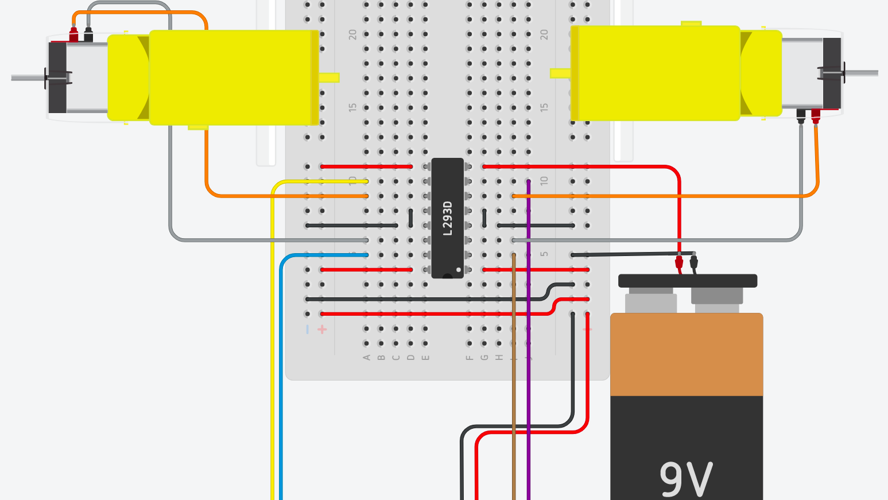
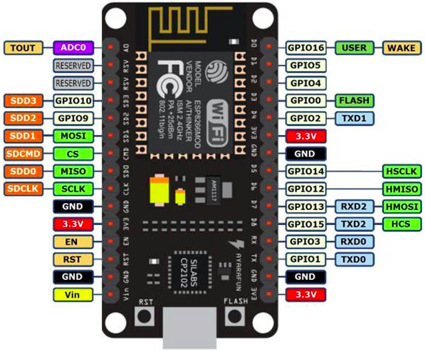
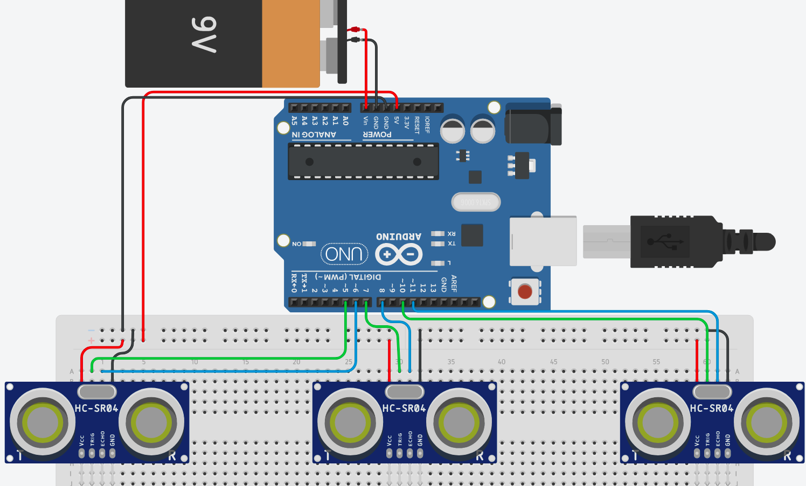
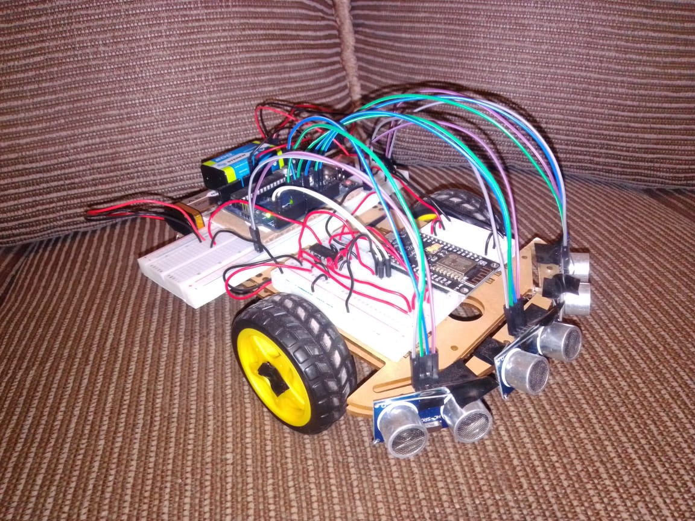
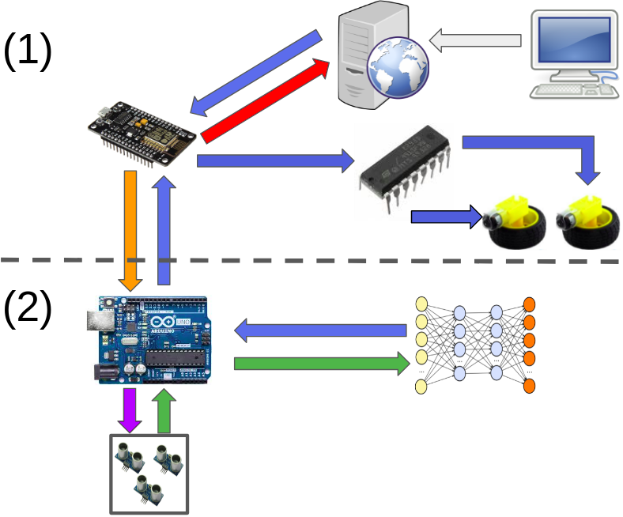
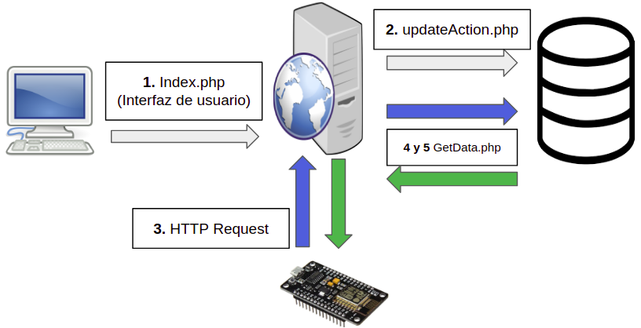
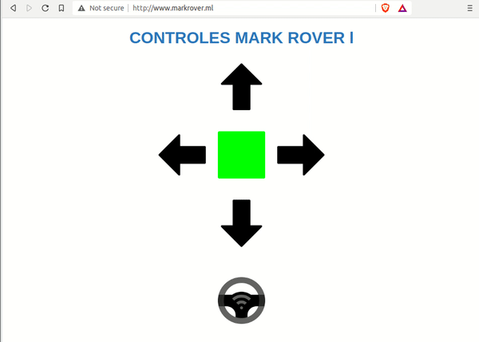
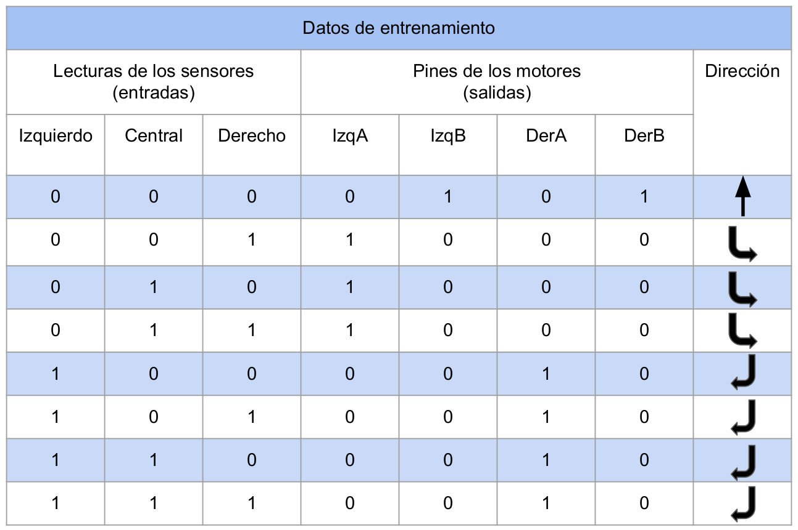

## Introducción

**Mark Rover I** es un sistema que permite a un vehı́culo ser controlado a distancia; además, cuenta con la autonomı́a para esquivar obstáculos. Es un proyecto que combina la electrónica con el aprendizaje automático y el internet de las cosas.

### Especificaciones funcionales

- El vehı́culo puede ser controlado desde cualquier lugar del mundo mediante una conexión a Internet.
- Puede controlarse manualmente y también cuenta con la opción de Piloto Automático.
- El sistema es capaz de esquivar obstáculos de manera autónoma cuando se controla a sı́ mismo.
- Para la toma de decisiones en el modo de Piloto Automático, se ha implementado una red neuronal que procesa los datos recolectados por los sensores de proximidad del vehı́culo.

### Aplicaciones

- El control a distancia de un vehı́culo es útil en aplicaciones y actividades de seguridad, vigilancia, exploración o reconocimiento de áreas desconocidas y/o peligrosas.
- La implementación de algoritmos de Machine Learning en sistemas electrónicos para tomar decisiones a partir de las lecturas recabadas por diferentes sensores puede aplicarse en diversos sistemas de un vehı́culo autónomo, por ejemplo:
  - Detección, reconocimiento y evasión de obstáculos.
  - Sistema de piloto automático.
  - Aparcamiento automático.

## Circuitos electrónicos

### Lista de los componentes electrónicos necesarios

A continuación, la lista de los commponentes electrónicos necesarios y su corres-
pondiente función:

- Chasis de carro de dos llantas: Para el posicionamiento de todos los componentes fı́sicos del sistema.
- Dos motorreductores de 6V (Incluidos en el chasis): Para el movimiento del vehı́culo.
- Protoboards: Para realizar las conexiones entre los componentes electrónicos.
- Tres sensores ultrasónicos HC-SR04: Para la detección de obstáculos, distribuidos a lo ancho de la parte frontal del chasis.
- Arduino Uno: Para el control de los sensores ultrasónicos y ejecución de la red neuronal.
- Módulo NodeMCU Esp8266: Para la conexión a Internet y gestión de los dos motorreductores.
- Chip L293D (Puente H): Para el suministro de energı́a a los dos motorreductores.
- Tres baterı́as de 9V: Una para alimentar el Arduino Uno, otra para alimentar el
  módulo NodeMCU Esp8266 y una más para alimentar ambos motorreductores.

### Circuito para el control de los motores

Para controlar los motores se utilizó el módulo NodeMCU Esp8266, y para alimentarlos, el chip L293D junto con una baterı́a de 9V. A continuación su circuito:

<div style="text-align:center">
    
    <p><i>Figura 1. Circuito para el control de los motores</i></p>
</div>

Los cables de color café, morado, amarillo y azul, que en el circuito se aprecian conectados a los pines 2, 7, 10 y 15 del chip L293D (comenzando a contar desde la muesca blanca en la esquina inferior derecha del chip) son los encargados de hacer girar los motorreductores. Dependiendo del voltaje que suministremos a esas terminales las ruedas girarán en un sentido, en otro o no se moverán. El chip L293D se alimenta conectando su Pin número 1 a los 5V de salida del Arduino Uno.

Los pines 10 y 15 controlan la rueda izquierda; los pines 2 y 7, la derecha. Recordemos que para que exista una corriente eléctrica entre dos puntos debe existir también una diferencia de potencial entre ellos; por ejemplo, si a los pines 10 y 15 se les suministra la misma cantidad de voltaje, la rueda izquierda no se moverá. De esta manera podemos controlar la dirección del flujo de corriente entre los pines del chip responsables del giro de los motorreductores y, por lo tanto, seremos capaces de controlar la dirección del vehı́culo.

Para suministrar el voltaje a los pines que hacen girar los motores, los conectaremos al módulo NodeMCU Esp8266 de la siguente manera:

Cable café $$\longrightarrow$$ pin 2 (D4/GPIO02)
Cable morado $$\longrightarrow$$ pin 0 (D3/GPIO00)
Cable amarillo $$\longrightarrow$$ pin 5 (D1/GPIO05)
Cable azul $$\longrightarrow$$ pin 4 (D2/GPIO04)

<div style="text-align:center">
    
    <p><i>Figura 2. Diagrama del Módulo NodeMCU Esp8266</i></p>
</div>

Además, también necesitamos alimentar a este módulo con otra baterı́a de 9V mediante los pines V in y alguno de sus pines GND.

### Circuito para el control de los sensores ultrasónicos

El microcontrolador responsable de la gestión los sensores de proximidad, ası́ como de la ejecución de la red neuronal, es el Arduino Uno. A continuación, el circuito:

<div style="text-align:center">
    
    <p><i>Figura 3. Circuito de los sensores ultrasónicos</i></p>
</div>

La conexión de los sensores es muy sencilla. De izquierda a derecha, los pines 1 y 4 son los de alimentación, se conectan directamente a 5V y GND respectivamente. Los pines 2 y 3 corresponden a los llamados Trigger pin y Echo pin. El pin Trigger se encarga de hacer que el sensor produzca pulsos ultrasónicos, mientras que el pin Echo es responsable de enviar los datos al Arduino una vez que los pulsos ultrasónicos reboten en un objeto y sean detectados nuevamente por el sensor.

Nótese que el Arduino Uno también necesita la alimentación externa de 9V. En este caso también se conectará la baterı́a en los pines V in y uno de los pines GND de la placa.

### Integración de los circuitos

La placa Arduino Uno debe comunicarse con el Módulo NodeMCU Esp8266 ya que al activarse la opción de piloto automático sucederá lo siguiente:

1. El módulo se pondrá en contacto con el Arduino para solicitarle una acción.
2. El Arduino recibirá la señal, obtendrá la información de los sensores y calculará una acción mediante la red neuronal, finalmente la enviará como respuesta al módulo.

3. El módulo recibirá del Arduino la acción calculada por la red neuronal y realizará la acción correspondiente generando una diferencia de potencial en los pines del chip L293D para que los motores giren hacia adelante, hacia atrás, o no se muevan.

Para lograr este objetivo establecemos una conexión alámbrica serial entre el Arduino Uno y el Módulo NodeMCU Esp8266 conectando entre sı́ sus pines Tx y Rx (responsables de la comunicación en serie) de forma cruzada; es decir, el pin Tx del Arduino se conectará al pin Rx del módulo, y el pin Rx del Arduino se conectará al pin Tx del módulo.

Finalmente, necesitamos tener una conexión a Tierra en común entre la GND del Arduino, la del módulo NodeMCU Esp8266, la del chip L293D y la de cada una de las baterı́as.

Realizando las conexiones pertinentes, el vehı́culo ensamblado se ve de la siguente forma:

<div style="text-align:center">
    
    <p><i>Figura 4. Mark Rover I ensamblado</i></p>
</div>

## Procedimientos de comunicación

### Red de sensores

La red de sensores del Mark Rover I se puede dividir en dos partes:

<div style="text-align:center">
    
    <p><i>Figura 5. Red de sensores</i></p>
</div>

La **parte (1)** es la responsable de recibir la instrucción del usuario almacenada en la base de datos de un servidor web para que el vehı́culo realice la acción solicitada. La **parte (2)** se encarga de recolectar los datos de los sensores ultrasónicos e introducirlos a la red neuronal para finalmente ponerse en contacto con el módulo NodeMCU Esp8266 y comunicarle la acción que se debe realizar cuando el vehı́culo está en piloto automático.

El proceso de comunicación se describe para el Módulo NodeMCU Esp8266 y el
Arduino Uno:

#### Proceso de comunicación (NodeMCU Esp8266) Parte (1)

1. El usuario elige una acción desde la interfaz (Avanzar, Retroceder, Girar a la izquierda, Girar a la derecha, Detenerse o Activar piloto automático).
2. La acción solicitada por el usuario se almacena en el servidor dentro de una base de datos.
3. El módulo NodeMCU Esp8266 se comunica con el servidor y le solicita la acción.
4. El servidor extrae la acción de la base de datos y se la envı́a de regreso como respuesta al Módulo NodeMCU Esp8266.
5. El Módulo NodeMCU Esp8266 recibe la acción a realizar.

   - Si la acción es igual a _Activar piloto automático_:
     - a) Pedir al Arduino Uno que calcule una acción con la red neuronal.
     - b) Obtener la acción calculada por el Arduino Uno.
     - c) Ir al paso 6.
   - Si la acción es diferente a Activar piloto automático:
     - a) Ir al paso 6.

6. Enviar el voltaje correspondiente a los pines del chip L293D en función de la
   acción a realizar.

#### Proceso de comunicación (Arduino Uno) Parte (2)

Partiendo del Punto 5 anterior: _a) Pedir al Arduino Uno que calcule una acción con la red neuronal_:

1. El Arduino Uno recibe la petición del Módulo NodeMCU Esp8266.
2. El Arduino Uno recaba los datos de la situación actual desde los sensores ultrasónicos.
3. El Arduino Uno introduce los datos recién obtenidos a la red neuronal y obtiene la acción a realizar.
4. El Arduino Uno le responde al Módulo NodeMCU Esp8266 con la acción calculada.

### Servidor web

Para que un usuario pueda controlar el vehı́culo a distancia hacemos uso de un servidor web que se encarga de recibir las instrucciones del usuario, las almacena en una base de datos y se las comunica al Módulo NodeMCU Esp8266. Para lograr estos objetivos hacemos uso de cuatro scripts y una base de datos.

<div style="text-align:center">
    
    <p><i>Figura 6. Diagrama del servidor web</i></p>
</div>

- **Index.php**: Contiene la interfaz de usuario. Haciendo uso de Ajax podemos interactuar con el servidor desde ahı́ utilizando el archivo updateAction.php.
- **updateAction.php**: Recibe una acción desde la interfaz y la escribe en la base de datos.
- **getData.php**: Obtiene la acción desde la base de datos cuando el Módulo NodeMCU Esp8266 lo solicita.
- **database.php**: Contiene el objeto de nuestra base de datos, ası́ como sus credenciales.
- **database.sql**: Código SQL para crear la base de datos necesaria.

#### Index.php

Lo realmente importante de este archivo se encuentra en su código de JavaScript, el cuál contiene la función que nos permite comunicarnos con el servidor:

```javascript
"use strict";

// ***** FUNCIÓN PARA COMUNICARSE CON EL SERVIDOR *****
$(function () {
  $("input").click(function (e) {
    e.preventDefault();
    let value;
    if (this.src.includes("atm.png")) {
      value = "stop";
    } else {
      value = $(this)[0].form[0].value;
    }
    console.log(value);
    $.ajax({
      type: "POST",
      url: "updateAction.php",
      data: { direction: value },
    });
  });
});

const directionButtons = document.querySelectorAll(".directionButton");
let pressed = directionButtons[2];

const directionButtonPressed = function () {
  const image = this.src.split("/")[5].split(".")[0];
  let newImage = "";
  if (image.includes("-pressed")) {
    return;
  } else {
    newImage = "assets/" + image + "-pressed.png";
    pressed.src = pressed.src.replace("-pressed", "");
    pressed = this;
  }
  this.src = newImage;
};

const atmPilotButtonPressed = function () {
  const image = this.src.split("/")[5].split(".")[0];
  let newImage = "";
  if (!image.includes("-pressed")) {
    for (let i = 0; i < directionButtons.length; i++) {
      directionButtons[i].disabled = true;
    }
    pressed.src = pressed.src.replace("-pressed", "");
    this.src = "assets/" + image + "-pressed.png";
    pressed = this;
  } else {
    for (let i = 0; i < directionButtons.length; i++) {
      directionButtons[i].disabled = false;
    }
    this.src = this.src.replace("-pressed", "");
    pressed = directionButtons[2];
    pressed.src =
      "assets/" + pressed.src.split("/")[5].split(".")[0] + "-pressed.png";

    return;
  }
};

for (let i = 0; i < directionButtons.length; i++) {
  directionButtons[i].addEventListener("click", directionButtonPressed);
}

document
  .querySelector(".atmPilotButton")
  .addEventListener("click", atmPilotButtonPressed);
```

Para una visualización amigable de los controles se utilizó el siguiente HTML y su correspondiente hoja de estilos en CSS:

```html
<!DOCTYPE html>
<html>
  <head>
    <meta name="viewport" content="width=device-width, initial-scale=1" />
    <meta charset="utf-8" />
    <link rel="stylesheet" href="style.css" />
    <script src="jquery.min.js"></script>
  </head>
  <body>
    <h1>CONTROLES MARK ROVER l</h1>
    <div class="container">
      <form action="updateAction.php" method="post" id="FORWARD">
        <input type="hidden" name="direction" value="forward" />
      </form>

      <form action="updateAction.php" method="post" id="LEFT">
        <input type="hidden" name="direction" value="left" />
      </form>

      <form action="updateAction.php" method="post" id="STOP">
        <input type="hidden" name="direction" value="stop" />
      </form>

      <form action="updateAction.php" method="post" id="RIGHT">
        <input type="hidden" name="direction" value="right" />
      </form>

      <form action="updateAction.php" method="post" id="REVERSE">
        <input type="hidden" name="direction" value="reverse" />
      </form>

      <form action="updateAction.php" method="post" id="AUTOMATIC">
        <input type="hidden" name="direction" value="atm" />
      </form>

      <input
        type="image"
        class="directionButton"
        src="assets/up-arrow.png"
        alt="submit"
        form="FORWARD"
      /><br /><br />
      <input
        type="image"
        class="directionButton"
        src="assets/left-arrow.png"
        alt="submit"
        form="LEFT"
      />
      <input
        type="image"
        class="directionButton"
        src="assets/stp-pressed.png"
        alt="submit"
        form="STOP"
      />
      <input
        type="image"
        class="directionButton"
        src="assets/right-arrow.png"
        alt="submit"
        form="RIGHT"
      /><br /><br />
      <input
        type="image"
        class="directionButton"
        src="assets/down-arrow.png"
        alt="submit"
        form="REVERSE"
      />
      <br /><br /><br />
      <input
        type="image"
        class="atmPilotButton"
        src="assets/atm.png"
        alt="submit"
        form="AUTOMATIC"
      />
    </div>
    <script src="script.js"></script>
  </body>
</html>
```

```css
html {
  font-family: Arial;
  display: inline-block;
  margin: 0px auto;
  text-align: center;
}

h1 {
  font-size: 2rem;
  color: #2980b9;
}

h2 {
  font-size: 1.25rem;
  color: #2980b9;
}

.directionButton {
  width: 10%;
  height: 10%;
  outline: none;
  padding: 10px;
}

.atmPilotButton {
  width: 10%;
  height: 10%;
  outline: none;
  padding: 10px;
}

.directionButton:active {
  box-shadow: 0 1px #666;
  transform: translateY(10px);
  outline: none;
}

.atmPilotButton:active {
  box-shadow: 0 1px #666;
  transform: translateY(10px);
  outline: none;
}

.selected {
  transform: translateY(10px);
}

.unselected {
  transform: translateY(-10px);
}
```

<div style="text-align:center">
    
    <p><i>Figura 7. Interfaz de usuario</i></p>
</div>

#### updateAction.php

```php
<?php
  require 'database.php';

  if (!empty($_POST)) {
    $Direccion = $_POST['direction'];

    // insert data
    $pdo = Database::connect();
    $pdo->setAttribute(PDO::ATTR_ERRMODE, PDO::ERRMODE_EXCEPTION);
    $sql = "UPDATE direccion SET Direccion = ? WHERE ID = 0";
    $q = $pdo->prepare($sql);
    $q->execute(array($Direccion));
    Database::disconnect();
    header("Location: index.php");
  }
?>
```

#### getData.php

```php
<?php
  include 'database.php';

  if (!empty($_POST)) {
    $id=$_POST["ID"];
    $pdo = Database::connect();
    $pdo->setAttribute(PDO::ATTR_ERRMODE, PDO::ERRMODE_EXCEPTION);
    $sql = 'SELECT * FROM direccion WHERE ID = ?';

    $q = $pdo->prepare($sql);
    $q->execute(array($id));
    $data = $q->fetch(PDO::FETCH_ASSOC);
    Database::disconnect();

    echo $data['Direccion'];
  }
?>
```

#### database.php

```php
<?php
	class Database {
		private static $dbName = 'dbcarro' ;
		private static $dbHost = 'localhost' ;
		private static $dbUsername = 'usr';
		private static $dbUserPassword = 'password';

		private static $cont  = null;

		public function __construct() {
			die('Init function is not allowed');
		}

		public static function connect() {
		  // One connection through whole application
		  if ( null == self::$cont ) {
        try {
          self::$cont =  new PDO( "mysql:host=".self::$dbHost.";"."dbname=".self::$dbName, self::$dbUsername, self::$dbUserPassword);
        }
        catch(PDOException $e) {
          die($e->getMessage());
        }
		  }
		  return self::$cont;
		}

		public static function disconnect() {
			self::$cont = null;
		}
	}
?>
```

#### database.sql

Cabe recalcar que nuestra base de datos consta únicamente de una tabla llamada **dirección** con un solo elemento que representa la acción más reciente del usuario.

```sql
SET SQL_MODE = "NO_AUTO_VALUE_ON_ZERO";
SET AUTOCOMMIT = 0;
START TRANSACTION;
SET time_zone = "+00:00";


/*!40101 SET @OLD_CHARACTER_SET_CLIENT=@@CHARACTER_SET_CLIENT */;
/*!40101 SET @OLD_CHARACTER_SET_RESULTS=@@CHARACTER_SET_RESULTS */;
/*!40101 SET @OLD_COLLATION_CONNECTION=@@COLLATION_CONNECTION */;
/*!40101 SET NAMES utf8mb4 */;

CREATE TABLE `direccion` (
  `ID` int NOT NULL,
  `Direccion` varchar(7) NOT NULL
) ENGINE=InnoDB DEFAULT CHARSET=utf8mb4 COLLATE=utf8mb4_0900_ai_ci;

INSERT INTO `direccion` (`ID`, `Direccion`) VALUES
(0, 'forward');

ALTER TABLE `direccion`
  ADD PRIMARY KEY (`ID`);
COMMIT;

/*!40101 SET CHARACTER_SET_CLIENT=@OLD_CHARACTER_SET_CLIENT */;
/*!40101 SET CHARACTER_SET_RESULTS=@OLD_CHARACTER_SET_RESULTS */;
/*!40101 SET COLLATION_CONNECTION=@OLD_COLLATION_CONNECTION */;
```

## Control del movimiento

La lógica para el control del vehı́culo es muy sencilla. Como ya se ha explicado antes, el Módulo NodeMCU Esp8266 se comunica concurrentemente con el servidor para obtener la instrucción del usuario. Después, con un bloque de sentencias If/Else se identifica la acción a realizar que puede ser: ejecutar una instrucción directa ó predecir la dirección con la red neuronal. Finalmente, se le aplica el determinado voltaje a los pines del chip L293D. Todo este proceso se ejecuta en el Módulo NodeMCU Esp8266.

```arduino
// Librerias auxiliares para el modulo NodeMCU ESP8266
#include <ESP8266WiFi.h>
#include <WiFiClient.h>
#include <ESP8266HTTPClient.h>

// PARA LA CONEXION A INTERNET Y COMUNICACION CON EL SERVIDOR

// ***** Informacion necesaria para conectarse a Internet*****
// ***** SSID y Contrasena del router *****
const char* ssid = "ssid";
const char* password = "password";

// *** Para inicial la conexion a internet en modo estacion ***
void connectToWiFiAsSTA(){
  WiFi.mode(WIFI_STA);
  WiFi.begin(ssid, password);
}

// ***** Direccion IPv4 del servidor *****
const char* host = "http://markrover.ml/";

//*** Direccion del archivo PHP que nos enviara la informacion ***
int id = 0; // ID de la direccion del carro en la base de datos.
String archivoGet = "GetData.php"; // Archivo que nos contestara
// Direccion en el servirdor del archivo que nos contestara la peticion
String direccionGet = host + archivoGet;
// Cadena que se enviara como peticion al servidor.
String idBD = "ID=" + String(id);

// ***** Variables para recibir los mensajes *****
// Se declara un objeto cliente para comunicarse con el servidor
HTTPClient http;
int httpCodeGet; // Para enviar la peticion
// Para obtener el mensaje recibido como cadena de caracteres
String payload;

// ********************************************************************


// ************** CONTROL DE LOS MOTORES ***************
// ***** Velocidad de los motores en manual*****
unsigned short int velocidad = 600; // Velocidad de los motores
unsigned short int deltaAdelante = 30; // Diferencia de velocidades
unsigned short int deltaAtras = 35; // Diferencia de velocidades

// ***** Velocidad de los motores en automatico*****
// Velocidad de los motores
unsigned short int velocidad_automatico = 450;
// Diferencia de velocidades
unsigned short int deltaAdelante_automatico = 23;
// Diferencia de velocidades
unsigned short int deltaAtras_automatico = 26;

// ***** Pines asignados para el control de los motores *****
unsigned short int izqA = 5;
unsigned short int izqB = 4;
unsigned short int derA = 0;
unsigned short int derB = 2;

// ***** Bandera auxiliar para controlar los giros en reversa *****
boolean beforeWasForward;

// ***** Para almacenar la salida de cada pin de los motores *****
int outputIzqA, outputIzqB, outputDerA, outputDerB;

// ********************************************************************


void setup() {
  // Se inicializa la comunicacion serial
  Serial.begin(115200);

  // Se inicia la conexion a Internet
  connectToWiFiAsSTA();

  // Los pines de la placa se declaran como salidas
  pinMode(izqA, OUTPUT);
  pinMode(izqB, OUTPUT);
  pinMode(derA, OUTPUT);
  pinMode(derB, OUTPUT);
}

// ***** Funcion para enviar una instruccion al chip L293D *****
void action(int outputIzqA, int outputIzqB, int outputDerA,int outputDerB){
  analogWrite(izqA, outputIzqA);
  analogWrite(izqB, outputIzqB);
  analogWrite(derA, outputDerA);
  analogWrite(derB, outputDerB);
}

// ***** Variable para contar el tiempo sin usar la funcion "Delay"
unsigned long currentMillis;

//Para leer el mensaje del Arduino cuando nos encontremos en "Piloto Automatico"
byte mensaje[4];

void loop() {

  // ***** COMUNICACION CON EL SERVIDOR *****
  // ***** Se inicia la comunicacion con el archivo GetData.php *****
  http.begin(direccionGet); // Se inicia la conexion con el servidor
  // Se especifica el tipo de mensaje
  http.addHeader("Content-Type", "application/x-www-form-urlencoded");

  // ***** Se realiza la peticion y se obtiene la respuesta *****
  httpCodeGet = http.POST(idBD); // Se envia la peticion
  // Se convierte a cadena de caracteres la respuesta del servidor
  payload = http.getString();

  // ********************************************************************

  // ***** Se decide que hacer con los motores de acuerdo a la respuesta del servidor *****

  // ***** COMUNICACION CON EL ARDUINO *****
  if (payload=="atm"){
    // Se le dice al Arduino que necesitamos su servicio
    Serial.write(0);
    currentMillis = millis();

    // Se hace una pequena pausa para que el Arduino lea el mensaje y vacie el buffer,
    // asi evitamos conflictos con el siguiente While
    while (millis() < currentMillis + 50);
    while(!Serial.available());

    // Se lee la salida de la red neuronal y se pasan esos valores a nuestras variables
    Serial.readBytes(mensaje, 4);

    // Se establece el valor de salida para cada pin en funcion
    // de la respuesta del Arduino
    if (mensaje[0] - '0' == 1) outputIzqA = velocidad_automatico-deltaAtras_automatico;
    else outputIzqA = 0;

    if(mensaje[1] - '0'== 1) outputIzqB = velocidad_automatico - deltaAdelante_automatico;
    else outputIzqB = 0;

    if(mensaje[2] - '0' == 1) outputDerA = velocidad_automatico;
    else outputDerA = 0;

    if(mensaje[3] - '0'== 1) outputDerB = velocidad_automatico;
    else outputDerB = 0;

    // Se ejecuta la accion en los motores
    action(outputIzqA,outputIzqB,outputDerA,outputDerB);
    http.end(); //--> Cierra la conexion con el servidor
  }

  // ***** CASOS DE CONDUCCION MANUAL *****
  else if (payload == "forward") {
    if (!beforeWasForward) beforeWasForward = true;
    outputIzqA = 0;
    outputIzqB = velocidad-deltaAdelante;
    outputDerA = 0;
    outputDerB = velocidad;

    action(outputIzqA,outputIzqB,outputDerA,outputDerB);
    http.end(); //--> Close connection
  }
  else if (payload == "reverse") {
    if(beforeWasForward)beforeWasForward = false;

    outputIzqA = velocidad-deltaAtras;
    outputIzqB = 0;
    outputDerA = velocidad;
    outputDerB  = 0;

    action(outputIzqA,outputIzqB,outputDerA,outputDerB);
    http.end(); // Cierra la conexion con el servidor
  }
  else if (payload == "left") {
    outputIzqA = 0;
    outputIzqB = 0;

    if (beforeWasForward){
      outputDerA = 0;
      outputDerB = velocidad;
    }
    else{
      outputDerA = velocidad;
      outputDerB = 0;
    }

    action(outputIzqA,outputIzqB,outputDerA,outputDerB);
    http.end(); // Cierra la conexion con el servidor
  }
  else if (payload == "right") {

    if(beforeWasForward){
      outputIzqA = 0;
      outputIzqB = velocidad-deltaAdelante;
    }
    else {
      outputIzqA = velocidad-deltaAdelante;
      outputIzqB = 0;
    }

    outputDerA = 0;
    outputDerB = 0;

    action(outputIzqA,outputIzqB,outputDerA,outputDerB);
    http.end(); // Cierra la conexion con el servidor
  }
  else if (payload == "stop") {
    if(!beforeWasForward) beforeWasForward = true;

    outputIzqA = 0;
    outputIzqB = 0;
    outputDerA = 0;
    outputDerB = 0;

    action(outputIzqA,outputIzqB,outputDerA,outputDerB);
    http.end(); // Cierra la conexion con el servidor
  }
}
```

## Red neuronal

### Datos de entrenamiento

Antes de pensar en un modelo para la red neuronal se deben establecer los datos de entrenamiento y resolver algunos problemas referentes a ellos.

Para alimentar a la red neuronal haremos uso de las lecturas de los sensores ultrasónicos que miden con suficiente precisión distancias entre 3cm y 4m. Fuera del intervalo [3,400] los sensores registran basura: si la distancia entre un sensor y el obstáculo es menor que 3cm, por lo general obtendremos un valor negativo demasiado grande (−1273, por ejemplo); en cambio, si el objeto se encuentra a más de 400cm, obtendrı́amos más o menos lo mismo, pero con signo contrario (1273, por ejemplo). Entonces, de alguna manera debemos manipular estos datos para mantenerlos siempre dentro del intervalo deseado.

El segundo problema es normalizar las lecturas de los sensores. Es bien sabido que un modelo de Machine Learning debe alimentarse con datos normalizados para asegurar su correcto funcionamiento. Partimos de la función de normalización Min-Max para mapear las lecturas al intervalo [0,1]:

$$
y=\frac{x-min}{max-min}
$$

donde:

- $$x$$: Dato del sensor
- $$min$$: Límite inferior del intervalo
- $$max$$: Límite superior del intervalo

Y es aquı́ en donde surge otro detalle que no podemos dejar pasar. El intervalo de lectura de los sensores [3,400] es muy grande; por lo tanto, aún si aplicamos la función M in − M ax, un cambio de pocos centı́metros no tendrı́a un impacto significativo en el resultado del dato normalizado. Sin embargo, para nuestro sistema los cambios pequeños sı́ son importantes, ya que esta mı́nima diferencia puede ser determinante al momento de evitar (o no) una colisión. Para resolver este inconveniente transformaremos el intervalo [3,400] a [0,20]. Se ha tomado esta decisión porque si un objeto se encuentra a más de 20cm no representa un peligro para nuestro sistema; por lo tanto, si está más lejos, tampoco y el vehı́culo puede seguir su curso.

Para resolver los problemas antes mencionados, que sesgarı́an nuestros conjuntos
de datos, hemos definido una función de ajuste:

Sea $$x$$ la lectura de un sensor y $$f_a(x)$$ nuestra **función de ajuste**:

$$
f_a(x)=
    \begin{cases}
        0, & \text{si } x<0\\
        x, & \text{si } 0\leq x \leq 20 \\
        20, & \text{si } x>20
    \end{cases}
$$

En este punto ya es posible entrenar la red neuronal y realizar predicciones; sin embargo, se ha tomado la decisión de definir nuestra propia función de normalización con la única finaliad de darles un significado más humano a nuestros datos. En vez de utilizar la función Min−Max hemos definido la función Min-Max Inversa, la cual nos permitirá mapear los valores más grandes hacia números cercanos a cero y los valores más pequeños, hacia números cercanos a uno. De esta forma, al detectar un objeto a 0cm del vehı́culo, nuestra nueva función de normalización nos devolverá un 1 indicando que el peligro de colisión es máximo. En cambio, si detectamos un objeto a 20cm o más, Min-Max Inversa nos regresará un 0 representando que el peligro de colisión es nulo.

Sea $$x$$ la lectura de un sensor y $$f_n (x)$$ nuestra **función de normalización**:

$$
f_n(x) = \frac{max - x}{max}
$$

donde $$max$$ es el máximo valor posible, en nuestro caso, $$max$$ = 20 ya que controlaremos las lecturas de los sensores para que siempre se mantengan en el intervalo [0,20].

Para generar nuestro conjunto de entrenamiento tomamos todas las combinaciones posibles de las lecturas de los sensores en los casos extremos (objeto a 0cm y 20cm), y las relacionamos con una acción, entonces obtendremos la siguiente tabla:

<div style="text-align:center">
    
    <p><i>Figura 8. Datos de entrenamiento</i></p>
</div>

No queremos que la red neuronal aprenda a detenerse porque nos interesa que el vehı́culo siempre se mantenga en movimiento. Por ese motivo las dirección detenerse no aparece en nuestros datos de entrenamiento. Otra observación importante es que dar reversa no es una opción. Como no tenemos un sensor en la parte trasera, entonces necesitamos minimizar las posibilidades de colisionar al retroceder; además, podrı́amos entrar en el ciclo Adelante-Atrás-Adelante-Atrás. Por las razones ante- riores, siempre que sea absolutamente necesario retroceder, lo haremos haciendo una especie de ”U ” o gancho buscando que los sensores dejen de ver al obstáculo.

### Modelo

Las redes neuronales son algoritmos muy complejos que requieren de muchos recursos computacionales para entrenar y, en general, para su correcto desempeño. En el contexto de este proyecto dichos recursos son extremadamente limitados. Por ejemplo en el Arduino Uno, que es en donde la red neuronal se ejecutará, contamos con una memoria SRAM de 2kb para el manejo de las variables y 256kb de memoria Flash para cargar programas; además su velocidad de procesamiento es de aproximadamente 16MHz, que comparado con los 3GHz de una computadora de gama media se queda demasiado corto. También cabe recalcar que no existe ninguna herramienta (al menos para el Arduino Uno) para la implementación de redes neuronales, por lo que será necesario empotrar los pesos en el microcontrolador y realizar las operaciones de forma manual. Por lo tanto, no resultarı́a conveniente utilizar una modelo extremadamente robusto; además, hay que tomar en cuenta que la complejidad del problema que necesitamos resolver no es alta.

Por las razones anteriores, se utilizará una pequeña red con dos capas ocultas con cuatro y tres neuronas respectivamente. La entrada de la red será un vector de tres elementos que corresponden a las lecturas de cada uno de los sensores, mientras que su salida será un vector de cuatro elementos, donde los dos primeros corresponden a la salida hacia los pines del chip L293D que controlan la rueda izquierda; análogamente, los últimos dos elementos del vector resultado corresponden a los pines del chip que controlan la rueda derecha. La función de activación de todas las neuronas será la función Lógistica o Sigmoidal.

<div style="text-align:center">
    
    <p><i>Figura 9. Red neuronal</i></p>
</div>

### Optimizador

Para lograr que la red neuronal aprenda, hemos utilizado el algoritmo de optimización **RMSProp**. Éste es una variante del optimizador AdaDelta; a su vez, AdaDelta es una mejora del optimizador AdaGrad, que es una mejora al Descenso de Gradiente.

El **Descenso de gradiente** calcula la derivada de la matriz de pesos para moverse en dirección opuesta al vector que indica la dirección de máximo crecimiento (gradiente) para minimizar el error:

$$
 W = W - \alpha * \nabla W
$$

Una de las mejoras al Descenso de Gradiente, AdaGrad (Adaptative Gradient) busca adaptar la tasa de aprendizaje de tal modo que los parámetros que sufre menos actualizaciones se modifiquen con un paso más grande, y que los parámetros
que se actualizan más a menudo se modifiquen con un paso más pequeño. Para ello, almacena la sumatoria C del cuadrado de los gradientes para cada parámetro.

$$
\begin{align*}
    & C = C + \nabla W^2 \\
    & W = W - \alpha * \frac{\nabla W}{\sqrt{C + \epsilon}}
\end{align*}
$$
