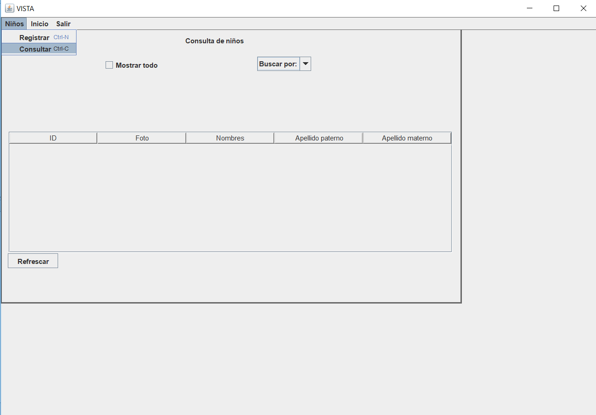
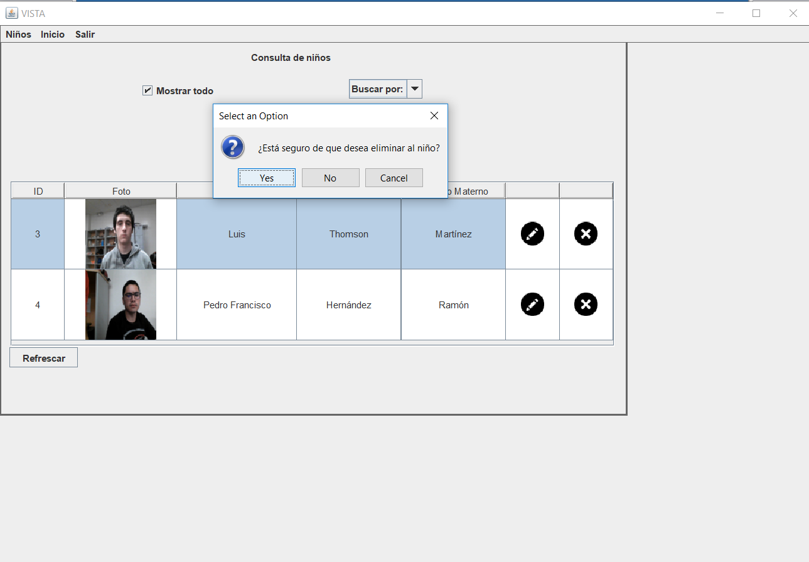

 
 

La documentación, así como el código fuente, se encuentran en el siguiente [repositorio de Github](https://github.com/FernandaDguez/VISTA).

**Autores**

- María Fernanda Domínguez Acosta
- Pedro Andrés Hernández Amador
- Adrián Leonardo Soto Tequida

 
 

## Instalación

Los requerimentos básicos para el uso de este sistema son:

- JDK 11+
- Sistema operativo de Windows.

Para instalar y correr el software por favor siga los siguientes pasos:

### Crear la base de Datos.

1.  Utilizando el cliente de su preferencia (nosotros utilizamos y
    recomendamos XAMPP) habilite el puerto 3306 y a través de
    PHPMyAdmin cree la base de datos de MySQL con el título de _VISTA_.

2.  Utilice nuestra archivo de la base de datos que se encuentra en este
    repositorio como: **_VISTA.sql_**.

### Ejecución del software

Para correr el programa es necesario que haga lo siguiente:

1.  Corra el servidor de la base de datos a través de XAMPP.

2.  Corra el ejecutable `VISTA.jar` que se encuentra dentro de la
    carpeta _dist_.

## Uso del software

Para utilizar el software, al ejecutarlo, lo primero que se debe hacer es iniciar sesión, ya sea como usuario (Recepcionista) o como Administrador del sistema a través de la siguiente ventana:

    
    
<i>Figura 1. Inicio de sesión</i>

### Como administrador

Si inicia sesión como Administrador puede, además de ejecutar la operación principal de identificar a los posibles tutores, también puede gestionar a los Recepcionistas registrádolos, editándolos, eliminándolos o simplemente consultándolos en el menú desplegable.

Para volver a la pantalla principal de Administrador haga clic en el botón de `Inicio` de la barra de menú superior.

De igual forma, para terminar su sesión haga clic en `Salir` y volverá a la pantalla de Inicio de Sesión.

    
    
<i>Figura 2. Pantalla principal para administradores</i>

#### Registrar a un recepcionista

En la barra de menú superior haga clic en `Recepcionistas` y en el menú desplegable vaya a `Registrar`. También puede utilizar el atajo `Ctrl+N` y a continuación observará la siguiente pantalla:

    
    
<i>Figura 3. Pantalla de registro de recepcionista</i>

Rellene los campos correspondientes y haga clic en el botón `Registrar` de la pantalla.

#### Actualizar la información de un recepcionista

En la barra de menú superior haga clic en `Recepcionistas` y en el menú desplegable vaya a `Actualizar`. También puede utilizar el atajo `Ctrl+U` y a continuación observará la siguiente pantalla:

    
    
<i>Figura 4. Pantalla de actualización de recepcionista</i>

1. Escribe en el área de **Recepcionista a actualizar** el nombre de usuario del recepcionista al que se le quiere editar algún dato.

2. En el área de **Información a actualizar** escriba en el campo correspondiente la información que desea actualizar de este usuario.

3. Una vez que haya escrito esta información, haga clic en el botón `Actualizar información` y se guardará esa información en la base de datos.

#### Eliminar un recepcionista

En la barra de menú superior haga clic en `Recepcionistas` y en el menú desplegable vaya a `Eliminar`. También puede utilizar el atajo `Ctrl+D` y a continuación observará la siguiente pantalla:

    
    
<i>Figura 5. Pantalla de eliminación de recepcionista</i>

1. Rellene todos los campos de información del recepcionista que desea eliminar de la base de datos.

2. Haga clic en el botón `Eliminar` que se encuentra debajo de los campos de información en la ventana y este recepcionista se habrá eliminado de la base de datos.

#### Consultar recepcionistas

En la barra de menú superior haga clic en `Recepcionistas` y en el menú desplegable vaya a `Consultar`. También puede utilizar el atajo `Ctrl+C` y a continuación observará la siguiente pantalla:

Si desea buscar Recepcionistas por Nombre y/o Apellido:

1. Seleccione el CheckBox de **`Buscar`** y escriba en los campos la información del recepcionista que busca.

2. Haga clic en el botón de `Consultar`.

    
    
<i>Figura 6. Consulta de recepcionistas meidante una búsqueda</i>

Si desea consultar todos los Recepcionistas registrados en la base de datos, simplemente selecccione el CheckBox de **`Mostrar Todo`**.

    
    
<i>Figura 7. Consulta de todos los recepcionistas</i>

### Como recepcionista

Por otro lado, si inicia sesión como Recepcionista, puede gestionar a los niños registrádolos, editándolos, eliminándolos o simplemente consultándolos. Además, puede realizar la tarea del principal del software que es la de identificar a los tutores.

    
    
<i>Figura 8. Pantalla principal para recepcionistas</i>

En la barra de menú superior encontrará los botones de `Inicio` para poder volver a la pantalla principal de recepcionista, `Salir` para cerrar sesión y volver a la pantalla de inicio de sesión, así como también un menú desplegable en el botón de `Niños` donde encontrará opciones para gestionar el registro de los infantes en la base de datos.

    
    
<i>Figura 9. Opciones para gestionar niños</i>

#### Registrar niño

Para registrar un niño en la base de datos:

En la barra de menú superior haga clic en `Niños` y en el menú desplegable vaya a `Registrar`. También puede utilizar el atajo `Ctrl+N` y a continuación observará la siguiente pantalla:

    
    
<i>Figura 10. Pantalla para el registro de un niño</i>

Rellene todos los campos de información del infante y capture la foto del niño o agréguela desde los archivos locales de la computadora.

    
    
<i>Figura 11. Obtención de la foto de un niño</i>

Haga clic en `Siguiente` y observará la siguiente pantalla.

    
    
<i>Figura 12. Captura de la información del tutor</i>

Rellene los campos de información del tutor e inserte o capture la foto del tutor para que se registre su rostro en la base de datos. También puede seleccionar el campo `Sin tutor` para registrar temporalmente a un niño sin su tutor, más adelante tendrá que ser registrado para que un adulto pueda llevárselo de la estancia.

    
    
<i>Figura 13. Captura de la foto del tutor</i>

Una vez realizados los pasos anteriores, el niño o la niña podrá reunirse con su tutor a la salida de la estancia. Además, a través de este mismo registro, puede decidir si agregar más adultos autorizados de llevarse al infante o si únicamente se registrará con la información proporcionada hasta el momento.

    
    
<i>Figura 14. Pantalla para el registro de autorizados</i>

Para registrar al infante sin autorizados haga clic en `Sin autorizados` en el menú desplegable y seleccione `Finalizar registro`.

#### Agregar un autorizado desde el registro

En el menú desplegable seleccione el número de autorizados y rellene los campos de información de cada uno, de manera similar al registro del tutor.

En el siguiente ejemplo se seleccionan dos autorizados:

    
    
<i>Figura 15. Captura de la información del primer autorizado</i>

    
    
<i>Figura 16. Captura de la información del segundo autorizado</i>

Una vez agregada la información de los autorizados seleccione `Finalizar registro` y confirme la información proporcionada.

    
    
<i>Figura 17. Confirmación de los datos del niño</i>

Por último, obtendrá el siguiente mensaje si ha realizado correctamente el proceso.

    
    
<i>Figura 18. Registro exitoso</i>

#### Consultar información de los niños registrados en la base de datos

Para poder ver la información de todos los niños registrados en la base de datos:

En la barra de menú superior haga clic en `Niños` y en el menú desplegable vaya a `Consultar`. También puede utilizar el atajo `Ctrl+C` y a continuación observará la siguiente pantalla:

    
    
<i>Figura 19. Pantalla para la consulta de niños</i>

Para consultar a los infantes puede buscarlos por **ID**, por **Nombre**, O bien puede seleccionar el CheckBox `Mostrar Todo` para visualizar a todos los niños registrados en la base de datos.

    
    
<i>Figura 21. Opciones de consulta de niños</i>

#### Eliminar a un niño o a un autorizado

Para eliminar a un niño del sistema, éste **se deberá haber consultado previamente.**

En la tabla de resultados de la cosulta seleccione el ícono `X` de la fila del niño que desee eliminar del registro y verá lo siguiente:

    
    
<i>Figura 22. confirmación para eliminar a un niño</i>

Seleccione **Sí** para eliminar definitivamente al niño de la base de datos.

Para eliminar al autorizado de un niño, en la tabla de resultados de la consulta seleccione el ícono del lápiz, y obtedrá la siguiente pantalla:

    
    
<i>Figura 23. Pantalla de edición de datos de un niño</i>

1. Seleccione el CheckBox de `Eliminar` en los autorizados que desee eliminar.

2. Haga clic en el botón de `Guardar Cambios`

#### Editar información de un niño o un tutor

Para editar la información de un niño previamente registrado en el sistema, éste **se deberá haber consultado previamente**.

    
    
<i>Figura 24. Lista de niños</i>

En la tabla de resultados de la consulta, seleccione el ícono del lápiz.

    
    
<i>Figura 25. Edición de un niño sin datos</i>

Seleccione el CheckBox de `Editar` en la casilla donde se muestra la información del niño. Asimismo, si este niño fue registrado sin tutor, aquí se encontrará la opción para agregar uno con el CheckBox de `Asignar Tutor`.

Para editar la información de un tutor o autorizado, en esta misma pantalla seleccione el CheckBox de `Editar` en el recuadro correspondiente; o en su defecto, si se desea agregar otro autorizado, seleccione el CheckBox de `Asignar` en el recuadro correspondiente a los autorizados y siga el proceso de forma similar a cuando se agrega un tutor desde el registro.

    
    
<i>Figura 26. Edición de un tutor</i>

Una vez editada o añadida la información deseada, haga clic en el botón de `Guardar Cambios`.

#### Identificar tutores

Esta es la función principal del sistema: Identificar a los adultos como tutores o autorizados de llevarse a algún niño. Si el adulto no está registrado en la base de datos, se guarda como una persona sospechosa.

Para poder realizar la tarea de identificar tanto tutores, autorizados y sospechosos, deberá estar en la pantalla principal de Recepcionista o Administrador. Puede acceder a esta pantalla siempre desde la barra de menú superior haciendo click en el botón de `Inicio`.

Procure tener la cámara posicionada correctamente a una altura donde se puedan apreciar correctamente los rostros de los tutores.

    
    
<i>Figura 27. Pantalla para la identificación de tutores (pantalla principal)</i>

Para ver los infantes que tiene asociado un adulto captado por la cámara, haga clic en el botón de `Capturar`

    
    
<i>Figura 28. Identificación de un tutor</i>

Cuando el adulto no se reconoce le podrá asignar un nombre para identificarlo y se guardará automáticamente en la bitácora como sospechoso.
